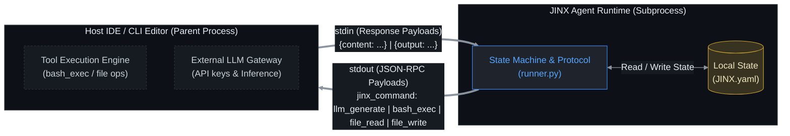
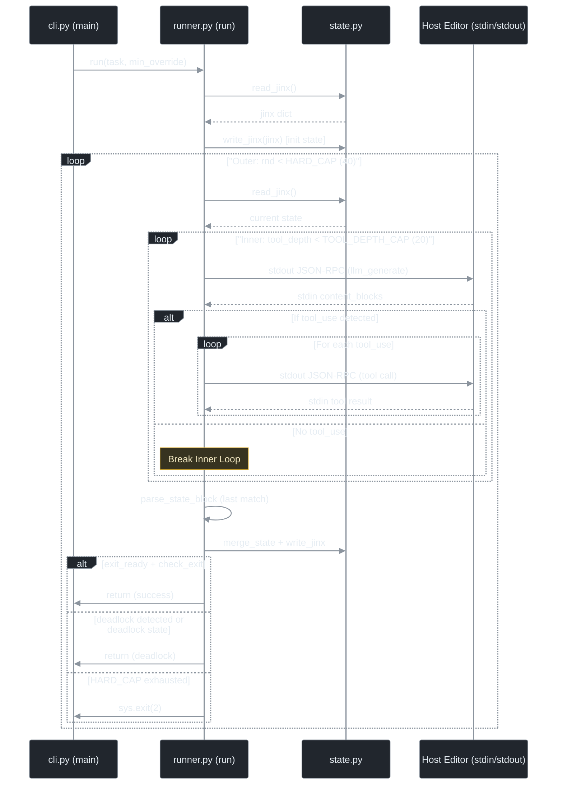

[English](README.md) | [Русский](README_RU.md) | [中文](README_ZH.md)

<p align="center">
  
  
  
  
</p>

<h1 align="center">JINX — Enterprise Sovereign Agent Runtime Specification</h1>

<p align="center">
  <strong>Technical specification for JINX, an isolated, stateful, protocol-driven cognitive loop designed to operate as a child process inside software engineering host environments.</strong>
</p>

---

## 1. Core Architecture & Inter-Process Communication (IPC)

JINX is an agent runtime designed to run inside a host environment (such as an IDE, command-line editor, or corporate orchestrator). The JINX runtime operates without independent network access or direct external service integrations; all external model invocation, file manipulation, and console execution requests are delegated to the host editor via standard input (`stdin`) and standard output (`stdout`) using structured JSON-RPC communication payloads.



### JSON-RPC Communication Specification

When JINX performs an action, it emits a structured JSON object to `stdout` ended with a newline character. The host environment reads this object from the process stream, executes the requested action, and returns the response as a JSON string to JINX's `stdin` ended with a newline.

#### 1. LLM Generation Request (`llm_generate`)
JINX delegates LLM inference to the host.
* **Payload emitted to `stdout`**:
```json
{
  "jinx_command": "llm_generate",
  "params": {
    "system": "System instructions defining the cognitive boundaries.",
    "messages": [{"role": "user", "content": "Round-specific context."}],
    "tools": [
      {
        "name": "bash_exec",
        "description": "Execute a bash or shell script in the environment.",
        "input_schema": {
          "type": "object",
          "properties": {
            "script": {"type": "string", "description": "The script to execute"}
          },
          "required": ["script"]
        }
      },
      {
        "name": "file_read",
        "description": "Read the contents of a file.",
        "input_schema": {
          "type": "object",
          "properties": {
            "path": {"type": "string", "description": "Path to the file"}
          },
          "required": ["path"]
        }
      },
      {
        "name": "file_write",
        "description": "Write or overwrite a file with new content.",
        "input_schema": {
          "type": "object",
          "properties": {
            "path": {"type": "string", "description": "Path to the file"},
            "content": {"type": "string", "description": "The full content to write"}
          },
          "required": ["path", "content"]
        }
      }
    ]
  }
}
```
* **Expected input response on `stdin`**:
```json
{
  "content": [
    {"type": "text", "text": "Analyzing codebase structure."},
    {"type": "tool_use", "id": "call_123", "name": "bash_exec", "input": {"script": "pytest tests/test_core.py"}}
  ]
}
```

#### 2. Shell Command Execution (`bash_exec`)
JINX requests the host to run a shell command.
* **Payload emitted to `stdout`**:
```json
{
  "jinx_command": "bash_exec",
  "tool_use_id": "call_123",
  "params": {
    "script": "pytest tests/test_core.py"
  }
}
```
* **Expected input response on `stdin`**:
```json
{
  "output": "=== 1 passed in 0.05s ==="
}
```

#### 3. File Operations (`file_read` & `file_write`)
JINX delegates file reads and writes to the host.
* **Payload emitted to `stdout` (read)**:
```json
{
  "jinx_command": "file_read",
  "tool_use_id": "call_124",
  "params": {
    "path": "src/core.py"
  }
}
```
* **Expected input response on `stdin` (read)**:
```json
{
  "content": "def run():\n    pass"
}
```

* **Payload emitted to `stdout` (write)**:
```json
{
  "jinx_command": "file_write",
  "tool_use_id": "call_125",
  "params": {
    "path": "src/core.py",
    "content": "def run():\n    return True"
  }
}
```
* **Expected input response on `stdin` (write)**:
```json
{
  "output": "Success"
}
```

---

## 2. Cognitive Loop Execution Protocol

The JINX runtime is governed by an iterative loop executed in discrete phases. Standard state properties are preserved across iterations via `JINX.yaml`.

```mermaid
%%{init: {'theme': 'base', 'themeVariables': {"darkMode": true, "background": "#0d1117", "primaryColor": "#21262d", "primaryTextColor": "#e6edf3", "primaryBorderColor": "#8b949e", "lineColor": "#8b949e", "textColor": "#e6edf3", "edgeLabelBackground": "#161b22", "mainBkg": "#21262d", "nodeBorder": "#8b949e", "nodeTextColor": "#e6edf3"}}}%%
flowchart LR
    classDef sub fill:#161b22,stroke:#30363d,stroke-dasharray: 3 3,color:#c9d1d9;
    classDef fail fill:#442326,stroke:#f85149,color:#ff7b72;
    classDef pass fill:#1f3b23,stroke:#56d364,color:#85e89d;

    subgraph P1["Phase I: Scope Intake"]
        A["1. Context & Boundary Parsing"]:::sub --> B["2. Write Scope to state.facts"]:::sub
    end
    style P1 fill:#0d1117,stroke:#30363d,color:#e6edf3

    subgraph P2["Phase II: Hypothesis Generation"]
        C["3. Register Failure History"]:::sub --> D["4. Evaluate Divergent Strategies"]:::sub
    end
    style P2 fill:#0d1117,stroke:#30363d,color:#e6edf3

    subgraph P3["Phase III: Breaker Testing"]
        E["5. Run Boundary Verification"]:::sub --> F["6. Populate requirements Schema"]:::sub
    end
    style P3 fill:#0d1117,stroke:#30363d,color:#e6edf3

    subgraph P4["Phase IV: Evaluation & Exit"]
        G{"7. Check Loop Convergence"}:::sub
        G -->|All Pass| H["Success Exit"]:::pass
        G -->|Failed Approaches >= 3| I["Deadlock Trigger"]:::fail
        G -->|Rounds >= 40| J["Hard Cap Trigger"]:::fail
    end
    style P4 fill:#0d1117,stroke:#30363d,color:#e6edf3

    B --> C
    D --> E
    F --> G
```



### Execution Phases

1. **Phase I: Scope Definition & Intake**
   Before starting file mutations, JINX parses the workspace environment and sets the boundaries of the target task. The validated context is written directly to the `state.facts` list in the configuration manifest `JINX.yaml`.

2. **Phase II: Hypothesis Generation & Divergence**
   If a previous round fails, JINX registers the failure reasons under `state.scores`. In subsequent rounds, JINX evaluates alternative strategies. Repeating identical approaches without modification is blocked by protocol rules.

3. **Phase III: Boundary Verification (Breaker Testing)**
   For each strategy, a boundary-testing step ("Breaker Test") must be run. The implementation must be verified against edge cases, exceptional inputs, or performance bounds. The scoring criteria are structured in a binary schema (true/false) under `state.scores[].requirements`.

4. **Phase IV: Multi-Criteria Convergence & Exit**
   After each round, JINX updates the metrics and checks for exit or deadlock conditions:
   * **Exit Condition**: Checked when `round` is greater than or equal to the minimum rounds constraint (`loop.min`) and `exit_ready` is marked as true. Exit occurs if the latest implementation satisfies all core requirements, and no higher score is achieved over the last 3 consecutive rounds.
   * **Deadlock Condition**: Initiated if the round count is greater than or equal to `loop.min` and the same requirements fail on 3 separate approaches. Or if the state is explicitly marked as `deadlock` by the runtime.
   * **Hard Cap**: The execution loop is strictly capped at 40 rounds (`HARD_CAP`), forcing a shutdown to prevent token over-consumption.

### Cognitive Process Sequence Flow



---

## 3. State Manifest Specification (`JINX.yaml`)

All cognitive progress, failure logs, tasks, and loop settings are serialized to `JINX.yaml`, located in the isolated `.agent` workspace folder. This structure keeps state metadata out of the project repository root.

```yaml
id: JINX
protocol:
  loop:
    min: 10

state:
  task: "PyJWT RS256 token signing implementation"
  facts:
    - "Workspace root verified"
    - "Configuration schema loaded"
  scores:
    - round: 1
      approach: "PyJWT RS256 token signing implementation"
      prior_failure: null
      requirements:
        compile: true
        unit_tests: false
      pass_count: 1
      all_pass: false
  debt: []
  open: []
  exit_ready: false
  deadlock: false
```

---

## 4. Codebase Component Inventory

The JINX runtime is comprised of the following Python components located in `.agent/` (with core package files under `.agent/src/jinx/`):

* **`jinx.py`** (Entrypoint Bootstrapper, located in `.agent/`):
  Serves as the execution entrypoint. It configures python path environments and delegates parameter passing to the command line parser.
* **`cli.py`** (Argument Parser):
  Parses inputs using Python's `argparse` library. Collects positional argument tasks and the optional `--min` loop iteration override before passing them to the orchestrator.
* **`runner.py`** (Orchestrator):
  Implements the state machine. Contains the main loop logic, processes standard streams to exchange payloads with the host editor, parses structured model output matching `<state>...</state>` tags, and evaluates the criteria for exiting and deadlock detection.
* **`state.py`** (Serialization Layer):
  Handles the file operations for `JINX.yaml`. Utilizes Pydantic schemas (`ScoreEntry` and `StateBlock`) to validate inputs and merges state transitions.
* **`tools.py`** (JSON-RPC Helper):
  Defines the available tool schemas (`bash_exec`, `file_read`, `file_write`) exported in LLM generation payloads and formats standardized stdout emissions.

---

## 5. Host Integration & Subprocess Implementation Guide

To integrate JINX, the host editor or corporate orchestrator must spawn the JINX execution command as a child process.

### Spawning Specification
* **Command**: `python .agent/jinx.py "[TASK_DESCRIPTION]"`
* **Process Configuration**: Set `stdout` and `stdin` to `subprocess.PIPE`. Enable text mode (`text=True`) and ensure autoflushing is active.
* **Loop Mechanics**: Parse each line of `stdout` as a JSON object, route the command according to the `jinx_command` property, run the underlying system logic, and write the output back to `stdin` as a single-line JSON string.

### Host Integration Python Example

The following script implements the host-side IPC execution protocol:

```python
import subprocess
import json

def execute_jinx(task_description: str):
    # Spawn JINX as a child process
    process = subprocess.Popen(
        ["python", ".agent/jinx.py", task_description],
        stdout=subprocess.PIPE,
        stdin=subprocess.PIPE,
        text=True
    )

    try:
        # Stream output line-by-line from the JINX child process
        for line in process.stdout:
            payload = json.loads(line.strip())
            command = payload.get("jinx_command")
            tool_use_id = payload.get("tool_use_id")
            params = payload.get("params", {})

            if command == "llm_generate":
                # Execute corporate LLM generation logic
                # ...
                ai_output = [
                    {"type": "text", "text": "Generated text step."},
                    {"type": "tool_use", "id": "call_01", "name": "bash_exec", "input": {"script": "pytest"}}
                ]
                # Return response JSON back to JINX stdin
                process.stdin.write(json.dumps({"content": ai_output}) + "\n")
                process.stdin.flush()

            elif command == "bash_exec":
                # Run the command on the host environment
                script = params.get("script")
                # ...
                execution_result = "Test suite passed"
                # Return execution response JSON back to JINX stdin
                process.stdin.write(json.dumps({"output": execution_result}) + "\n")
                process.stdin.flush()

            elif command == "file_read":
                # Read local workspace file
                filepath = params.get("path")
                # ...
                file_content = "File content mock"
                process.stdin.write(json.dumps({"content": file_content}) + "\n")
                process.stdin.flush()

            elif command == "file_write":
                # Write to local workspace file
                filepath = params.get("path")
                content = params.get("content")
                # ...
                process.stdin.write(json.dumps({"output": "Success"}) + "\n")
                process.stdin.flush()

    except Exception as e:
        process.kill()
        raise e

    process.wait()
    return process.returncode

if __name__ == "__main__":
    exit_code = execute_jinx("Implement corporate schema update")
    print(f"JINX process terminated with code: {exit_code}")
```

---

## 6. Post-Integration Developer Workflow

Once JINX is successfully launched and the IPC connection is managed by the host editor, the developer's interaction with the firmware operates on an audit-and-intervention model.

### Real-Time Diagnostics
During the execution of JINX, the developer does not need to actively manage standard streams. These are processed entirely by the background IDE wrapper. Instead, the developer monitors progress through the following channels:
1. **State Manifest Auditing**:
   Open `.agent/JINX.yaml` in the editor. This file is updated automatically at the completion of every round. The `state` section acts as a live dashboard:
   * **`facts`**: Tracks all extracted domain properties currently assumed by the agent.
   * **`scores`**: Records the metrics and outcomes of each approach round-by-round, displaying which requirements have passed and what failed.
   * **`debt`**: Lists any trade-offs or shortcuts documented by the agent.
2. **Standard Output Logs**:
   The host wrapper captures JINX's stderr or redirects LLM thought blocks (`{"type": "text"}`) into a native UI tab. This allows real-time viewing of the agent's current cognitive focus.

### Handling Pause and Deadlock Interventions
JINX is designed to automatically halt execution when specific protocol limits are hit, requesting human oversight before proceeding.
* **Deadlock Triggering**:
  If the same requirement fails on 3 distinct strategies, the state changes to `deadlock: true`, and the child process exits with an error status or pauses.
* **Manual Correction Workflow**:
  1. The developer inspects `.agent/JINX.yaml` to identify the failing requirement and approach history.
  2. The developer resolves the blocking issue in the code manually or adjusts the environmental constraints (e.g., correcting database seeds or test environment setups).
  3. The developer can manually modify the `state` properties in `JINX.yaml` to update the facts, debt, or open tasks.
  4. The developer restarts the JINX execution from the CLI via the host command. JINX reads the existing `JINX.yaml` manifest, identifies the historical rounds, and continues the cognitive loop using the updated context.

### Session Verification and Commit
Once the cognitive loop satisfies all exiting criteria, JINX exits cleanly with code `0`.
1. **Review Diff**: The developer inspects the file modifications generated in the repository workspace.
2. **Clear/Archive State**: The developer can safely commit the modified source files. The state metadata inside `.agent/JINX.yaml` remains saved in the isolated workspace directory, ready to serve as context for the next requested task.
