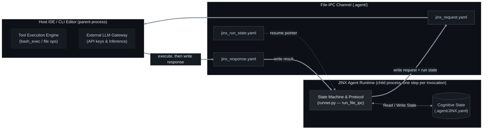
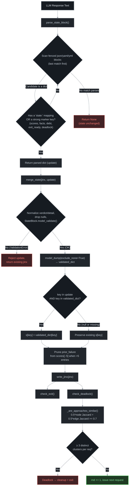
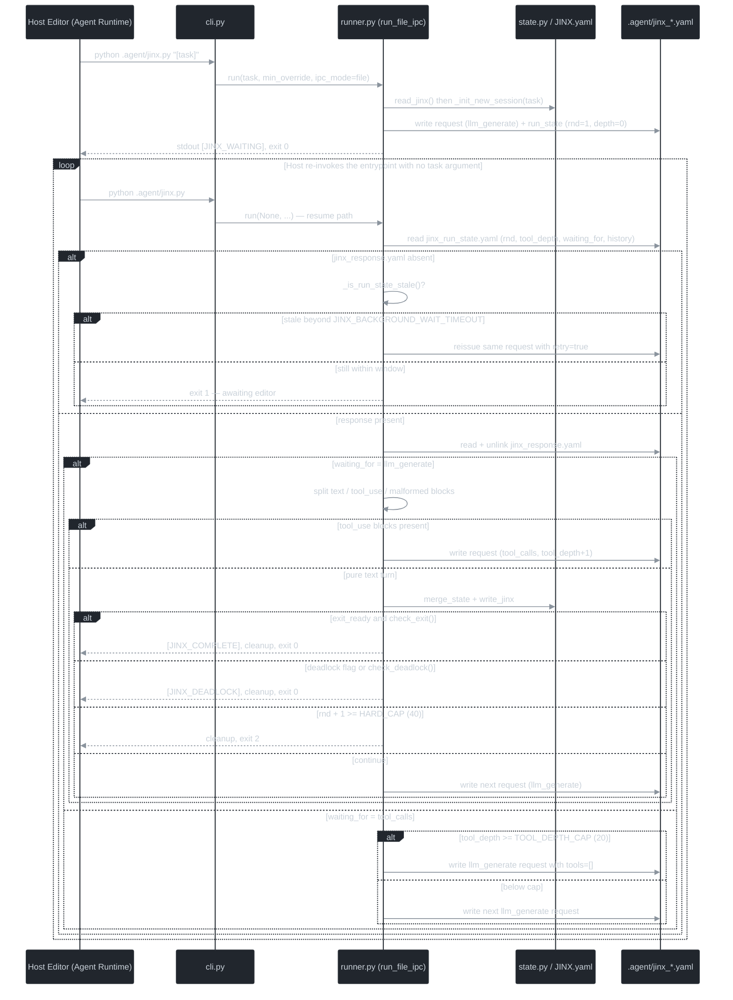
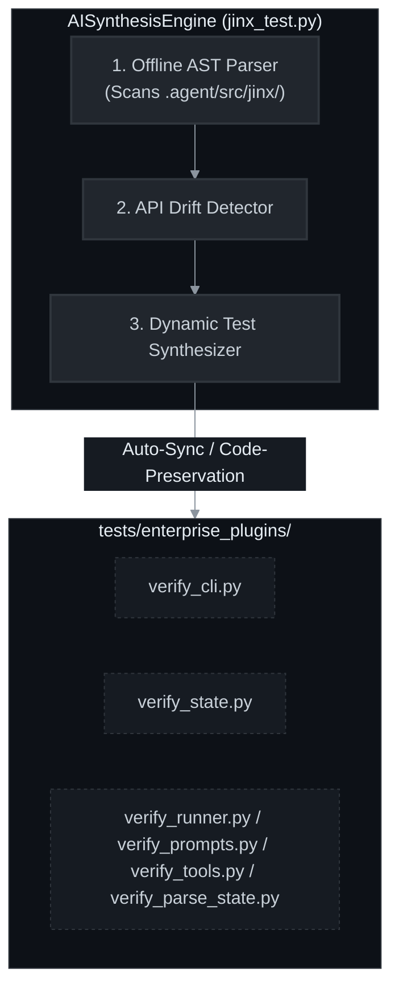

[English](README.md) | [Русский](README_RU.md) | [中文](README_ZH.md)

<p align="center">
  
  
  
  
</p>

<h1 align="center">JINX — Enterprise Sovereign Agent Runtime Specification</h1>

<p align="center">
  <strong>Technical specification for JINX, an isolated, stateful, protocol-driven cognitive loop designed to operate as a child process inside software engineering host environments.</strong>
</p>

---

## 1. Core Architecture & Inter-Process Communication (IPC)

JINX is an agent runtime designed to run inside a host environment (such as an IDE, command-line editor, or corporate orchestrator). The JINX runtime operates without independent network access or direct external service integrations; all external model invocation, file manipulation, and console execution requests are delegated to the host editor.

The runtime exposes **two IPC transports**, selected with the `--ipc` flag:

| Transport | Flag | Status | Mechanism |
| :--- | :--- | :--- | :--- |
| **File-based state machine** | `--ipc file` *(default)* | Primary | YAML request/response/run-state files inside `.agent/` |
| **Duplex stream JSON-RPC** | `--ipc rpc` | Legacy / embedded hosts | Line-delimited JSON over `stdout` / `stdin` |

### 1.1 File-Based IPC (default)

Each `python .agent/jinx.py` invocation performs **exactly one transition** of the state machine and then exits. The entire loop is re-entered by the host re-invoking the entrypoint with no task argument. All continuity lives on disk, so the runtime survives host restarts, editor crashes, and arbitrary process exit codes.

Three files make up the transport, all resolved relative to the `.agent/` directory:

| File | Written by | Purpose |
| :--- | :--- | :--- |
| `.agent/jinx_request.yaml` | JINX | The action JINX wants the host to perform |
| `.agent/jinx_response.yaml` | Host | The result of that action |
| `.agent/jinx_run_state.yaml` | JINX | Round counter, tool depth, message history, and the `waiting_for` pointer |

`stdout` carries only human-readable progress markers (`[JINX_WAITING]`, `[JINX_COMPLETE]`, `[JINX_DEADLOCK]`); all structured diagnostics go to `stderr` via the `jinx.cli` / `jinx.runner` loggers.


```mermaid
%%{init: {'theme': 'base', 'themeVariables': {"darkMode": true, "background": "#0d1117", "primaryColor": "#21262d", "primaryTextColor": "#e6edf3", "primaryBorderColor": "#8b949e", "lineColor": "#8b949e", "textColor": "#e6edf3", "edgeLabelBackground": "#161b22", "mainBkg": "#21262d", "nodeBorder": "#8b949e", "nodeTextColor": "#e6edf3"}}}%%
flowchart LR
    classDef sub fill:#161b22,stroke:#30363d,stroke-dasharray: 3 3,color:#c9d1d9;
    classDef state fill:#21262d,stroke:#30363d,stroke-width:2px,color:#e6edf3;
    classDef yaml fill:#161b22,stroke:#30363d,stroke-width:2px,color:#c9d1d9;

    subgraph JINX["JINX Agent Runtime (child process, one step per invocation)"]
        direction TB
        SM["State Machine & Protocol<br/>(runner.py — run_file_ipc)"]:::state
        DB[("Cognitive State<br/>(.agent/JINX.yaml)")]:::yaml
        SM <-->|"Read / Write State"| DB
    end
    style JINX fill:#0d1117,stroke:#30363d,color:#e6edf3

    subgraph IPC["File-IPC Channel (.agent/)"]
        direction TB
        REQ["jinx_request.yaml"]:::yaml
        RSP["jinx_response.yaml"]:::yaml
        RUN["jinx_run_state.yaml"]:::yaml
    end
    style IPC fill:#0d1117,stroke:#30363d,color:#e6edf3

    subgraph HOST["Host IDE / CLI Editor (parent process)"]
        direction TB
        EXE["Tool Execution Engine<br/>(bash_exec / file ops)"]:::sub
        LLM["External LLM Gateway<br/>(API keys & Inference)"]:::sub
    end
    style HOST fill:#0d1117,stroke:#30363d,color:#e6edf3

    SM ==>|"write request + run state"| REQ
    RUN -.->|"resume pointer"| SM
    RSP ==>|"write result"| SM
    REQ ==> HOST
    HOST ==>|"execute, then write response"| RSP
```

#### Request Contract — `type: llm_generate`

```yaml
type: llm_generate
system: "You are JINX, a single-agent cognitive loop..."   # prompts.SYSTEM_PROMPT
messages:                                                   # compacted history, see below
  - role: user
    content: "ROUND 1 (at least 10 rounds required before exit is considered)\nCURRENT STATE:\n..."
tools:                                                      # tools.tool_schema(); [] on depth-cap recovery
  - name: bash_exec
    description: Execute a bash or shell script in the environment.
    input_schema:
      type: object
      properties:
        script: {type: string, description: The script to execute}
      required: [script]
  - name: file_read
    description: Read the contents of a file.
    input_schema:
      type: object
      properties:
        path: {type: string, description: Path to the file}
        start_line: {type: integer, description: Optional 1-indexed starting line to read (inclusive)}
        end_line: {type: integer, description: Optional 1-indexed ending line to read (inclusive)}
      required: [path]
  - name: file_write
    description: Write or overwrite a file with new content.
    input_schema:
      type: object
      properties:
        path: {type: string, description: Path to the file}
        content: {type: string, description: The full content to write}
      required: [path, content]
processed_tool_use_ids: [call_00, call_01]   # already-executed calls, for editor-side dedupe
tool_result_cache:                          # memoized results, keyed by tool_use_id
  call_00: "85 passed in 0.21s"
retry: false                                  # true when reissued after a stale wait
```

**Expected host response:**

```yaml
content:
  - type: text
    text: "Analyzing codebase structure."
  - type: tool_use
    id: call_123
    name: bash_exec
    input: {script: pytest tests/test_state.py}
```

`content` may also be supplied as a plain string; JINX normalizes it into a single `text` block. Any `tool_use` block that is missing `id`/`name`, or whose `input` is not an object, is rejected and fed back to the model as a `tool_result` error instead of aborting the round.

#### Request Contract — `type: tool_calls`

```yaml
type: tool_calls
calls:
  - id: call_123
    name: bash_exec
    params: {script: pytest tests/test_state.py}
processed_tool_use_ids: []
tool_result_cache:
  call_00: "85 passed in 0.21s"
retry: false
```

**Expected host response:**

```yaml
results:
  - tool_use_id: call_123
    content: "59 passed in 0.14s"
```

#### Run State Contract — `jinx_run_state.yaml`

```yaml
rnd: 7
tool_depth: 2
waiting_for: llm_generate      # llm_generate | tool_calls
min_rounds: 10
updated_at: 1758901234.5       # epoch seconds, written on every state change
processed_tool_use_ids: [call_00, call_01]   # optional, see below
history:                       # bounded window of recent messages
  - {role: user, content: "ROUND 7 ..."}
  - {role: assistant, content: [{type: text, text: "..."}]}
```

On resume the runner requires exactly five keys — `rnd`, `tool_depth`, `history`, `waiting_for` and
`min_rounds` — and treats their absence as an invalid run state. `updated_at` is stamped on every
write and drives stale-wait detection.

`processed_tool_use_ids` is **optional and transient**. The runner appends each executed `tool_use_id`
to it after a tool response is processed, and reads it back when building the next request, but a
fresh `llm_generate` request rewrites the run state without the field. Hosts should therefore treat
the request's `processed_tool_use_ids` as the authoritative signal, and only use the run-state copy to
recover context for a stale retry.

`history` is a **bounded window**, not the whole transcript. The loop survives process boundaries
because each round reloads this window, and the window is advanced past a leading `tool_result` block
and trimmed of a trailing dangling `tool_use` block so the model never receives an orphan tool result
(`compact_history_for_request`). Two independent sizes apply: the run state keeps the newest
`JINX_HISTORY_PERSIST_WINDOW` messages (default **8**), while each `llm_generate` request ships only the
newest `JINX_HISTORY_WINDOW` (default **6**). Nothing ever reads the discarded messages back — exit and
deadlock detection read the score history in `JINX.yaml`, and tool dispatch only needs the most recent
calls — so the run state stays a fixed size instead of growing with every round. When a window is
truncated, the prompt carries a one-line note saying how many messages were elided, so the model does
not mistake the window for the whole session.

#### Stale-Wait Recovery

If `jinx_run_state.yaml` exists but `jinx_response.yaml` does not, the host failed to answer. JINX then calls `_is_run_state_stale()`: a run is stale only when **both** `updated_at` and the mtimes of `jinx_run_state.yaml` / `jinx_request.yaml` are older than `JINX_BACKGROUND_WAIT_TIMEOUT` (default `30` s). A stale run reissues the same request with `retry: true` and an expanded `processed_tool_use_ids` list so the host can return stored results instead of re-executing side effects; a non-stale run exits `1` and waits for the host to retry.

#### Cleanup and Signals

`SIGINT`, `SIGTERM`, and `SIGHUP` are trapped at import time; the handler removes all three IPC files and terminates via `os._exit(1)`. Normal exits call `clean_up_ipc_files()` on every success, deadlock, and hard-cap path, so a stale run state can never block the next session.

### 1.2 Duplex Stream JSON-RPC (`--ipc rpc`)

The legacy transport is preserved for hosts that prefer a single long-lived child process with piped streams. JINX prints one line-delimited JSON object per request and reads one line-delimited JSON object back.

#### `llm_generate`
* **Emitted to `stdout`**:
```json
{
  "jinx_command": "llm_generate",
  "params": {
    "system": "System instructions defining the cognitive boundaries.",
    "messages": [{"role": "user", "content": "Round-specific context."}],
    "tools": [{"name": "bash_exec", "input_schema": {"type": "object"}}]
  }
}
```
* **Expected response on `stdin`**:
```json
{
  "content": [
    {"type": "text", "text": "Analyzing codebase structure."},
    {"type": "tool_use", "id": "call_123", "name": "bash_exec", "input": {"script": "pytest tests/test_state.py"}}
  ]
}
```

#### `bash_exec`
* **Emitted to `stdout`**:
```json
{"jinx_command": "bash_exec", "tool_use_id": "call_123", "params": {"script": "pytest tests/test_state.py"}}
```
* **Expected response on `stdin`**:
```json
{"output": "=== 1 passed in 0.05s ==="}
```

#### `file_read` / `file_write`
* **Emitted to `stdout` (read)**:
```json
{"jinx_command": "file_read", "tool_use_id": "call_124", "params": {"path": "src/core.py", "start_line": 1, "end_line": 80}}
```
* **Expected response on `stdin` (read)**:
```json
{"content": "def run():\n    pass", "sliced": false}
```
* **Emitted to `stdout` (write)**:
```json
{"jinx_command": "file_write", "tool_use_id": "call_125", "params": {"path": "src/core.py", "content": "def run():\n    return True"}}
```
* **Expected response on `stdin` (write)**:
```json
{"output": "Success"}
```

A response is treated as an error when it carries an `error` key or a `status` string containing `error`. The optional `sliced` / `is_sliced` boolean tells JINX that the host already applied the `start_line` / `end_line` window; when it is absent or false, JINX slices the payload itself. Reads are served by a single background stdin reader thread feeding a shared queue, so timeouts never desynchronize the stream.

---

## 2. Cognitive Loop Execution Protocol

The JINX runtime is governed by an iterative loop executed in discrete phases. Standard state properties are preserved across iterations via `JINX.yaml`.


```mermaid
%%{init: {'theme': 'base', 'themeVariables': {"darkMode": true, "background": "#0d1117", "primaryColor": "#21262d", "primaryTextColor": "#e6edf3", "primaryBorderColor": "#8b949e", "lineColor": "#8b949e", "textColor": "#e6edf3", "edgeLabelBackground": "#161b22", "mainBkg": "#21262d", "nodeBorder": "#8b949e", "nodeTextColor": "#e6edf3"}}}%%
flowchart LR
    classDef sub fill:#161b22,stroke:#30363d,stroke-dasharray: 3 3,color:#c9d1d9;
    classDef fail fill:#442326,stroke:#f85149,color:#ff7b72;
    classDef pass fill:#1f3b23,stroke:#56d364,color:#85e89d;

    subgraph P1["Phase I: Scope Intake"]
        A["1. Context & Boundary Parsing"]:::sub --> B["2. Write Scope to state.facts"]:::sub
    end
    style P1 fill:#0d1117,stroke:#30363d,color:#e6edf3

    subgraph P2["Phase II: Hypothesis Generation"]
        C["3. Register Failure History"]:::sub --> D["4. Evaluate Divergent Strategies"]:::sub
    end
    style P2 fill:#0d1117,stroke:#30363d,color:#e6edf3

    subgraph P3["Phase III: Breaker Testing"]
        E["5. Run Boundary Verification"]:::sub --> F["6. Populate requirements Schema"]:::sub
    end
    style P3 fill:#0d1117,stroke:#30363d,color:#e6edf3

    subgraph P4["Phase IV: Evaluation & Exit"]
        G{"7. Check Loop Convergence"}:::sub
        G -->|All Pass| H["Success Exit"]:::pass
        G -->|Failed Approaches >= 3| I["Deadlock Trigger"]:::fail
        G -->|Rounds >= 40| J["Hard Cap Trigger"]:::fail
    end
    style P4 fill:#0d1117,stroke:#30363d,color:#e6edf3

    B --> C
    D --> E
    F --> G
```

### Execution Phases

1. **Phase I: Scope Definition & Intake**
   Before starting file mutations, JINX parses the workspace environment and sets the boundaries of the target task. The validated context is written directly to the `state.facts` list in the configuration manifest `JINX.yaml`.

2. **Phase II: Hypothesis Generation & Divergence**
   If a previous round fails, JINX registers the failure reasons under `state.scores`. In subsequent rounds, JINX evaluates alternative strategies, optionally describing each strategy as an `approach_graph` knowledge graph so that deadlock detection can distinguish genuinely different strategies from superficial rewording. Repeating identical approaches without modification is blocked by protocol rules.

3. **Phase III: Boundary Verification (Breaker Testing)**
   For each strategy, a boundary-testing step ("Breaker Test") must be run. The implementation must be verified against edge cases, exceptional inputs, or performance bounds. The scoring criteria are structured in a binary schema (true/false) under `state.scores[].requirements`.

4. **Phase IV: Multi-Criteria Convergence & Exit**
   After each round, JINX updates the metrics and checks for exit or deadlock conditions:
   * **Exit Condition** (`check_exit`): the current round must be `>= loop.min`, at least 2 score entries must exist, and the **latest** entry must have `all_pass: true`. Once 4 or more entries exist, the best `pass_count` of the last 3 rounds must not exceed the best `pass_count` of everything before them — a still-improving loop is not allowed to exit.
   * **Deadlock Condition** (`check_deadlock`): the round must be `>= loop.min`, and some requirement must have failed across at least **3 semantically distinct strategy clusters**. Or the model may declare `deadlock: true` itself.
   * **Hard Cap**: the execution loop is strictly capped at 40 rounds (`HARD_CAP`); the process then exits with status `2` to prevent unbounded token consumption.
   * **Tool Depth Cap**: a single round may chain at most 20 tool calls (`TOOL_DEPTH_CAP`). On breach JINX injects a recovery instruction and issues one final `llm_generate` with `tools: []`, forcing a state block instead of a truncation.

   `loop.min` is resolved from `protocol.loop.min` in `JINX.yaml` (default **10**) or the `--min` CLI override, and is re-resolved after every successful merge, so a protocol change emitted by the model takes effect mid-session.

### Cognitive Loop Control Flow


```mermaid
%%{init: {'theme': 'base', 'themeVariables': {"darkMode": true, "background": "#0d1117", "primaryColor": "#21262d", "primaryTextColor": "#e6edf3", "primaryBorderColor": "#8b949e", "lineColor": "#8b949e", "textColor": "#e6edf3", "edgeLabelBackground": "#161b22", "mainBkg": "#21262d", "nodeBorder": "#8b949e", "nodeTextColor": "#e6edf3"}}}%%
flowchart TD
    classDef start fill:#161b22,stroke:#8b949e,stroke-width:2px,color:#e6edf3;
    classDef process fill:#21262d,stroke:#30363d,stroke-width:2px,color:#c9d1d9;
    classDef decision fill:#161b22,stroke:#30363d,stroke-width:2px,color:#c9d1d9;
    classDef success fill:#1f3b23,stroke:#56d364,stroke-width:2px,color:#85e89d;
    classDef danger fill:#442326,stroke:#f85149,color:#ff7b72;

    A["LLM Response Text"]:::start --> B["parse_state_block()"]:::process
    B --> C{"Scan fenced json/yaml/yml blocks<br/>(last match first)"}:::decision
    C -->|"Candidate is a dict"| D{"Has a 'state:' mapping<br/>OR a strong marker key?<br/>(scores, facts, debt,<br/>exit_ready, deadlock)"}:::decision
    D -->|"Yes"| E["Return parsed dict (update)"]:::process
    D -->|"No"| C
    C -->|"No match parses"| F["Return None<br/>(state unchanged)"]:::danger

    E --> G["merge_state(jinx, update)"]:::process
    G --> H{"Normalize verdict/detail,<br/>drop nulls,<br/>StateBlock.model_validate()"}:::decision
    H -->|"No (ValidationError)"| I["Reject update,<br/>return existing jinx"]:::danger
    H -->|"Yes (OK)"| J["model_dump(exclude_none=True)<br/>→ validated_dict"]:::process
    J --> K{"key in update<br/>AND key in validated_dict?"}:::decision
    K -->|"Yes"| L["s[key] = validated_dict[key]"]:::process
    K -->|"No (null or missing)"| M["Preserve existing s[key]"]:::process
    L --> N["Prune prior_failure<br/>from scores[:-5] when >5 entries"]:::process
    M --> N
    N --> O["write_jinx(jinx)"]:::process

    O --> P["check_exit()"]:::process
    O --> Q["check_deadlock()"]:::process
    Q --> R["_are_approaches_similar()<br/>0.5*node Jaccard + 0.5*edge Jaccard >= 0.7"]:::process
    R --> S{"≥ 3 distinct<br/>clusters per req?"}:::decision
    S -->|"Yes"| T["Deadlock → cleanup + exit"]:::danger
    S -->|"No"| U["rnd += 1, issue next request"]:::success
```

`task` and `open` are deliberately **excluded** from the strong-marker set: they are common English words, and treating them as evidence would make the parser hijack unrelated YAML examples embedded in the model's reasoning.

### Cognitive Process Sequence Flow


```mermaid
%%{init: {'theme': 'base', 'themeVariables': {"darkMode": true, "background": "#0d1117", "primaryColor": "#21262d", "primaryTextColor": "#e6edf3", "primaryBorderColor": "#8b949e", "lineColor": "#8b949e", "textColor": "#e6edf3", "edgeLabelBackground": "#161b22", "actorBkg": "#21262d", "actorBorder": "#30363d", "actorTextColor": "#c9d1d9", "actorLineColor": "#30363d", "signalColor": "#8b949e", "signalTextColor": "#c9d1d9", "noteBkgColor": "#161b22", "noteBorderColor": "#30363d", "noteTextColor": "#c9d1d9", "labelBoxBkgColor": "#21262d", "labelBoxBorderColor": "#30363d", "labelTextColor": "#c9d1d9", "loopTextColor": "#c9d1d9", "activationBkgColor": "#21262d", "activationBorderColor": "#30363d"}}}%%
sequenceDiagram
    participant Host as Host Editor (Agent Runtime)
    participant CLI as cli.py
    participant Runner as runner.py (run_file_ipc)
    participant State as state.py / JINX.yaml
    participant IPC as .agent/jinx_*.yaml

    Host->>CLI: python .agent/jinx.py "[task]"
    CLI->>Runner: run(task, min_override, ipc_mode=file)
    Runner->>State: read_jinx() then _init_new_session(task)
    Runner->>IPC: write request (llm_generate) + run_state (rnd=1, depth=0)
    Runner-->>Host: stdout [JINX_WAITING], exit 0

    loop Host re-invokes the entrypoint with no task argument
        Host->>CLI: python .agent/jinx.py
        CLI->>Runner: run(None, ...) — resume path
        Runner->>IPC: read jinx_run_state.yaml (rnd, tool_depth, waiting_for, history)

        alt jinx_response.yaml absent
            Runner->>Runner: _is_run_state_stale()?
            alt stale beyond JINX_BACKGROUND_WAIT_TIMEOUT
                Runner->>IPC: reissue same request with retry=true
            else still within window
                Runner-->>Host: exit 1 — awaiting editor
            end
        else response present
            Runner->>IPC: read + unlink jinx_response.yaml
                alt waiting_for = llm_generate
                    Runner->>Runner: split text / tool_use / malformed blocks
                    alt tool_use blocks present
                        Runner->>IPC: write request (tool_calls, tool_depth+1)
                    else pure text turn
                        Runner->>State: merge_state + write_jinx
                        alt exit_ready and check_exit()
                            Runner-->>Host: [JINX_COMPLETE], cleanup, exit 0
                        else deadlock flag or check_deadlock()
                            Runner-->>Host: [JINX_DEADLOCK], cleanup, exit 0
                        else rnd + 1 >= HARD_CAP (40)
                            Runner-->>Host: cleanup, exit 2
                        else continue
                            Runner->>IPC: write next request (llm_generate)
                        end
                    end
            else waiting_for = tool_calls
                alt tool_depth >= TOOL_DEPTH_CAP (20)
                    Runner->>IPC: write llm_generate request with tools=[]
                else below cap
                    Runner->>IPC: write next llm_generate request
                end
            end
        end
    end
```

---

## 3. State Manifest Specification (`JINX.yaml`)

All cognitive progress, failure logs, tasks, and loop settings are serialized to `JINX.yaml`, located in the isolated `.agent` workspace folder. This structure keeps state metadata out of the project repository root.

```yaml
id: JINX
protocol:
  loop:
    min: 10

state:
  task: "PyJWT RS256 token signing implementation"
  facts:
    - "Workspace root verified"
    - "Configuration schema loaded"
  scores:
    - round: 1
      approach: "PyJWT RS256 token signing implementation"
      prior_failure: null
      requirements:
        compile: true
        unit_tests: false
      pass_count: 1
      all_pass: false
      approach_graph:            # optional — enables semantic deadlock clustering
        nodes:
          - {id: "jwt_signer.py", type: file}
          - {id: "pytest", type: tool}
        edges:
          - {source: "pytest", target: "jwt_signer.py", relation: tests}
  debt: []
  open: []
  lessons:                    # optional — durable, cross-run; merged into .agent/lessons.yaml
    - text: "verify the parse before writing a state block"
      kind: rule
      evidence: "an unquoted ':' silently discarded a whole round"
  exit_ready: false
  deadlock: false
```

`lessons` is the only field here that is **not** stored in `JINX.yaml`. It is
routed to the durable ledger described in §4a.1, because `_init_new_session`
resets this block when a new task starts.

### Path Resolution

`JINX.yaml` is located by a three-tier lookup (`_resolve_jinx_path`):

1. `JINX_PATH` environment variable, if set.
2. `.agent/JINX.yaml` next to the installed package (development layout).
3. An upward walk from the current working directory looking for `<dir>/.agent/JINX.yaml`, falling back to `<cwd>/.agent/JINX.yaml`.

### Score Entry Formats

`ScoreEntry` accepts two shapes. The **full** format carries `requirements`, `pass_count`, and `all_pass`. The **simplified** format carries only a verdict and a free-text detail:

```yaml
scores:
  - round: 2
    verdict: fail        # pass | passed | ok | true | 1  → all_pass: true
    detail: "RS256 key loading still fails on rotated keys"   # → approach
```

Both are auto-normalized to the full schema (`requirements: {task_complete: <bool>}`, `pass_count`, `all_pass`, `approach`) before Pydantic validation, so a terse model reply can never be rejected. `round` defaults to `0` and `approach` to `"unspecified"`; `task`, `facts`, `debt`, and `open` are replaced wholesale by whatever the model sends, while `None`-valued keys are ignored so partial updates preserve the rest of the manifest.

`scores` is the exception: it is **merged by round number** rather than replaced (`merge_scores`). An entry whose `round` already exists replaces that stored entry, and rounds absent from the reply are preserved on disk. The model therefore only has to send the current round, while a full re-send remains valid and simply overwrites in place. Merged order is ascending by `round`, and entries without an integer `round` are keyed positionally so they survive the round trip. This removes the previous failure mode where a reply that omitted a round silently deleted it, and it is what lets the prompt stop demanding a full history echo every round.

Two working lists are kept bounded on write. Near-duplicate entries in `facts`, `debt`, and `open` collapse into one — comparison ignores case, punctuation, and whitespace, so `"Doesn't work."` and `"doesnt work"` are the same fact — and `facts` is capped at `JINX_FACTS_CAP` (default **60**) with the oldest entries dropped first, because that list is re-sent every round and is otherwise the dominant per-round cost. Facts stay *replaced* rather than accumulated, so the model can still retract a belief it has since disproved.

When a state block fails validation the previous state is kept and the reason is appended to the next round's prompt instead of being logged and discarded. A rejected block now tells the model that its block was rejected, what the validation error was, and the usual causes (an unquoted `:` or `#` inside a scalar, a tab used for indentation, a key nested one level too deep) — silent rejection previously looked identical to a model that had simply done nothing.

---

## 4. Codebase Component Inventory

The JINX runtime is comprised of the following Python components located in `.agent/` (with core package files under `.agent/src/jinx/`):

* **`jinx.py`** (Entrypoint Bootstrapper, located in `.agent/`):
  Serves as the execution entrypoint. It prepends `.agent/src` to `sys.path` so `import jinx` resolves without a global install, then delegates to the command line parser. Includes an automatic dependency bootstrapper that checks for and automatically installs version-bounded dependencies (`pydantic>=2.0.0`, `pyyaml>=6.0`) via `sys.executable -m pip` if missing, exiting `1` with a manual-install hint on failure.
* **`cli.py`** (Argument Parser):
  Parses inputs using `argparse`. Collects the positional task (joined into a single string) and the optional `--min` round override and `--ipc {file,rpc}` transport override before passing them to the orchestrator. Logging is bound to `stderr` so the transport channel stays clean. A bare invocation with no task is treated as a resume and is only legal when a run state file exists.
* **`runner.py`** (Orchestrator):
  Implements the state machine and both transports. Key responsibilities:
  * `run_file_ipc` — the default single-step state machine: resume detection, stale-wait recovery, response dispatch, and round advancement.
  * `run` — the transport dispatcher. Delegates to `run_file_ipc` when `ipc_mode == "file"`, otherwise runs the legacy long-lived JSON-RPC loop inline.
  * `parse_state_block` — extracts the last valid state block from markdown fences. The language tag is optional, so an untagged fence is parsed too; everything goes through `yaml.safe_load`, which also accepts JSON.
  * `check_exit` / `check_deadlock` / `_are_approaches_similar` — convergence and semantic-clustering logic.
  * `Yaml` — isolated `SafeDumper` with a block-scalar-aware string presenter plus atomic temp-file writes; `HARD_CAP` (40) and `TOOL_DEPTH_CAP` (20) guard rails; signal handlers for IPC cleanup.
* **`state.py`** (Serialization Layer):
  Handles all file operations for the manifest `JINX.yaml`:
  * **Dynamic Path Resolution**: the three-tier `JINX_PATH` / dev-path / upward-walk lookup described in §3.
  * **Hardened Models**: Pydantic schemas `GraphNode`, `GraphEdge`, `ApproachGraph`, `ScoreEntry`, and `StateBlock` built with fault-tolerant defaults so a partially emitted block never raises or drops state.
  * **Atomic Writes**: `atomic_write_yaml` is the single source of truth for staging-file writes, shared by `StateManager.persist_state` and the runner.
  * **Format Normalization**: `_normalize_score_entry` / `_normalize_state_update` convert the simplified `verdict`/`detail` shape and drop `None` values before validation.
* **`tools.py`** (Tool Schema Registry):
  Returns the declarative tool schemas (`bash_exec`, `file_read` with optional `start_line`/`end_line`, `file_write`) shipped in every `llm_generate` request. It performs no I/O.
* **`learning.py`** (Durable Cross-Run Lesson Ledger):
  Makes learning outlive a run. `facts`/`debt`/`open` are per-run working memory and are deliberately truncated to keep per-round cost flat, so without this module the most expensive thing JINX learns is discarded between tasks. The ledger lives in a **separate file**, `.agent/lessons.yaml`, precisely because `_init_new_session` wipes the state block on a new task. Key responsibilities:
  * `add_lessons` — additive and deduplicating: a re-stated rule increments a `seen` counter instead of appending a copy, so a model that restates its rules every round cannot grow the file. Bounded by `JINX_LESSONS_CAP`.
  * `render_lessons` — injects a bounded `LEARNED RULES` block. Bounded by **both** a count (`JINX_LESSONS_INJECT_LIMIT`) and a character budget (`JINX_LESSONS_BUDGET_CHARS`), because characters are what actually cost tokens. Returns the keys of the lessons shown, which is what makes credit assignment possible.
  * `record_outcome` — each round credits or blames the lessons it was actually shown, by whether that round passed. A rule that keeps failing sinks and stops being injected, so the store self-prunes instead of growing. Without this the ledger would be a write-only log.
* **`selfpatch.py`** (Gated Self-Patching):
  Lets JINX edit its own code without letting it remove its own brakes. `file_write` accepts a bare string path, so the model has always been able to rewrite `.agent/src/jinx/*.py` — and has, which is how this repository's own release work happens. Nothing used to check whether the result still worked. This module adds that check:
  * **Verify and roll back** — `capture_baseline` copies the source tree, `baseline_changed` diffs it, and `restore_baseline` reverts. After any round that touched framework source, `verify` runs `pytest` **and** the full `jinx_test` suite; if either fails the edit is undone and the failure output is fed back to the model. A failed attempt costs one round instead of the whole run. The baseline lives for the whole run, not one round: it is captured when the run starts, kept while a round changes nothing, and re-captured after a verified edit is adopted. It is dropped on a clean finish, and deliberately **kept** on an error exit, because that is what lets the next invocation repair the damage.
  * **Bootstrap preflight** — the same check runs once more in `.agent/jinx.py` before JINX is imported, loading `selfpatch.py` directly from its path. Without this, a self-edit that leaves a syntax error would stop the framework from starting at all, and the gate designed to catch exactly that would be unable to run. With no baseline on disk there is nothing to compare against, so a broken tree fails loudly instead of being silently overwritten.
  * **Brake protection** — `guard_tool_call` refuses a write that would redefine `merge_state`, `StateBlock`, `atomic_write_yaml`, `_resolve_jinx_path`, `check_exit`, `check_deadlock`, `_resolve_min_rounds`, `_handle_llm_response`, or `SYSTEM_PROMPT`, and treats `selfpatch.py` and `learning.py` as wholly off limits. Refusal happens **before** dispatch, not after, so the model is told it was refused instead of concluding verification is broken. Protection compares the *bodies* of those definitions against what is on disk, not merely their presence, so rewriting a whole protected file is allowed as long as the brake itself is byte-identical. Weakening, rewriting or deleting a brake is refused, and so are the sneakier variants: appending a second definition that shadows the protected one at import time, or editing the file through `bash_exec`, which never passes the guard at all. The gate therefore re-runs the same comparison against the on-disk files and the baseline *before* verification, and a brake touched that way is rolled back without being tested: a green suite cannot justify changing the code that decides what a green suite means.
* **`prompts.py`** (Prompt Templates):
  Holds `SYSTEM_PROMPT`, the `MISSING_STATE_WARNING` injected when a round omits its state block, the `TOOL_DEPTH_CRITICAL_MSG` recovery directive, and `construct_round_prompt()`.

### Runtime Environment Variables

| Variable | Default | Applies to | Purpose |
| :--- | :--- | :--- | :--- |
| `JINX_PATH` | *(auto)* | both | Explicit path to `JINX.yaml` |
| `JINX_IPC_TIMEOUT` | `10` | `--ipc rpc` | Seconds to wait per stdin read attempt |
| `JINX_IPC_RETRIES` | `3` | `--ipc rpc` | Read attempts before raising `IPCError` |
| `JINX_IPC_BACKOFF` | `1.0` | `--ipc rpc` | Seconds between read attempts |
| `JINX_BACKGROUND_WAIT_TIMEOUT` | `30` | `--ipc file` | Seconds before an unanswered run is considered stale |
| `JINX_HISTORY_WINDOW` | `6` | both | Messages shipped in each `llm_generate` request |
| `JINX_HISTORY_PERSIST_WINDOW` | `8` | both | Messages retained in `jinx_run_state.yaml` |
| `JINX_FACTS_CAP` | `60` | both | Max `facts` entries kept; oldest dropped first |
| `JINX_KEEP_IPC_ON_SIGNAL` | *(unset)* | both | Set to `1` to keep IPC files on Ctrl+C for inspection |
| `JINX_TOOL_RESULT_CACHE_CAP` | `64` | both | Max memoized tool results kept; oldest evicted |

---

## 4a. Self-Improvement: Two Distinct Capabilities

JINX can improve itself, but "self-improvement" covers two very different things with very different risk profiles. Conflating them is the main design mistake available here, so they are kept separate.

### 4a.1 Durable Lessons — always safe, and the higher-value half

Everything JINX already learned (`prior_failure`, `approach_graph`, `facts`/`debt`/`open`) is **per-run** and deliberately truncated to hold per-round cost flat — `facts` at 60 entries, `prior_failure` to the last 5 rounds. So the most expensive thing it learns is thrown away between tasks, and every new task starts from zero.

The `lessons` field in the state block fixes that. Lessons are:

* **Additive.** Unlike `facts`/`debt`/`open`, which are *replaced* by whatever the model sends each round, lessons are merged. Send only new ones.
* **Durable.** They are written to `.agent/lessons.yaml`, a separate file, because starting a new task calls `_init_new_session`, which resets the state block. Wiping lessons there would make the store decay at exactly the rate of the state it is meant to outlast.
* **Credit-assigned.** Each round, the lessons that were actually injected are credited or blamed according to whether that round passed. Proven rules float up; rules that keep failing stop being shown. This is what makes it learning rather than a log, and it is also what keeps the store bounded.

Because they survive into later tasks, a lesson must be a general, reusable imperative rather than a note about the current task:

```yaml
lessons:
  - text: "state blocks are validated as one unit, so never leave approach_graph half-filled"
    kind: antipattern        # rule | skill | antipattern (inferred if omitted)
    evidence: "round 2 was rejected wholesale for one incomplete edge"
```

`kind` is optional and inferred from the wording when absent. `evidence` is optional.

To reset what JINX believes it has learned, delete `.agent/lessons.yaml`.

### 4a.2 Gated Self-Patching — powerful, and verified

JINX may edit its own code under `.agent/src/jinx/*.py` to improve its results, and for framework work this is often the *right* strategy rather than a workaround. The gate exists because of what was previously missing: a check that the result still works.

After any round that writes to framework source, the runner:

1. runs `pytest` **and** the full `scripts/jinx_test.py` suite, stopping at the first failure;
2. keeps the edit if both pass;
3. otherwise **reverts the source tree** and feeds the failure output back into the next round's prompt, so a failed attempt produces evidence instead of a silently broken framework.

Separately, a write that would redefine the brake logic is **refused before dispatch** — not written and then undone — so the model is told it was refused rather than concluding that verification is broken. Protected: `merge_state`, `StateBlock`, `atomic_write_yaml`, `_resolve_jinx_path`, `check_exit`, `check_deadlock`, `_resolve_min_rounds`, `_handle_llm_response`, and `SYSTEM_PROMPT`; `selfpatch.py` and `learning.py` are off limits entirely.

**Why the guard is not optional.** `file_write` has no path restrictions, and the model can already merge a `protocol` block into the manifest, which re-resolves `min_rounds` mid-session. Autonomous self-modification without a brake-removal guard would make "the agent improved itself" and "the agent removed the logic that would have noticed" indistinguishable — and the second is prompt-injectable from any task.

Set `JINX_ALLOW_PROTECTED_EDITS=1` to permit protected edits. That is a deliberate human override, not something for the agent to set for itself.

| Variable | Default | Applies to | Purpose |
| :--- | :--- | :--- | :--- |
| `JINX_SELF_PATCH` | `1` | both | Set to `0` to disable the verify-and-revert gate and lesson injection entirely |
| `JINX_SELF_PATCH_TIMEOUT` | `600` | both | Seconds allowed for each verification suite before it counts as a failure |
| `JINX_SELF_PATCH_BASELINE` | `.agent/.selfpatch_baseline` | both | Where the throwaway pre-edit source copy lives |
| `JINX_ALLOW_PROTECTED_EDITS` | `0` | both | `1` permits edits to protected brake logic. Human override only |
| `JINX_LESSONS_CAP` | `40` | both | Max stored lessons; oldest evicted first |
| `JINX_LESSONS_INJECT_LIMIT` | `12` | both | Max lessons injected into a round prompt |
| `JINX_LESSONS_BUDGET_CHARS` | `1200` | both | Character budget for the injected block |
| `JINX_LESSONS_PATH` | `.agent/lessons.yaml` | both | Location of the durable lesson ledger |

---

## 5. Host Integration & Subprocess Implementation Guide

To integrate JINX, the host editor or corporate orchestrator must spawn the JINX execution command as a child process and drive the request/response loop.

### Spawning Specification
* **Command**: `python .agent/jinx.py "[TASK_DESCRIPTION]"` to start, `python .agent/jinx.py` to resume.
* **Process Configuration**: run with text-mode pipes. The host owns no in-memory state — everything needed to continue the loop is on disk.
* **Loop Mechanics**: after each invocation, read `.agent/jinx_request.yaml`. Dispatch on `type`, execute, write `.agent/jinx_response.yaml`, and re-invoke with no task argument. The loop ends when `jinx_request.yaml` no longer appears.

### Host Integration Python Example

The following script implements the host-side File-IPC execution protocol:

```python
import subprocess
import sys
from pathlib import Path
from typing import Any, Dict, List

import yaml

AGENT = Path(".agent")
REQUEST = AGENT / "jinx_request.yaml"
RESPONSE = AGENT / "jinx_response.yaml"
RUN_STATE = AGENT / "jinx_run_state.yaml"


def current_round() -> int:
    """The round JINX is asking about, read from the run state it just wrote.

    The manifest merges `scores` by round number, so the host only ever sends the
    round it is currently answering; earlier rounds are already on disk.
    """
    state = yaml.safe_load(RUN_STATE.read_text(encoding="utf-8")) or {}
    return int(state.get("rnd", 1))


def spawn(task: str | None = None) -> subprocess.CompletedProcess:
    """One JINX transition. Returns immediately after a request is written."""
    argv = [sys.executable, str(AGENT / "jinx.py")]
    if task:
        argv.append(task)
    return subprocess.run(argv, text=True, capture_output=True, check=False)


def call_llm(request: Dict[str, Any]) -> Dict[str, Any]:
    """Route `system` / `messages` / `tools` to your inference gateway.

    Replace the body with a real gateway call. This stub reads one file on the
    first round, then reports a state block, so the loop below actually reaches
    [JINX_COMPLETE] instead of requesting tools forever.
    """
    already_ran_a_tool = any(
        isinstance(m, dict) and isinstance(m.get("content"), list)
        and any(isinstance(b, dict) and b.get("type") == "tool_result"
                for b in m["content"])
        for m in request.get("messages", [])
    )
    if not already_ran_a_tool:
        return {"content": [
            {"type": "text", "text": "Inspecting the workspace."},
            {"type": "tool_use", "id": "call_01", "name": "file_read",
             "input": {"path": ".agent/src/jinx/state.py"}},
        ]}
    return {"content": [{"type": "text", "text": (
        "Read the manifest module.\n\n"
        "```yaml\nid: JINX\nstate:\n"
        "  task: Update the auth schema\n"
        "  facts:\n    - Inspected src/jinx/state.py\n"
        # Only this round's entry. merge_scores() keeps every earlier round, so
        # the manifest accumulates distinct rounds and check_exit can complete.
        f"  scores:\n    - round: {current_round()}\n"
        "      approach: Read the manifest module\n"
        "      requirements:\n        task_complete: true\n"
        "      pass_count: 1\n      all_pass: true\n"
        "  debt: []\n  open: []\n  exit_ready: true\n  deadlock: false\n```"
    )}]}


def run_tool(name: str, params: Dict[str, Any]) -> str:
    if name == "bash_exec":
        return subprocess.run(
            params["script"], shell=True, text=True,
            stdout=subprocess.PIPE, stderr=subprocess.STDOUT,
        ).stdout
    if name == "file_read":
        lines = Path(params["path"]).read_text(encoding="utf-8").splitlines()
        start = max(1, int(params.get("start_line", 1)))
        end = int(params.get("end_line", len(lines)))
        return "\n".join(lines[start - 1:end])
    if name == "file_write":
        target = Path(params["path"])
        target.parent.mkdir(parents=True, exist_ok=True)
        target.write_text(params["content"], encoding="utf-8")
        return "Success"
    return f"Error: unknown tool '{name}'"


def dispatch(request: Dict[str, Any]) -> None:
    """Write the response JINX is blocked on."""
    if request.get("type") == "llm_generate":
        response = call_llm(request)
    else:  # type == "tool_calls"
        # Replay memoized results instead of repeating the side effect. A call id
        # alone is not enough: the cache carries what the call actually produced.
        cache = request.get("tool_result_cache") or {}
        done: List[Dict[str, str]] = []
        for call in request.get("calls", []):
            cid = call["id"]
            if cid in cache:
                done.append({"tool_use_id": cid, "content": cache[cid]})
                continue
            done.append({
                "tool_use_id": cid,
                "content": run_tool(call["name"], call.get("params") or {}),
            })
        response = {"results": done}
    RESPONSE.write_text(yaml.safe_dump(response, sort_keys=False), encoding="utf-8")


def execute_jinx(task_description: str) -> int:
    result = spawn(task_description)
    if result.returncode != 0:
        return result.returncode  # 1 = awaiting editor, 2 = HARD_CAP exhausted

    while REQUEST.exists():
        request = yaml.safe_load(REQUEST.read_text(encoding="utf-8"))
        REQUEST.unlink()          # consume the request before writing the response
        dispatch(request)

        result = spawn()          # resume: no task argument
        if result.returncode != 0:
            return result.returncode

    # No request pending: JINX printed [JINX_COMPLETE] or [JINX_DEADLOCK].
    return 0


if __name__ == "__main__":
    print(f"JINX terminated with code: {execute_jinx('Update the auth schema')}")
```

> **Note**: never delete `jinx_run_state.yaml` between iterations — it is JINX's only pointer to the current round, tool depth, and message history.

**Dispatch table:**

| `type` | Read from request | Write to response |
| :--- | :--- | :--- |
| `llm_generate` | `system`, `messages`, `tools` | `content:` list of `text` / `tool_use` blocks |
| `tool_calls` | `calls[]` with `id`, `name`, `params` | `results[]` with `tool_use_id`, `content` |

Both request types carry `tool_result_cache`, a map of `tool_use_id` to the result that call produced. The runner records every result it receives and persists the map (bounded by `JINX_TOOL_RESULT_CACHE_CAP`, default **64**, oldest evicted), so a later request — including a `retry: true` reissue after a stale wait — can be answered from memory.

This is what makes `processed_tool_use_ids` sufficient. The id list alone tells the host *that* a call already ran but not *what it returned*, so the only safe response was to skip the call and drop its output — losing the result the model needed. With the cache the host can replay the exact stored content under the same `tool_use_id` and the side effect is not repeated. Hosts should therefore check `tool_result_cache` first and fall back to `processed_tool_use_ids` only if a cache is unavailable, since a call may legitimately be re-requested later with a different parameter set.

---

## 6. Post-Integration Developer Workflow

Once JINX is successfully launched and the File-IPC handshake is driven by the host, the developer's interaction with the runtime operates on an audit-and-intervention model.

### Real-Time Diagnostics
During execution, the developer does not need to actively manage the loop. Progress is observable through the following channels:
1. **State Manifest Auditing**:
   Open `.agent/JINX.yaml` in the editor. It is rewritten atomically at the end of every round. The `state` section acts as a live dashboard:
   * **`facts`**: Tracks all extracted domain properties currently assumed by the agent.
   * **`scores`**: Records the metrics and outcomes of each approach round-by-round, including `prior_failure` and any `approach_graph`.
   * **`debt`**: Lists any trade-offs or shortcuts documented by the agent.
   * **`open`**: Lists unresolved items carried into the next round.
2. **Run State Auditing**:
   `.agent/jinx_run_state.yaml` exposes `rnd`, `tool_depth`, `waiting_for`, and the recent message window, which is ideal for tracing exactly what the model was last told and what it did. For the complete record of what was attempted, read the `scores` history in `JINX.yaml` — that is lossless and unbounded by design, and it is the authoritative audit trail.
3. **Standard Output / Error Logs**:
   The host surfaces JINX's stdout progress markers and the `stderr` log stream (`[jinx.cli]`, `[jinx.runner]`, `[jinx.state]`) in a native UI tab.

### Handling Pause and Deadlock Interventions
JINX halts execution automatically when protocol limits are hit, requesting human oversight.
* **Deadlock Triggering**:
  If the same requirement fails across 3 semantically distinct strategy clusters, `deadlock` is forced to `true` in the manifest, `[JINX_DEADLOCK]` is printed, IPC files are removed, and the process exits `0` (the loop terminated deliberately, not by error — inspect the manifest to distinguish it from a successful `[JINX_COMPLETE]`).
* **Hard Cap Triggering**:
  After 40 rounds the process exits `2` without cleanup markers being relied upon; IPC files are still removed.
* **Manual Correction Workflow**:
  1. Inspect `.agent/JINX.yaml` to identify the failing requirement and the approach history.
  2. Resolve the blocking issue in the code, or correct the environment (database seeds, fixtures, tool availability).
  3. Optionally hand-edit the `state` properties in `JINX.yaml` (facts, debt, open issues).
   4. Restart from the CLI. A bare `python .agent/jinx.py` **resumes only when `jinx_run_state.yaml` still exists** — it is the flag that marks a run as unfinished. That file is removed on `[JINX_COMPLETE]`, `[JINX_DEADLOCK]`, and after the hard cap, so once a run has terminated a bare restart exits `1` with "Cannot start new session without a task description" rather than resuming. `JINX.yaml` itself is *not* deleted and stays readable as an audit record, but supplying a task calls `_init_new_session`, which resets `facts`, `scores`, `debt`, and `open` — so a new task starts from a clean slate and the previous evaluations are gone from the manifest. To continue interrupted work, leave the run-state in place and either fix the blocking cause and re-run bare, or hand-edit the manifest first.

### Session Verification and Commit
Once the loop satisfies all exit criteria, JINX prints `[JINX_COMPLETE] Task resolved successfully!` and exits `0`.
1. **Review Diff**: Inspect the file modifications produced in the workspace.
2. **Clear/Archive State**: The state metadata in `.agent/JINX.yaml` persists as context for the next task; the transient `jinx_request.yaml`, `jinx_response.yaml`, and `jinx_run_state.yaml` are removed automatically.

---

## 7. machineGPT Pluggable Verification & AI Synthesis Engine

To guarantee schema conformance and structural stability of JINX, a unified super test suite lives at `scripts/jinx_test.py`. It combines static environment auditing and unit regression testing with a fully automated, self-healing dynamic AI Synthesis Engine.


```mermaid
%%{init: {'theme': 'base', 'themeVariables': {"darkMode": true, "background": "#0d1117", "primaryColor": "#21262d", "primaryTextColor": "#e6edf3", "primaryBorderColor": "#8b949e", "lineColor": "#8b949e", "textColor": "#e6edf3", "edgeLabelBackground": "#161b22", "mainBkg": "#21262d", "nodeBorder": "#8b949e", "nodeTextColor": "#e6edf3"}}}%%
flowchart TD
    classDef sub fill:#161b22,stroke:#30363d,stroke-dasharray: 3 3,color:#c9d1d9;
    classDef standard fill:#21262d,stroke:#30363d,stroke-width:2px,color:#c9d1d9;

    subgraph Engine["AISynthesisEngine (jinx_test.py)"]
        AST["1. Offline AST Parser<br/>(Scans .agent/src/jinx/)"]:::standard
        DIFF["2. API Drift Detector"]:::standard
        GEN["3. Dynamic Test Synthesizer"]:::standard
        AST --> DIFF --> GEN
    end
    style Engine fill:#0d1117,stroke:#30363d,color:#e6edf3

    subgraph Plugins["tests/enterprise_plugins/"]
        V_CLI["verify_cli.py"]:::sub
        V_STATE["verify_state.py"]:::sub
        V_OTHER["verify_runner.py / verify_prompts.py / verify_tools.py / verify_parse_state.py"]:::sub
    end
    style Plugins fill:#0d1117,stroke:#30363d,color:#e6edf3

    GEN -->|"Auto-Sync / Code-Preservation"| Plugins
```

### Core Testing Pillars
The orchestrator runs **diagnostic phases grouped into primary verification pillars** (with additional phases and pillars under `--stress`). The four static pillars run first, followed by one AI-synthesized phase per discovered core module:

1. **Platform & Environment Audit**: Validates runtime constraints, Python dependencies (Pydantic, PyYAML, Pytest), and file path resolutions.
2. **Schema & Model Conformance**: Stresses Pydantic model serialization and full state-block round-trip cycles (including `ApproachGraph` nodes and edges) through `.agent/JINX.yaml`.
3. **Graph Similarity & Stress Testing**: Exercises Jaccard clustering, deadlock detection, and similarity scaling thresholds under extreme topological conditions.
4. **Pytest Integration Regressions**: Natively triggers the entire `tests/` unit regression suite.
5. **AI-Synthesized Dynamic Verification (Pluggable)**: Scans `.agent/src/jinx/` via Abstract Syntax Trees and compiles class, method, and function presence checks into `tests/enterprise_plugins/verify_<module>.py` — one phase per module (`cli`, `runner`, `state`, `tools`, `prompts`, `parse_state`).
6. **Cognitive Loop Scale & Performance Stress Profiling (`--stress`)**: Simulates 500-node/499-edge `ApproachGraph`s, profiles full Pydantic cycle and YAML dump/load throughput, and simulates 100-way disjoint-clustering deadlock scenarios within tight sub-millisecond budgets.

### Code Preservation Boundary Protocols
Developers and AI agents can extend any dynamic test module under `tests/enterprise_plugins/verify_<module>.py` without worrying about their manual assertions being overwritten during auto-sync runs. Custom testing logic placed inside designated boundary comments is strictly preserved:
```python
# ==============================================================================
# <CUSTOM_CODE_START>
# Add custom assertions and execution tests below. They will be preserved.
def custom_validation_rules(suite):
    # Your manual custom testing assertions go here
    assert True
# <CUSTOM_CODE_END>
# ==============================================================================
```

### Test Suite CLI Arguments
The test suite can be run from the repository root:

| Flag | Effect |
| :--- | :--- |
| *(none)* | Run the full verification cycle and render the status dashboard |
| `--ai-list` | Print the discovered module inventory, their classes/functions, and plugin coverage status |
| `--ai-sync` | Force full AST compilation and sync/regeneration of the plugin modules |
| `--stress` | Enable the extra stress/performance phase |
| `--output PATH` | Override the JSON report destination (default `tests/jinx_test_report.json`) |
| `--verbose` | Emit detailed per-check output |

```bash
python scripts/jinx_test.py
python scripts/jinx_test.py --ai-list
python scripts/jinx_test.py --ai-sync
python scripts/jinx_test.py --stress
python -m pytest -q          # 59 regression tests in tests/
```

---

## 8. Integration Protocol for Anthropic Claude Code CLI Host Environment

The JINX architectural specification defines runtime deployment as a managed core within the official **Anthropic Claude Code CLI** console development environment. Under this orchestration scheme, Claude Code assumes the role of the parent orchestration host, translating JINX's logical steps into external services and the local file system.

The orchestration host manages:
1. Interception of incoming user requests.
2. Routing requests to external inference gateways (Claude via the Anthropic API).
3. Executing JINX declarative directives for file read, write, and system command execution.
4. Feeding results back into the JINX cognitive loop via the File-IPC mechanism.

In this repository, `CLAUDE.md` is configured to automatically and unconditionally route all user messages, greetings, and tasks through JINX to ensure the automated orchestration loop works seamlessly. If you prefer to manually invoke JINX, you can edit `CLAUDE.md` to restrict it to explicit requests only.

### Security and Interactive Execution Authorization

By default, the Claude Code CLI security model requires interactive operator confirmation for each file modification and shell command execution.

> [!TIP]
> **Recommended Secure Setup**: We strongly recommend keeping interactive prompts enabled. This ensures you explicitly review and approve every change JINX proposes before it is executed on your system.

#### OPTIONAL: Non-Interactive Sandbox Mode (For isolated or trust-verified environments)

If you prefer a fully automated, non-blocking cognitive loop (e.g., in a secure, isolated development container, sandboxed virtual machine, or CI/CD runner), you can opt to configure Claude's global settings to auto-approve file edits and specific shell patterns.

> [!CAUTION]
> **CRITICAL SECURITY WARNING**: Enabling `"defaultMode": "acceptEdits"` and auto-approving shell commands disables Claude Code's interactive confirmation prompts. This allows JINX (and any other agent running in this workspace) to read, write, and execute arbitrary commands on your host system without asking for confirmation. Do NOT configure these settings on your main host or in untrusted project environments.

The global settings configuration file is located at the universal path mapped to the active user profile's home directory:
* **Windows OS**: `%USERPROFILE%\.claude\settings.json` (resolves to `C:\Users\<Active_User_Account>\.claude\settings.json` dynamically)
* **macOS / Linux**: `~/.claude/settings.json` (resolves to `/home/<username>/.claude/settings.json`)

#### System Directives to Initialize or Modify the Configuration Profile:

To initialize or edit the security profile under your active user context, execute the appropriate shell command:

* **Windows (PowerShell)**:
  ```powershell
  notepad "$env:USERPROFILE\.claude\settings.json"
  ```
* **Windows (Command Prompt - CMD)**:
  ```cmd
  notepad %USERPROFILE%\.claude\settings.json
  ```
* **macOS / Linux (Terminal)**:
  ```bash
  nano ~/.claude/settings.json
  ```

Insert the following declarative permissions block into the JSON configuration file (wrap in a root `{}` object if the file is being newly created):

```json
{
  "permissions": {
    "defaultMode": "acceptEdits",
    "allow": [
      "Bash(python *)"
    ]
  }
}
```

#### Functional Purpose of Authorization Parameters (for Non-Interactive Mode):
| Parameter | Value Type | Architectural Description & Functional Purpose |
| :--- | :--- | :--- |
| `"defaultMode": "acceptEdits"` | `string` | Configures the host's file sandbox to auto-approve modifications. Allows JINX to perform non-blocking reads and writes of IPC files (`.agent/jinx_request.yaml`, `.agent/jinx_response.yaml`, `.agent/jinx_run_state.yaml`) and target software assets. |
| `"allow": ["Bash(python *)"]` | `array[string]` | Declarative whitelist of terminal command patterns. Permits the host to launch and execute the JINX orchestrator (`python .agent/jinx.py`) without waiting for manual operator approval. |

### Session Launch and Message Routing Procedure

1. Initialize the Claude Code CLI session within the project root directory:
   ```bash
   claude
   ```
2. To start a task with JINX, prefix your request or ask Claude explicitly to run JINX:
   * *“JINX: Add division to calc.py and verify with unit tests”*
   * *“Please run JINX to implement division”*

Following the developer's instruction, the host bootstraps the JINX orchestrator via `python .agent/jinx.py "[request]"`, drives the File-IPC handshake until `.agent/jinx_request.yaml` disappears, and reports the terminal marker (`[JINX_COMPLETE]`, `[JINX_DEADLOCK]`, or exit code `2`).

---

## Web Agent

A React + Express + Vite dashboard for live visualization of the cognitive loop lives in `.agent/webagent/`.

```bash
cd .agent/webagent
npm install
npm run dev          # http://localhost:3301
```

See [`README.md`](.agent/webagent/README.md) · [`README_RU.md`](.agent/webagent/README_RU.md) · [`README_ZH.md`](.agent/webagent/README_ZH.md) for the full dashboard guide, environment variables, and API surface.


