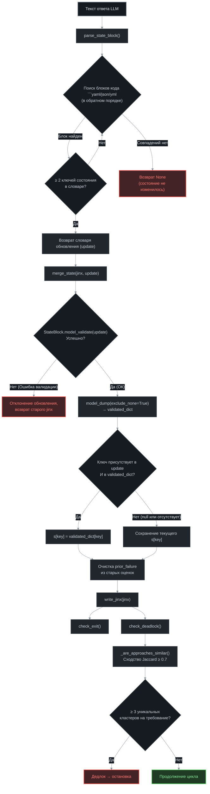
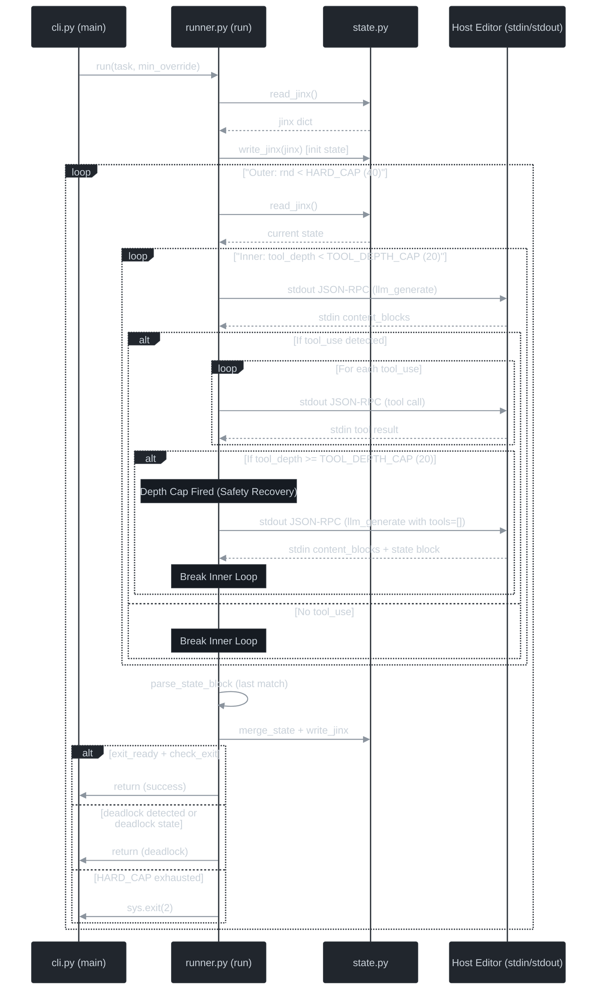
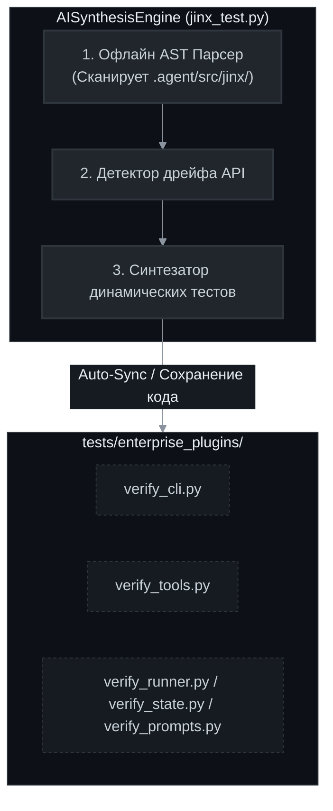

[English](README.md) | [Русский](README_RU.md) | [中文](README_ZH.md)

<p align="center">
  
  
  
  
</p>

<h1 align="center">JINX — Спецификация Среды Выполнения Суверенного Корпоративного Агента</h1>

<p align="center">
  <strong>Техническая спецификация JINX, изолированного, сохраняющего состояние, управляемого протоколом когнитивного цикла, предназначенного для работы в качестве дочернего процесса внутри хост-среды разработки ПО.</strong>
</p>

---

## 1. Базовая архитектура и межпроцессное взаимодействие (IPC)

JINX представляет собой среду выполнения агента, спроектированную для запуска внутри хост-окружения (такого как IDE, консольный текстовый редактор или корпоративный оркестратор). Среда выполнения JINX функционирует без автономного сетевого доступа или встроенных интеграций с внешними сервисами; все запросы на вызов моделей, манипуляции с файлами и выполнение консольных команд делегируются хост-редактору через стандартный ввод (`stdin`) и стандартный вывод (`stdout`) с использованием структурированных пакетов обмена данными в формате JSON-RPC.

```mermaid
%%{init: {'theme': 'base', 'themeVariables': {"darkMode": true, "background": "#0d1117", "primaryColor": "#21262d", "primaryTextColor": "#e6edf3", "primaryBorderColor": "#8b949e", "lineColor": "#8b949e", "textColor": "#e6edf3", "edgeLabelBackground": "#161b22", "mainBkg": "#21262d", "nodeBorder": "#8b949e", "nodeTextColor": "#e6edf3"}}}%%
flowchart LR
    classDef sub fill:#161b22,stroke:#30363d,stroke-dasharray: 3 3,color:#c9d1d9;
    classDef state fill:#21262d,stroke:#30363d,stroke-width:2px,color:#e6edf3;
    classDef yaml fill:#161b22,stroke:#30363d,stroke-width:2px,color:#c9d1d9;

    subgraph JINX["Среда Выполнения JINX (Дочерний процесс)"]
        direction TB
        SM["Стейт-машина и Протокол<br/>(runner.py)"]:::state
        DB[("Локальное Состояние<br/>(.agent/JINX.yaml)")]:::yaml
        SM <-->|"Чтение / Запись Состояния"| DB
    end
    style JINX fill:#0d1117,stroke:#30363d,color:#e6edf3

    subgraph HOST["Хост-IDE / CLI-Редактор (Родительский процесс)"]
        direction TB
        EXE["Движок Выполнения Инструментов<br/>(bash_exec / операции с файлами)"]:::sub
        LLM["Внешний Шлюз LLM<br/>(API-ключи и Инференс)"]:::sub
    end
    style HOST fill:#0d1117,stroke:#30363d,color:#e6edf3

    SM ==>|"stdout (Пакеты JSON-RPC)<br/>jinx_command: llm_generate | bash_exec | file_read | file_write"| HOST
    HOST ==>|"stdin (Ответные Пакеты)<br/>{content: ...} | {output: ...}"| SM
```



### Спецификация взаимодействия по протоколу JSON-RPC

При выполнении действия JINX выводит структурированный объект JSON в `stdout`, завершающийся символом новой строки. Хост-среда считывает этот объект из потока процесса, выполняет запрашиваемое действие и возвращает ответ в виде JSON-строки в `stdin` JINX, также завершающийся символом новой строки.

#### 1. Запрос генерации LLM (`llm_generate`)
JINX делегирует выполнение вызова LLM хосту.
* **Пакет, отправляемый в `stdout`**:
```json
{
  "jinx_command": "llm_generate",
  "params": {
    "system": "Системные инструкции, определяющие когнитивные границы.",
    "messages": [{"role": "user", "content": "Контекст конкретного раунда выполнения."}],
    "tools": [
      {
        "name": "bash_exec",
        "description": "Execute a bash or shell script in the environment.",
        "input_schema": {
          "type": "object",
          "properties": {
            "script": {"type": "string", "description": "The script to execute"}
          },
          "required": ["script"]
        }
      },
      {
        "name": "file_read",
        "description": "Read the contents of a file.",
        "input_schema": {
          "type": "object",
          "properties": {
            "path": {"type": "string", "description": "Path to the file"}
          },
          "required": ["path"]
        }
      },
      {
        "name": "file_write",
        "description": "Write or overwrite a file with new content.",
        "input_schema": {
          "type": "object",
          "properties": {
            "path": {"type": "string", "description": "Path to the file"},
            "content": {"type": "string", "description": "The full content to write"}
          },
          "required": ["path", "content"]
        }
      }
    ]
  }
}
```
* **Ожидаемый ответ хоста на `stdin`**:
```json
{
  "content": [
    {"type": "text", "text": "Анализ структуры кодовой базы."},
    {"type": "tool_use", "id": "call_123", "name": "bash_exec", "input": {"script": "pytest tests/test_core.py"}}
  ]
}
```

#### 2. Запуск команд консоли (`bash_exec`)
JINX запрашивает у хоста выполнение команды в консоли.
* **Пакет, отправляемый в `stdout`**:
```json
{
  "jinx_command": "bash_exec",
  "tool_use_id": "call_123",
  "params": {
    "script": "pytest tests/test_core.py"
  }
}
```
* **Ожидаемый ответ хоста на `stdin`**:
```json
{
  "output": "=== 1 passed in 0.05s ==="
}
```

#### 3. Операции с файлами (`file_read` и `file_write`)
JINX делегирует чтение и запись файлов хосту.
* **Пакет, отправляемый в `stdout` (чтение)**:
```json
{
  "jinx_command": "file_read",
  "tool_use_id": "call_124",
  "params": {
    "path": "src/core.py"
  }
}
```
* **Ожидаемый ответ хоста на `stdin` (чтение)**:
```json
{
  "content": "def run():\n    pass"
}
```

* **Пакет, отправляемый в `stdout` (запись)**:
```json
{
  "jinx_command": "file_write",
  "tool_use_id": "call_125",
  "params": {
    "path": "src/core.py",
    "content": "def run():\n    return True"
  }
}
```
* **Ожидаемый ответ хоста на `stdin` (запись)**:
```json
{
  "output": "Success"
}
```

---

## 2. Протокол выполнения когнитивного цикла

Работа JINX управляется итерационным циклом, выполняемым по четко разграниченным фазам. Параметры состояния сохраняются между итерациями в файле `JINX.yaml`.

```mermaid
%%{init: {'theme': 'base', 'themeVariables': {"darkMode": true, "background": "#0d1117", "primaryColor": "#21262d", "primaryTextColor": "#e6edf3", "primaryBorderColor": "#8b949e", "lineColor": "#8b949e", "textColor": "#e6edf3", "edgeLabelBackground": "#161b22", "mainBkg": "#21262d", "nodeBorder": "#8b949e", "nodeTextColor": "#e6edf3"}}}%%
flowchart LR
    classDef sub fill:#161b22,stroke:#30363d,stroke-dasharray: 3 3,color:#c9d1d9;
    classDef fail fill:#442326,stroke:#f85149,color:#ff7b72;
    classDef pass fill:#1f3b23,stroke:#56d364,color:#85e89d;

    subgraph P1["Фаза I: Сбор данных и скоупинг"]
        A["1. Анализ контекста и границ"]:::sub --> B["2. Запись границ в state.facts"]:::sub
    end
    style P1 fill:#0d1117,stroke:#30363d,color:#e6edf3

    subgraph P2["Фаза II: Генерация гипотез"]
        C["3. Регистрация истории сбоев"]:::sub --> D["4. Оценка альтернативных стратегий"]:::sub
    end
    style P2 fill:#0d1117,stroke:#30363d,color:#e6edf3

    subgraph P3["Фаза III: Разрушающее тестирование"]
        E["5. Запуск граничного тестирования"]:::sub --> F["6. Заполнение схемы требований"]:::sub
    end
    style P3 fill:#0d1117,stroke:#30363d,color:#e6edf3

    subgraph P4["Фаза IV: Оценка и выход"]
        G{"7. Проверка сходимости цикла"}:::sub
        G -->|Все пройдены| H["Успешный выход"]:::pass
        G -->|Сбои подходов >= 3| I["Триггер дедлока"]:::fail
        G -->|Раунды >= 40| J["Лимит раундов"]:::fail
    end
    style P4 fill:#0d1117,stroke:#30363d,color:#e6edf3

    B --> C
    D --> E
    F --> G
```



### Фазы выполнения

1. **Фаза I: Определение границ задачи и сбор данных**
   Прежде чем инициировать изменения файлов, JINX анализирует свойства рабочего пространства и фиксирует границы целевой задачи. Подтвержденный контекст записывается непосредственно в список `state.facts` конфигурационного манифеста `JINX.yaml`.

2. **Фаза II: Генерация гипотез и дивергенция**
   В случае неудачи предыдущего раунда JINX регистрирует причины сбоя в блоке `state.scores`. В последующих раундах JINX оценивает альтернативные технические стратегии. Повторение идентичных подходов без изменений заблокировано правилами протокола.

3. **Фаза III: Верификация граничных условий (Разрушающее тестирование / Breaker Test)**
   Для каждой технической стратегии должен выполняться этап граничного тестирования ("Breaker Test"). Реализация подлежит обязательной валидации на пограничных случаях, некорректных входных данных или пределах производительности. Критерии оценки структурированы в бинарной схеме (true/false) в блоке `state.scores[].requirements`.

4. **Фаза IV: Конвергенция и многокритериальный выход**
   После каждого раунда JINX обновляет метрики выполнения и проверяет условия выхода или дедлока:
   * **Условие выхода**: Проверяется, когда индекс раунда `round` больше или равен минимально заданному ограничению (`loop.min`), а параметр `exit_ready` установлен в значение `true`. Выход происходит, если последняя реализация удовлетворяет всем основным требованиям, и за последние 3 последовательных раунда не было получено более высокой оценки выполнения.
   * **Условие дедлока**: Активируется, если количество раундов превышает или равно значению `loop.min` и одно и то же требование падает на 3 независимых подходах. Также активируется при явном установлении флага `deadlock` в значение `true` внутри исполняемой среды.
   * **Жесткий лимит**: Общее количество итерационных раундов ограничено значением 40 (`HARD_CAP`), по достижении которого выполнение принудительно завершается для предотвращения избыточного расхода токенов.

### Блок-схема когнитивного цикла / Cognitive Control Flow



### Диаграмма последовательности выполнения / Sequence Flow Diagram



---

## 3. Спецификация манифеста состояния (`JINX.yaml`)

Все когнитивные результаты, журналы ошибок, задачи и параметры цикла сериализуются в файл `JINX.yaml`, расположенный в изолированной рабочей папке `.agent`. Данная архитектура исключает хранение метаданных состояния в корне основного репозитория проекта.

```yaml
id: JINX
protocol:
  loop:
    min: 10

state:
  task: "Реализация подписи токенов PyJWT RS256"
  facts:
    - "Проверен корневой каталог рабочего пространства"
    - "Загружена схема конфигурации"
  scores:
    - round: 1
      approach: "Реализация подписи токенов PyJWT RS256"
      prior_failure: null
      requirements:
        compile: true
        unit_tests: false
      pass_count: 1
      all_pass: false
  debt: []
  open: []
  exit_ready: false
  deadlock: false
```

---

## 4. Инвентарь компонентов кодовой базы

Среда выполнения JINX состоит из следующих Python-компонентов, расположенных в директории `.agent/` (при этом основные пакетные модули находятся в `.agent/src/jinx/`):

* **`jinx.py`** (Входной скрипт запуска, расположен в `.agent/`):
  Служит единой точкой входа для выполнения. Настраивает пути импорта Python и делегирует обработку параметров командной строки парсеру. Включает автоматический загрузчик зависимостей, который проверяет наличие и автоматически устанавливает строго ограниченные версии зависимостей (`pydantic>=2.0.0`, `pyyaml>=6.0`) в текущее окружение, если они отсутствуют.
* **`cli.py`** (Обработчик аргументов):
  Производит разбор входящих параметров с использованием библиотеки `argparse`. Собирает позиционный аргумент описания задачи и опциональный флаг переопределения минимального числа раундов `--min` перед вызовом основного оркестратора.
* **`runner.py`** (Оркестратор):
  Реализует логику конечного автомата. Содержит центральный цикл выполнения, управляет стандартными потоками для обмена сообщениями с хост-редактором, анализирует вывод модели для извлечения markdown YAML-блоков состояния и рассчитывает условия завершения работы или фиксации дедлока.
* **`state.py`** (Слой сериализации состояния):
  Выполняет операции файлового ввода-вывода для файла манифеста состояния `JINX.yaml`. Его особенности включают:
  * **Динамическое разрешение путей**: Реализует многоуровневый алгоритм поиска (через переменную окружения `JINX_PATH`, проверку путей разработки или рекурсивный поиск вверх по дереву каталогов от текущей рабочей директории CWD), гарантирующий корректную и бесшовную работу JINX как в локальных репозиториях, так и в глобально установленных через pip окружениях.
  * **Закаленные схемы валидации**: Использует модели Pydantic (`ScoreEntry` и `StateBlock`), спроектированные с отказоустойчивыми значениями по умолчанию (например, `round=0`, `approach="unspecified"`), что полностью предотвращает появление исключений парсинга и непреднамеренный сброс состояния, даже если LLM опускает второстепенные метрики в своем YAML-блоке.
* **`tools.py`** (Вспомогательный модуль JSON-RPC):
  Задает схемы доступных инструментов (`bash_exec`, `file_read`, `file_write`), передаваемых в запросах LLM-генерации, и форматирует стандартизированный вывод в stdout.

---

## 5. Руководство по интеграции с хостом и реализации подпроцесса

Для интеграции JINX хост-редактор или оркестратор уровня предприятия должен запускать исполняемую команду JINX как дочерний процесс.

### Требования к запуску подпроцесса
* **Команда выполнения**: `python .agent/jinx.py "[TASK_DESCRIPTION]"`
* **Конфигурация процесса**: Настройте перенаправление потоков `stdout` и `stdin` в `subprocess.PIPE`. Активируйте текстовый режим (`text=True`) и обеспечьте автоматический сброс буфера вывода (`flush`).
* **Логика цикла**: Считывайте каждую строку из `stdout` как объект JSON, маршрутизируйте вызов в зависимости от значения поля `jinx_command`, выполняйте соответствующее системное действие и возвращайте результат в `stdin` в виде JSON-строки в одну строку.

### Пример интеграции на языке Python

Приведенный ниже сценарий демонстрирует практическую реализацию хост-стороны протокола IPC:

```python
import subprocess
import json

def execute_jinx(task_description: str):
    # Запуск JINX как дочернего процесса
    process = subprocess.Popen(
        ["python", ".agent/jinx.py", task_description],
        stdout=subprocess.PIPE,
        stdin=subprocess.PIPE,
        text=True
    )

    try:
        # Построчное чтение вывода из дочернего процесса JINX
        for line in process.stdout:
            payload = json.loads(line.strip())
            command = payload.get("jinx_command")
            tool_use_id = payload.get("tool_use_id")
            params = payload.get("params", {})

            if command == "llm_generate":
                # Реализация корпоративной логики генерации LLM
                # ...
                ai_output = [
                    {"type": "text", "text": "Текстовый шаг генерации."},
                    {"type": "tool_use", "id": "call_01", "name": "bash_exec", "input": {"script": "pytest"}}
                ]
                # Отправка JSON-ответа обратно в stdin JINX
                process.stdin.write(json.dumps({"content": ai_output}) + "\n")
                process.stdin.flush()

            elif command == "bash_exec":
                # Запуск команды в окружении хоста
                script = params.get("script")
                # ...
                execution_result = "Test suite passed"
                # Отправка JSON-ответа обратно в stdin JINX
                process.stdin.write(json.dumps({"output": execution_result}) + "\n")
                process.stdin.flush()

            elif command == "file_read":
                # Чтение локального файла рабочей области
                filepath = params.get("path")
                # ...
                file_content = "File content mock"
                process.stdin.write(json.dumps({"content": file_content}) + "\n")
                process.stdin.flush()

            elif command == "file_write":
                # Запись в локальный файл рабочей области
                filepath = params.get("path")
                content = params.get("content")
                # ...
                process.stdin.write(json.dumps({"output": "Success"}) + "\n")
                process.stdin.flush()

    except Exception as e:
        process.kill()
        raise e

    process.wait()
    return process.returncode

if __name__ == "__main__":
    exit_code = execute_jinx("Implement corporate schema update")
    print(f"Код завершения процесса JINX: {exit_code}")
```

---

## 6. Постинтеграционный рабочий процесс разработчика

После успешного запуска JINX и настройки управления IPC-подключением со стороны хост-редактора, взаимодействие разработчика с прошивкой строится на основе модели аудита и оперативного вмешательства.

### Диагностика в реальном времени
Во время работы JINX разработчику не требуется вручную обрабатывать стандартные потоки ввода-вывода (эти задачи полностью выполняет фоновый модуль интеграции IDE). Вместо этого разработчик может контролировать ход выполнения по следующим каналам:
1. **Аудит манифеста состояния**:
   Откройте `.agent/JINX.yaml` в редакторе. Этот файл автоматически обновляется в реальном времени по окончании каждого раунда. Блок `state` выступает в качестве интерактивного дашборда:
   * **`facts`**: Отслеживает все выявленные факты и свойства рабочей области, принятые агентом.
   * **`scores`**: Регистрирует метрики и результаты выполнения каждого раунда с детализацией по требованиям.
   * **`debt`**: Перечисляет зафиксированные компромиссы или временные решения.
2. **Просмотр логов генерации**:
   Интеграционный модуль IDE перехватывает промежуточные мыслительные блоки LLM (`{"type": "text"}`) и транслирует их в нативную вкладку чата или консоли, что позволяет видеть текущую когнитивную задачу агента.

### Обработка пауз и разрешение дедлоков
Архитектура JINX предусматривает принудительную остановку цикла при достижении критических лимитов протокола для запроса вмешательства человека:
* **Условие дедлока**:
  Если одно и то же требование падает на 3 независимых подходах, флаг состояния переходит в значение `deadlock: true`, и дочерний процесс завершает работу с ошибкой либо приостанавливается.
* **Рабочий процесс ручной коррекции**:
  1. Разработчик открывает файл `.agent/JINX.yaml` для локализации упавшего требования и истории попыток.
  2. Разработчик устраняет блокирующую проблему в коде проекта вручную или корректирует параметры окружения (например, исправляет конфигурации БД или тестовые фикстуры).
  3. При необходимости разработчик может вручную изменить свойства `state` в `JINX.yaml` (например, скорректировать факты или список открытых задач).
  4. Разработчик повторно запускает сессию JINX из CLI через команду хоста. JINX считывает текущий манифест `JINX.yaml`, идентифицирует историю прошлых раундов и продолжает когнитивный цикл с учетом обновленного контекста.

### Верификация и фиксация изменений
Когда когнитивный цикл успешно завершает работу по критериям выхода, процесс JINX завершается с кодом `0`.
1. **Анализ диффов**: Разработчик проверяет внесенные изменения в файлах проекта.
2. **Фиксация кода**: Разработчик выполняет коммит готовых файлов. Метаданные состояния в `.agent/JINX.yaml` остаются в изолированной директории рабочего пространства и служат контекстной базой для последующих запусков.

---

## 7. Модульная система верификации и AI-синтеза тестов machineGPT

Для обеспечения 100% совместимости, строгого соответствия схемам данных и структурной стабильности JINX, в проекте реализован профессиональный унифицированный тестовый сьют `scripts/jinx_test.py`. Данная система объединяет статический аудит окружения и модульное регрессионное тестирование с полностью автоматизированным, самовосстанавливающимся динамическим движком AI-синтеза (`AISynthesisEngine`).



### Основные направления верификации
Оркестратор тестов выполняет 9 независимых диагностических фаз, сгруппированных в 5 ключевых направлений (или 10 фаз и 6 направлений при запуске с параметром `--stress`):
1. **Аудит платформы и окружения**: Проверяет системные требования, python-зависимости (Pydantic, PyYAML, Pytest) и корректность разрешения путей к файлам.
2. **Соответствие схем и моделей**: Проверяет валидацию моделей Pydantic и полный цикл сериализации/десериализации состояния в манифест `.agent/JINX.yaml`.
3. **Сходство графов и нагрузочное тестирование**: Тестирует алгоритмы математической кластеризации графов, обнаружение дедлоков и масштабирование сходства при экстремальных топологических нагрузках.
4. **Регрессионные тесты Pytest**: Нативно запускает существующий набор модульных unit-тестов проекта.
5. **Динамическая AI-верификация (модульная)**: Автоматически сканирует структуру исходного кода ядра JINX с помощью абстрактных синтаксических деревьев (AST) и компилирует актуальные тесты для классов, методов и функций в директории `tests/enterprise_plugins/`.
6. **Стресс-профилирование когнитивного цикла (`--stress`)**: Симулирует работу с ApproachGraph из 500 узлов и 499 ребер, профилирует пропускную способность полного цикла Pydantic/YAML сериализации, а также симулирует дедлок-сценарии с 100 изолированными путями в рамках сверхжесткого лимита времени (доли миллисекунды).

### Протокол сохранения пользовательского кода
Разработчики и AI-агенты могут дополнять сгенерированные файлы верификации в `tests/enterprise_plugins/verify_<module>.py` собственными проверками и утверждениями. Любой пользовательский код, размещенный внутри специальных комментариев-границ, строго сохраняется при автоматической синхронизации и обновлениях:
```python
# ==============================================================================
# <CUSTOM_CODE_START>
# Добавляйте пользовательские тесты и утверждения ниже. Они будут сохранены.
def custom_validation_rules(suite):
    # Ваши кастомные проверки
    assert True
# <CUSTOM_CODE_END>
# ==============================================================================
```

### Параметры командной строки (CLI)
Запуск тестового сьюта осуществляется из корня репозитория:
* **Запуск полного цикла верификации**:
  ```bash
  python scripts/jinx_test.py
  ```
* **Вывод каталога обнаруженных модулей и статуса покрытия тестами**:
  ```bash
  python scripts/jinx_test.py --ai-list
  ```
* **Принудительная компиляция AST и полная синхронизация модулей**:
  ```bash
  python scripts/jinx_test.py --ai-sync
  ```
* **Высокомасштабное стресс-тестирование и микросекундное профилирование производительности**:
  ```bash
  python scripts/jinx_test.py --stress
  ```

---

## 8. Протокол Интеграции с Хост-Средой Anthropic Claude Code CLI

Архитектурная спецификация JINX предусматривает бесшовное развертывание среды выполнения в качестве управляемого ядра внутри официальной консольной среды разработки **Anthropic Claude Code CLI**. При данной схеме развертывания Claude Code берет на себя роль родительского хост-процесса (orchestration host), обеспечивая трансляцию логических шагов JINX во внешние сервисы и локальную файловую систему.

Хост-оркестратор осуществляет:
1. Перехват входящих запросов пользователя.
2. Маршрутизацию запросов на внешние инференс-шлюзы Anthropic API (Claude 3.5 Sonnet).
3. Исполнение декларативных директив JINX на чтение, модификацию файлов и выполнение системных команд.
4. Возврат результатов выполнения обратно в когнитивный цикл JINX через механизм File-IPC.

В данном репозитории `CLAUDE.md` настроен на автоматическую и безусловную маршрутизацию всех сообщений, приветствий и задач пользователя через JINX для обеспечения бесшовной работы цикла автоматической оркестровки. Если вы предпочитаете запускать JINX вручную, вы можете изменить файл `CLAUDE.md`, ограничив его запуск только явными запросами.

### Безопасность и Интерактивная Авторизация Выполнения

По умолчанию модель безопасности Claude Code CLI требует интерактивного подтверждения оператора для каждого изменения файлов и выполнения команд терминала.

> [!TIP]
> **Рекомендуемая безопасная настройка**: Мы настоятельно рекомендуем сохранять интерактивные запросы включенными. Это гарантирует, что вы будете явно просматривать и утверждать каждое изменение, которое JINX предлагает внести в вашу систему.

#### ОПЦИОНАЛЬНО: Неинтерактивный режим песочницы (для изолированных или проверенных доверенных сред)

Если вы предпочитаете полностью автоматизированный, неблокирующий когнитивный цикл (например, в безопасном изолированном контейнере разработки, на виртуальной машине в песочнице или в среде CI/CD), вы можете настроить глобальные параметры Claude для автоматического подтверждения редактирования файлов и определенных шаблонов команд.

> [!CAUTION]
> **КРИТИЧЕСКОЕ ПРЕДУПРЕЖДЕНИЕ О БЕЗОПАСНОСТИ**: Включение `"defaultMode": "acceptEdits"` и автоматическое одобрение команд терминала отключает интерактивные запросы подтверждения Claude Code. Это позволяет JINX (и любому другому агенту, запущенному в этой рабочей области) читать, записывать и выполнять произвольные команды на вашей хост-системе без подтверждения. НЕ настраивайте эти параметры на основной рабочей машине или в средах с ненадлежащим уровнем доверия.

Конфигурационный файл глобальных настроек размещен по универсальному пути, привязанному к домашней директории активного профиля пользователя:
* **Windows OS**: `%USERPROFILE%\.claude\settings.json` (интерпретируется как `C:\Users\<Текущая_Учетная_Запись>\.claude\settings.json`)
* **macOS / Linux**: `~/.claude/settings.json` (интерпретируется как `/home/<Имя_Пользователя>/.claude/settings.json`)

#### Системные директивы для создания и инициализации конфигурационного профиля:

Для инициализации или модификации профиля безопасности используйте стандартные средства системного терминала под вашей текущей учетной записью:

* **Windows (PowerShell)**:
  ```powershell
  notepad "$env:USERPROFILE\.claude\settings.json"
  ```
* **Windows (Command Prompt - CMD)**:
  ```cmd
  notepad %USERPROFILE%\.claude\settings.json
  ```
* **macOS / Linux (Bash/Zsh)**:
  ```bash
  nano ~/.claude/settings.json
  ```

Внедрите в структуру конфигурационного JSON-документа следующий блок декларативных разрешений (в случае создания нового файла оберните структуру в корневой объект `{}`):

```json
{
  "permissions": {
    "defaultMode": "acceptEdits",
    "allow": [
      "Bash(python *)"
    ]
  }
}
```

#### Архитектурное назначение параметров авторизации (для неинтерактивного режима):
| Параметр | Тип значения | Описание и функциональное назначение |
| :--- | :--- | :--- |
| `"defaultMode": "acceptEdits"` | `string` | Переводит файловую песочницу хоста в режим автоматического одобрения. Разрешает JINX неблокирующее создание временных файлов IPC-обмена (`jinx_request.json`, `jinx_response.json`) и целевых артефактов ПО. |
| `"allow": ["Bash(python *)"]` | `array[string]` | Декларативный белый список шаблонов терминальных команд. Позволяет хосту запускать и транслировать управление оркестратору `python .agent/jinx.py` без интерактивного ожидания действий оператора. |

### Регламент Запуска и Сквозной Маршрутизации

1. Инициализируйте сессию консольного интерфейса Claude Code в корневом каталоге проекта:
   ```bash
   claude
   ```
2. Чтобы запустить задачу с помощью JINX, добавьте префикс к вашему запросу или явно попросите Claude запустить JINX:
   * *«JINX: Добавь функцию деления в calc.py и проверь тестами»*
   * *«Пожалуйста, запусти JINX для реализации деления»*

В соответствии с явными указаниями разработчика, хост выполнит инициализацию дочернего оркестратора `python .agent/jinx.py "[запрос]"` и прозрачно проведет сессию через все транзакционные раунды когнитивного цикла до полной верификации поставленной задачи.


