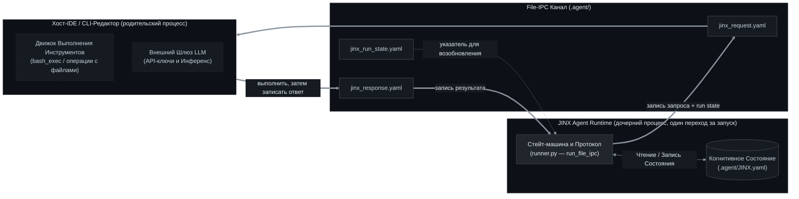
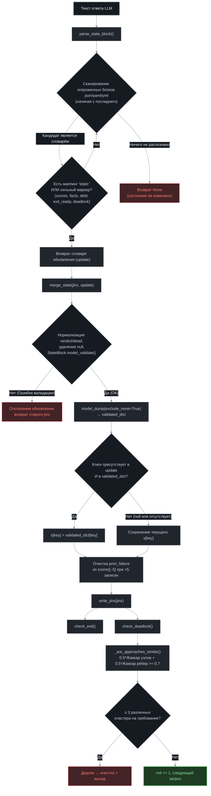
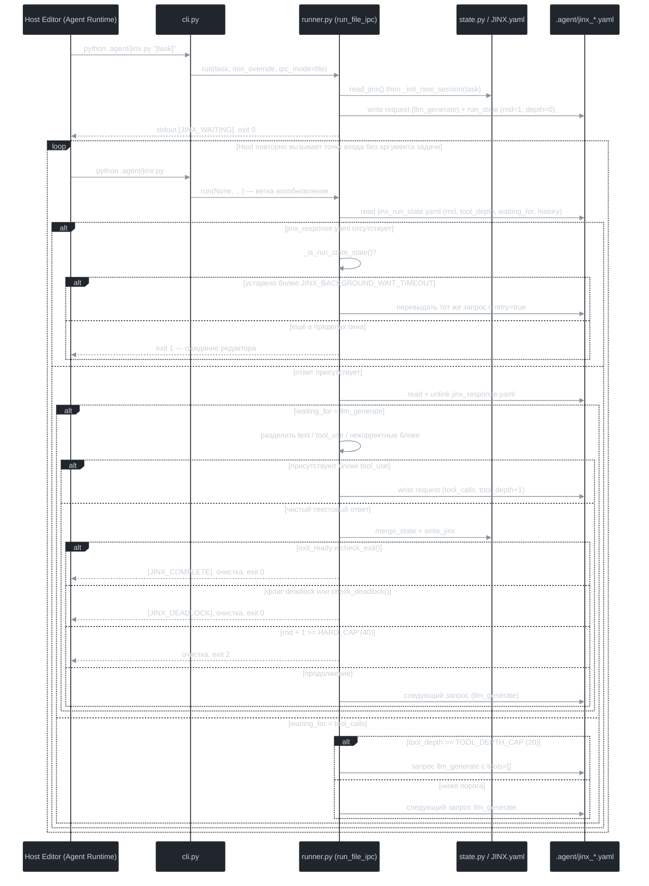
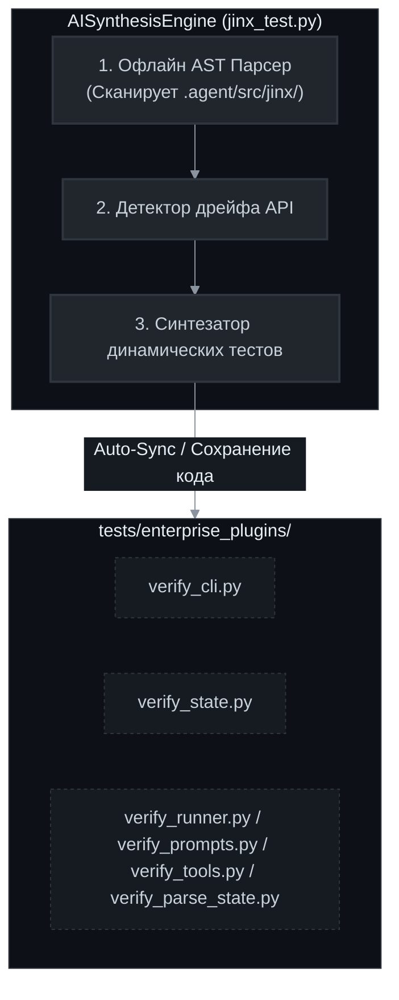

[English](README.md) | [Русский](README_RU.md) | [中文](README_ZH.md)

<p align="center">
  
  
  
  
</p>

<h1 align="center">JINX — Спецификация Среды Выполнения Суверенного Корпоративного Агента</h1>

<p align="center">
  <strong>Техническая спецификация JINX, изолированного, сохраняющего состояние, управляемого протоколом когнитивного цикла, предназначенного для работы в качестве дочернего процесса внутри хост-среды разработки ПО.</strong>
</p>

---

## 1. Базовая архитектура и межпроцессное взаимодействие (IPC)

JINX представляет собой среду выполнения агента, спроектированную для запуска внутри хост-окружения (такого как IDE, консольный текстовый редактор или корпоративный оркестратор). Среда выполнения JINX функционирует без автономного сетевого доступа или встроенных интеграций с внешними сервисами; все запросы на вызов моделей, манипуляции с файлами и выполнение консольных команд делегируются хост-редактору.

Среда выполнения предоставляет **два транспорта IPC**, выбираемых флагом `--ipc`:

| Транспорт | Флаг | Статус | Механизм |
| :--- | :--- | :--- | :--- |
| **Файловая конечная машина** | `--ipc file` *(по умолчанию)* | Основной | YAML-файлы запроса/ответа/состояния внутри `.agent/` |
| **Дуплексный поток JSON-RPC** | `--ipc rpc` | Устаревший / встраиваемые хосты | Разделенные переводами строки JSON через `stdout` / `stdin` |

### 1.1. File-IPC (по умолчанию)

Каждый запуск `python .agent/jinx.py` выполняет **ровно один переход** конечного автомата и затем завершается. Весь цикл восстанавливается повторным вызовом точки входа хостом без аргумента задачи. Вся непрерывность хранится на диске, поэтому среда выполнения переживает перезапуски редактора, сбои и любые коды возврата процесса.

Транспорт состоит из трёх файлов, все пути вычисляются относительно каталога `.agent/`:

| Файл | Кто пишет | Назначение |
| :--- | :--- | :--- |
| `.agent/jinx_request.yaml` | JINX | Действие, которое JINX просит выполнить хост |
| `.agent/jinx_response.yaml` | Хост | Результат этого действия |
| `.agent/jinx_run_state.yaml` | JINX | Счётчик раундов, глубина инструментов, история сообщений и указатель `waiting_for` |

В `stdout` попадают только читаемые маркеры прогресса (`[JINX_WAITING]`, `[JINX_COMPLETE]`, `[JINX_DEADLOCK]`); вся структурированная диагностика уходит в `stderr` через логгеры `jinx.cli` / `jinx.runner`.


```mermaid
%%{init: {'theme': 'base', 'themeVariables': {"darkMode": true, "background": "#0d1117", "primaryColor": "#21262d", "primaryTextColor": "#e6edf3", "primaryBorderColor": "#8b949e", "lineColor": "#8b949e", "textColor": "#e6edf3", "edgeLabelBackground": "#161b22", "mainBkg": "#21262d", "nodeBorder": "#8b949e", "nodeTextColor": "#e6edf3"}}}%%
flowchart LR
    classDef sub fill:#161b22,stroke:#30363d,stroke-dasharray: 3 3,color:#c9d1d9;
    classDef state fill:#21262d,stroke:#30363d,stroke-width:2px,color:#e6edf3;
    classDef yaml fill:#161b22,stroke:#30363d,stroke-width:2px,color:#c9d1d9;

    subgraph JINX["JINX Agent Runtime (дочерний процесс, один переход за запуск)"]
        direction TB
        SM["Стейт-машина и Протокол<br/>(runner.py — run_file_ipc)"]:::state
        DB[("Когнитивное Состояние<br/>(.agent/JINX.yaml)")]:::yaml
        SM <-->|"Чтение / Запись Состояния"| DB
    end
    style JINX fill:#0d1117,stroke:#30363d,color:#e6edf3

    subgraph IPC["File-IPC Канал (.agent/)"]
        direction TB
        REQ["jinx_request.yaml"]:::yaml
        RSP["jinx_response.yaml"]:::yaml
        RUN["jinx_run_state.yaml"]:::yaml
    end
    style IPC fill:#0d1117,stroke:#30363d,color:#e6edf3

    subgraph HOST["Хост-IDE / CLI-Редактор (родительский процесс)"]
        direction TB
        EXE["Движок Выполнения Инструментов<br/>(bash_exec / операции с файлами)"]:::sub
        LLM["Внешний Шлюз LLM<br/>(API-ключи и Инференс)"]:::sub
    end
    style HOST fill:#0d1117,stroke:#30363d,color:#e6edf3

    SM ==>|"запись запроса + run state"| REQ
    RUN -.->|"указатель для возобновления"| SM
    RSP ==>|"запись результата"| SM
    REQ ==> HOST
    HOST ==>|"выполнить, затем записать ответ"| RSP
```

#### Контракт запроса — `type: llm_generate`

```yaml
type: llm_generate
system: "You are JINX, a single-agent cognitive loop..."   # prompts.SYSTEM_PROMPT
messages:                                                   # усечённая история, см. ниже
  - role: user
    content: "ROUND 1 (at least 10 rounds required before exit is considered)\nCURRENT STATE:\n..."
tools:                                                      # tools.tool_schema(); [] при восстановлении по лимиту глубины
  - name: bash_exec
    description: Execute a bash or shell script in the environment.
    input_schema:
      type: object
      properties:
        script: {type: string, description: The script to execute}
      required: [script]
  - name: file_read
    description: Read the contents of a file.
    input_schema:
      type: object
      properties:
        path: {type: string, description: Path to the file}
        start_line: {type: integer, description: Optional 1-indexed starting line to read (inclusive)}
        end_line: {type: integer, description: Optional 1-indexed ending line to read (inclusive)}
      required: [path]
  - name: file_write
    description: Write or overwrite a file with new content.
    input_schema:
      type: object
      properties:
        path: {type: string, description: Path to the file}
        content: {type: string, description: The full content to write}
      required: [path, content]
processed_tool_use_ids: [call_00, call_01]   # уже выполненные вызовы, для дедупликации на стороне редактора
tool_result_cache:                          # memoized results, keyed by tool_use_id
  call_00: "85 passed in 0.21s"
retry: false                                  # true при перевыдаче после устаревшего ожидания
```

**Ожидаемый ответ хоста:**

```yaml
content:
  - type: text
    text: "Analyzing codebase structure."
  - type: tool_use
    id: call_123
    name: bash_exec
    input: {script: pytest tests/test_state.py}
```

Поле `content` допускается передать и как обычную строку — JINX нормализует её в один блок `text`. Любой блок `tool_use`, в котором отсутствуют `id`/`name` либо `input` не является объектом, отклоняется и возвращается модели как ошибка в `tool_result`, вместо аварийного завершения раунда.

#### Контракт запроса — `type: tool_calls`

```yaml
type: tool_calls
calls:
  - id: call_123
    name: bash_exec
    params: {script: pytest tests/test_state.py}
processed_tool_use_ids: []
tool_result_cache:
  call_00: "85 passed in 0.21s"
retry: false
```

**Ожидаемый ответ хоста:**

```yaml
results:
  - tool_use_id: call_123
    content: "59 passed in 0.14s"
```

#### Контракт состояния запуска — `jinx_run_state.yaml`

```yaml
rnd: 7
tool_depth: 2
waiting_for: llm_generate      # llm_generate | tool_calls
min_rounds: 10
updated_at: 1758901234.5       # epoch-секунды, обновляется при каждом изменении состояния
processed_tool_use_ids: [call_00, call_01]   # необязательное поле, см. ниже
history:                       # ограниченное окно последних сообщений
  - {role: user, content: "ROUND 7 ..."}
  - {role: assistant, content: [{type: text, text: "..."}]}
```

При возобновлении раннер требует ровно пять ключей — `rnd`, `tool_depth`, `history`, `waiting_for` и
`min_rounds` — и считает состояние некорректным при их отсутствии. Поле `updated_at` проставляется
при каждой записи и управляет определением устаревшего ожидания.

Поле `processed_tool_use_ids` **необязательное и временное**. Раннер дописывает в него каждый
выполненный `tool_use_id` после обработки ответа с результатами инструментов и читает его обратно при
формировании следующего запроса, однако новый запрос `llm_generate` перезаписывает состояние запуска
без этого поля. Поэтому хосту следует считать `processed_tool_use_ids` в запросе источником истины, а
копию в состоянии запуска использовать только для восстановления контекста при повторной выдаче
устаревшего запроса.

Поле `history` — это **ограниченное окно**, а не вся транскрипция. Цикл переживает границы процессов потому, что каждый раунд перезагружает это окно, а окно сдвигается за ведущий блок `tool_result` и очищается от висящего в конце вызова `tool_use`, поэтому модель никогда не получает «сиротский» результат инструмента (`compact_history_for_request`). Действуют два независимых размера: в run-state хранятся последние `JINX_HISTORY_PERSIST_WINDOW` сообщений (по умолчанию **8**), а в каждый запрос `llm_generate` отправляются только последние `JINX_HISTORY_WINDOW` (по умолчанию **6**). Отброшенные сообщения никто никогда не читает обратно — проверка выхода и детекция дедлока смотрят на историю оценок в `JINX.yaml`, а диспетчеризация инструментов нуждается только в последних вызовах, — поэтому run-state имеет фиксированный размер и не растёт от раунда к раунду. При усечении окна в промпт добавляется однострочное примечание о числе отброшенных сообщений, чтобы модель не приняла окно за всю сессию.

#### Восстановление после устаревшего ожидания

Если `jinx_run_state.yaml` существует, а `jinx_response.yaml` — нет, значит хост не ответил. Тогда JINX вызывает `_is_run_state_stale()`: запуск считается устаревшим только когда **и** `updated_at`, **и** время изменения `jinx_run_state.yaml` / `jinx_request.yaml` старше `JINX_BACKGROUND_WAIT_TIMEOUT` (по умолчанию `30` с). Устаревший запуск перевыдаёт тот же запрос с `retry: true` и расширенным списком `processed_tool_use_ids`, чтобы хост вернул сохранённые результаты, а не повторил побочные эффекты; неустаревший запуск завершается с кодом `1` и ждёт повтора хоста.

#### Очистка и сигналы

`SIGINT`, `SIGTERM` и `SIGHUP` перехватываются на этапе импорта; обработчик удаляет все три IPC-файла и завершает процесс через `os._exit(1)`. Нормальные выходы вызывают `clean_up_ipc_files()` на каждом пути успеха, дедлока и жёсткого лимита, поэтому устаревшее состояние запуска не может заблокировать следующую сессию.

### 1.2. Дуплексный поток JSON-RPC (`--ipc rpc`)

Устаревший транспорт сохранён для хостов, предпочитающих один долгоживущий дочерний процесс с перенаправленными потоками. JINX печатает по одному JSON-объекту на строку в запрос и читает по одному JSON-объекту в ответ.

#### `llm_generate`
* **Отправляется в `stdout`**:
```json
{
  "jinx_command": "llm_generate",
  "params": {
    "system": "System instructions defining the cognitive boundaries.",
    "messages": [{"role": "user", "content": "Round-specific context."}],
    "tools": [{"name": "bash_exec", "input_schema": {"type": "object"}}]
  }
}
```
* **Ожидаемый ответ в `stdin`**:
```json
{
  "content": [
    {"type": "text", "text": "Analyzing codebase structure."},
    {"type": "tool_use", "id": "call_123", "name": "bash_exec", "input": {"script": "pytest tests/test_state.py"}}
  ]
}
```

#### `bash_exec`
* **Отправляется в `stdout`**:
```json
{"jinx_command": "bash_exec", "tool_use_id": "call_123", "params": {"script": "pytest tests/test_state.py"}}
```
* **Ожидаемый ответ в `stdin`**:
```json
{"output": "=== 1 passed in 0.05s ==="}
```

#### `file_read` / `file_write`
* **Отправляется в `stdout` (чтение)**:
```json
{"jinx_command": "file_read", "tool_use_id": "call_124", "params": {"path": "src/core.py", "start_line": 1, "end_line": 80}}
```
* **Ожидаемый ответ в `stdin` (чтение)**:
```json
{"content": "def run():\n    pass", "sliced": false}
```
* **Отправляется в `stdout` (запись)**:
```json
{"jinx_command": "file_write", "tool_use_id": "call_125", "params": {"path": "src/core.py", "content": "def run():\n    return True"}}
```
* **Ожидаемый ответ в `stdin` (запись)**:
```json
{"output": "Success"}
```

Ответ считается ошибочным, если содержит ключ `error` либо строку `status` с подстрокой `error`. Необязательный булев флаг `sliced` / `is_sliced` сообщает JINX, что хост уже применил окно `start_line` / `end_line`; если он отсутствует или равен false, JINX выполняет нарезку самостоятельно. Чтение потока обслуживает единственный фоновый поток-читатель `stdin`, сбрасывающий данные в общую очередь, поэтому таймауты не рассинхронизируют поток.

---

## 2. Протокол выполнения когнитивного цикла

Работа JINX управляется итерационным циклом, выполняемым по чётко разграниченным фазам. Параметры состояния сохраняются между итерациями в файле `JINX.yaml`.


```mermaid
%%{init: {'theme': 'base', 'themeVariables': {"darkMode": true, "background": "#0d1117", "primaryColor": "#21262d", "primaryTextColor": "#e6edf3", "primaryBorderColor": "#8b949e", "lineColor": "#8b949e", "textColor": "#e6edf3", "edgeLabelBackground": "#161b22", "mainBkg": "#21262d", "nodeBorder": "#8b949e", "nodeTextColor": "#e6edf3"}}}%%
flowchart LR
    classDef sub fill:#161b22,stroke:#30363d,stroke-dasharray: 3 3,color:#c9d1d9;
    classDef fail fill:#442326,stroke:#f85149,color:#ff7b72;
    classDef pass fill:#1f3b23,stroke:#56d364,color:#85e89d;

    subgraph P1["Фаза I: Сбор данных и скоупинг"]
        A["1. Анализ контекста и границ"]:::sub --> B["2. Запись границ в state.facts"]:::sub
    end
    style P1 fill:#0d1117,stroke:#30363d,color:#e6edf3

    subgraph P2["Фаза II: Генерация гипотез"]
        C["3. Регистрация истории сбоев"]:::sub --> D["4. Оценка альтернативных стратегий"]:::sub
    end
    style P2 fill:#0d1117,stroke:#30363d,color:#e6edf3

    subgraph P3["Фаза III: Разрушающее тестирование"]
        E["5. Запуск граничного тестирования"]:::sub --> F["6. Заполнение схемы требований"]:::sub
    end
    style P3 fill:#0d1117,stroke:#30363d,color:#e6edf3

    subgraph P4["Фаза IV: Оценка и выход"]
        G{"7. Проверка сходимости цикла"}:::sub
        G -->|Все пройдены| H["Успешный выход"]:::pass
        G -->|Сбои подходов >= 3| I["Триггер дедлока"]:::fail
        G -->|Раунды >= 40| J["Лимит раундов"]:::fail
    end
    style P4 fill:#0d1117,stroke:#30363d,color:#e6edf3

    B --> C
    D --> E
    F --> G
```

### Фазы выполнения

1. **Фаза I: Определение границ задачи и сбор данных**
   Прежде чем инициировать изменения файлов, JINX анализирует свойства рабочего пространства и фиксирует границы целевой задачи. Подтверждённый контекст записывается непосредственно в список `state.facts` конфигурационного манифеста `JINX.yaml`.

2. **Фаза II: Генерация гипотез и дивергенция**
   В случае неудачи предыдущего раунда JINX регистрирует причины сбоя в блоке `state.scores`. В последующих раундах JINX оценивает альтернативные технические стратегии, опционально описывая каждую из них как граф знаний `approach_graph`, чтобы обнаружение дедлока отличало действительно различные стратегии от чисто косметических переформулировок. Повторение идентичных подходов без изменений заблокировано правилами протокола.

3. **Фаза III: Верификация граничных условий (Разрушающее тестирование / Breaker Test)**
   Для каждой технической стратегии должен выполняться этап граничного тестирования ("Breaker Test"). Реализация подлежит обязательной валидации на пограничных случаях, некорректных входных данных или пределах производительности. Критерии оценки структурированы в бинарной схеме (true/false) в блоке `state.scores[].requirements`.

4. **Фаза IV: Конвергенция и многокритериальный выход**
   После каждого раунда JINX обновляет метрики выполнения и проверяет условия выхода или дедлока:
   * **Условие выхода** (`check_exit`): текущий раунд должен быть `>= loop.min`, должна существовать как минимум 2 записи в `scores`, а **последняя** запись обязана иметь `all_pass: true`. Как только записей становится 4 или больше, лучший `pass_count` последних 3 раундов не должен превышать лучший `pass_count` всего, что было раньше — всё ещё улучшающийся цикл выходить не вправе.
   * **Условие дедлока** (`check_deadlock`): раунд должен быть `>= loop.min`, и по некоторому требованию должен набраться провал как минимум в **3 семантически различных кластерах стратегий**. Также дедлок может быть объявлен моделью через `deadlock: true`.
   * **Жёсткий лимит**: количество итерационных раундов ограничено значением 40 (`HARD_CAP`); по его достижении процесс завершается со статусом `2`, предотвращая неограниченный расход токенов.
   * **Лимит глубины инструментов**: в рамках одного раунда допускается не более 20 последовательных вызовов инструментов (`TOOL_DEPTH_CAP`). При превышении JINX внедряет восстановительную инструкцию и выполняет один финальный `llm_generate` с `tools: []`, требуя блок состояния вместо усечения.

   `loop.min` определяется из `protocol.loop.min` в `JINX.yaml` (по умолчанию **10**) либо из переопределения `--min`, и пересчитывается после каждого успешного merge, поэтому изменение протокола, выданное моделью, вступает в силу прямо в середине сессии.

### Блок-схема когнитивного цикла / Cognitive Control Flow


```mermaid
%%{init: {'theme': 'base', 'themeVariables': {"darkMode": true, "background": "#0d1117", "primaryColor": "#21262d", "primaryTextColor": "#e6edf3", "primaryBorderColor": "#8b949e", "lineColor": "#8b949e", "textColor": "#e6edf3", "edgeLabelBackground": "#161b22", "mainBkg": "#21262d", "nodeBorder": "#8b949e", "nodeTextColor": "#e6edf3"}}}%%
flowchart TD
    classDef start fill:#161b22,stroke:#8b949e,stroke-width:2px,color:#e6edf3;
    classDef process fill:#21262d,stroke:#30363d,stroke-width:2px,color:#c9d1d9;
    classDef decision fill:#161b22,stroke:#30363d,stroke-width:2px,color:#c9d1d9;
    classDef success fill:#1f3b23,stroke:#56d364,stroke-width:2px,color:#85e89d;
    classDef danger fill:#442326,stroke:#f85149,color:#ff7b72;

    A["Текст ответа LLM"]:::start --> B["parse_state_block()"]:::process
    B --> C{"Сканирование огороженных блоков json/yaml/yml<br/>(начиная с последнего)"}:::decision
    C -->|"Кандидат является словарём"| D{"Есть маппинг 'state:'<br/>ИЛИ сильный маркер?<br/>(scores, facts, debt,<br/>exit_ready, deadlock)"}:::decision
    D -->|"Да"| E["Возврат словаря обновления (update)"]:::process
    D -->|"Нет"| C
    C -->|"Ничего не распознано"| F["Возврат None<br/>(состояние не изменено)"]:::danger

    E --> G["merge_state(jinx, update)"]:::process
    G --> H{"Нормализация verdict/detail,<br/>удаление null,<br/>StateBlock.model_validate()"}:::decision
    H -->|"Нет (Ошибка валидации)"| I["Отклонение обновления,<br/>возврат старого jinx"]:::danger
    H -->|"Да (ОК)"| J["model_dump(exclude_none=True)<br/>→ validated_dict"]:::process
    J --> K{"Ключ присутствует в update<br/>И в validated_dict?"}:::decision
    K -->|"Да"| L["s[key] = validated_dict[key]"]:::process
    K -->|"Нет (null или отсутствует)"| M["Сохранение текущего s[key]"]:::process
    L --> N["Очистка prior_failure<br/>из scores[:-5] при >5 записях"]:::process
    M --> N
    N --> O["write_jinx(jinx)"]:::process

    O --> P["check_exit()"]:::process
    O --> Q["check_deadlock()"]:::process
    Q --> R["_are_approaches_similar()<br/>0.5*Жаккар узлов + 0.5*Жаккар рёбер >= 0.7"]:::process
    R --> S{"≥ 3 различных<br/>кластера на требование?"}:::decision
    S -->|"Да"| T["Дедлок → очистка + выход"]:::danger
    S -->|"Нет"| U["rnd += 1, следующий запрос"]:::success
```

Ключи `task` и `open` намеренно **исключены** из множества сильных маркеров: это распространённые английские слова, и трактовка их как признака состояния заставила бы парсер перехватывать посторонние YAML-примеры из рассуждений модели.

### Диаграмма последовательности выполнения / Sequence Flow Diagram


```mermaid
%%{init: {'theme': 'base', 'themeVariables': {"darkMode": true, "background": "#0d1117", "primaryColor": "#21262d", "primaryTextColor": "#e6edf3", "primaryBorderColor": "#8b949e", "lineColor": "#8b949e", "textColor": "#e6edf3", "edgeLabelBackground": "#161b22", "actorBkg": "#21262d", "actorBorder": "#30363d", "actorTextColor": "#c9d1d9", "actorLineColor": "#30363d", "signalColor": "#8b949e", "signalTextColor": "#c9d1d9", "noteBkgColor": "#161b22", "noteBorderColor": "#30363d", "noteTextColor": "#c9d1d9", "labelBoxBkgColor": "#21262d", "labelBoxBorderColor": "#30363d", "labelTextColor": "#c9d1d9", "loopTextColor": "#c9d1d9", "activationBkgColor": "#21262d", "activationBorderColor": "#30363d"}}}%%
sequenceDiagram
    participant Host as Host Editor (Agent Runtime)
    participant CLI as cli.py
    participant Runner as runner.py (run_file_ipc)
    participant State as state.py / JINX.yaml
    participant IPC as .agent/jinx_*.yaml

    Host->>CLI: python .agent/jinx.py "[task]"
    CLI->>Runner: run(task, min_override, ipc_mode=file)
    Runner->>State: read_jinx() then _init_new_session(task)
    Runner->>IPC: write request (llm_generate) + run_state (rnd=1, depth=0)
    Runner-->>Host: stdout [JINX_WAITING], exit 0

    loop Host повторно вызывает точку входа без аргумента задачи
        Host->>CLI: python .agent/jinx.py
        CLI->>Runner: run(None, ...) — ветка возобновления
        Runner->>IPC: read jinx_run_state.yaml (rnd, tool_depth, waiting_for, history)

        alt jinx_response.yaml отсутствует
            Runner->>Runner: _is_run_state_stale()?
            alt устарело более JINX_BACKGROUND_WAIT_TIMEOUT
                Runner->>IPC: перевыдать тот же запрос с retry=true
            else ещё в пределах окна
                Runner-->>Host: exit 1 — ожидание редактора
            end
        else ответ присутствует
            Runner->>IPC: read + unlink jinx_response.yaml
            alt waiting_for = llm_generate
                Runner->>Runner: разделить text / tool_use / некорректные блоки
                alt присутствуют блоки tool_use
                    Runner->>IPC: write request (tool_calls, tool_depth+1)
                else чистый текстовый ответ
                    Runner->>State: merge_state + write_jinx
                    alt exit_ready и check_exit()
                        Runner-->>Host: [JINX_COMPLETE], очистка, exit 0
                    else флаг deadlock или check_deadlock()
                        Runner-->>Host: [JINX_DEADLOCK], очистка, exit 0
                    else rnd + 1 >= HARD_CAP (40)
                        Runner-->>Host: очистка, exit 2
                    else продолжение
                        Runner->>IPC: следующий запрос (llm_generate)
                    end
                end
            else waiting_for = tool_calls
                alt tool_depth >= TOOL_DEPTH_CAP (20)
                    Runner->>IPC: запрос llm_generate с tools=[]
                else ниже порога
                    Runner->>IPC: следующий запрос llm_generate
                end
            end
        end
    end
```

---

## 3. Спецификация манифеста состояния (`JINX.yaml`)

Все когнитивные результаты, журналы ошибок, задачи и параметры цикла сериализуются в файл `JINX.yaml`, расположенный в изолированной рабочей папке `.agent`. Данная архитектура исключает хранение метаданных состояния в корне основного репозитория проекта.

```yaml
id: JINX
protocol:
  loop:
    min: 10

state:
  task: "Реализация подписи токенов PyJWT RS256"
  facts:
    - "Проверен корневой каталог рабочего пространства"
    - "Загружена схема конфигурации"
  scores:
    - round: 1
      approach: "Реализация подписи токенов PyJWT RS256"
      prior_failure: null
      requirements:
        compile: true
        unit_tests: false
      pass_count: 1
      all_pass: false
      approach_graph:            # необязательно — включает семантическую кластеризацию дедлоков
        nodes:
          - {id: "jwt_signer.py", type: file}
          - {id: "pytest", type: tool}
        edges:
          - {source: "pytest", target: "jwt_signer.py", relation: tests}
  debt: []
  open: []
  lessons:                    # необязательно — долговременные, между запусками; сливаются в .agent/lessons.yaml
    - text: "проверяй разбор перед записью блока состояния"
      kind: rule
      evidence: "некавыченный ':' молча отбросил целый раунд"
  exit_ready: false
  deadlock: false
```

`lessons` — единственное поле здесь, которое **не** хранится в `JINX.yaml`. Оно
направляется в долговременный реестр, описанный в §4a.1, поскольку
`_init_new_session` сбрасывает этот блок при старте новой задачи.

### Разрешение пути

Файл `JINX.yaml` определяется трёхуровневым поиском (`_resolve_jinx_path`):

1. Переменная окружения `JINX_PATH`, если она установлена.
2. Файл `.agent/JINX.yaml` рядом с установленным пакетом (раскладка для разработки).
3. Подъём вверх от текущей рабочей директории в поисках `<dir>/.agent/JINX.yaml` с запасным вариантом `<cwd>/.agent/JINX.yaml`.

### Форматы записей оценок

`ScoreEntry` принимает две формы. **Полная** форма несёт `requirements`, `pass_count` и `all_pass`. **Упрощённая** форма несёт только вердикт и свободный текст:

```yaml
scores:
  - round: 2
    verdict: fail        # pass | passed | ok | true | 1  → all_pass: true
    detail: "RS256 key loading still fails on rotated keys"   # → approach
```

Обе формы автоматически нормализуются в полную схему (`requirements: {task_complete: <bool>}`, `pass_count`, `all_pass`, `approach`) до валидации через Pydantic, поэтому краткий ответ модели никогда не будет отклонён. `round` по умолчанию равен `0`, а `approach` — `"unspecified"`; ключи `task`, `facts`, `debt` и `open` заменяются целиком тем, что прислала модель, тогда как ключи со значением `None` игнорируются, и частичное обновление сохраняет остальной манифест.

Исключение — `scores`: этот список **объединяется по номеру раунда**, а не заменяется (`merge_scores`). Запись с уже существующим `round` перезаписывает её, а раунды, отсутствующие в ответе, сохраняются на диске. Поэтому модели достаточно прислать только текущий раунд, а полная переотправка по-прежнему допустима и просто перезаписывает записи на месте. Порядок после объединения — по возрастанию `round`, а записи без целого `round` ключуются позиционно и не теряются при цикле сохранения. Это устраняет прежний отказ, при котором ответ, пропустивший раунд, молча его удалял, и именно это позволяет промпту перестать требовать повторную отправку всей истории каждый раунд.

Два рабочих списка ограничиваются при записи. Близкие по смыслу дубликаты в `facts`, `debt` и `open` схлопываются в один — сравнение игнорирует регистр, пунктуацию и пробелы, поэтому `"Doesn't work."` и `"doesnt work"` считаются одним и тем же фактом, — а `facts` ограничивается значением `JINX_FACTS_CAP` (по умолчанию **60**), причём самые старые записи отбрасываются первыми, поскольку этот список переотправляется каждый раунд и иначе становится основной статьёй затрат. `facts` при этом *заменяется*, а не накапливается, чтобы модель могла отозвать убеждение, которое позже опровергла.

Если блок состояния не проходит валидацию, предыдущее состояние сохраняется, а причина отклонения добавляется в промпт следующего раунда вместо того, чтобы просто попасть в лог. Отклонённый блок теперь сообщает модели, что он отклонён, какая именно ошибка валидации возникла и каковы типичные причины (незаключённая в кавычки `:` или `#` внутри значения, табуляция вместо отступов, ключ с лишним уровнем вложенности) — раньше молчаливое отклонение было неотличимо от модели, которая просто ничего не сделала.

---

## 4. Инвентарь компонентов кодовой базы

Среда выполнения JINX состоит из следующих Python-компонентов, расположенных в директории `.agent/` (при этом основные пакетные модули находятся в `.agent/src/jinx/`):

* **`jinx.py`** (Входной скрипт запуска, расположен в `.agent/`):
  Служит единой точкой входа для выполнения. Он добавляет `.agent/src` в `sys.path`, чтобы `import jinx` разрешался без глобальной установки, а затем делегирует обработку командной строки парсеру. Включает автоматический загрузчик зависимостей, который проверяет наличие и автоматически устанавливает строго ограниченные версии зависимостей (`pydantic>=2.0.0`, `pyyaml>=6.0`) через `sys.executable -m pip`, завершаясь с кодом `1` и подсказкой ручной установки при неудаче.
* **`cli.py`** (Обработчик аргументов):
  Разбирает входящие параметры с помощью `argparse`. Собирает позиционный аргумент задачи (объединяемый в одну строку), а также необязательные переопределения `--min` (число раундов) и `--ipc {file,rpc}` (выбор транспорта) перед передачей оркестратору. Логирование привязано к `stderr`, чтобы канал транспорта оставался чистым. Запуск без аргумента задачи трактуется как возобновление и допустим только при наличии файла состояния запуска.
* **`runner.py`** (Оркестратор):
  Реализует конечный автомат и оба транспорта. Ключевые обязанности:
  * `run_file_ipc` — конечная машина одного перехода: определение возобновления, восстановление после устаревшего ожидания, маршрутизация ответа и переход к следующему раунду.
  * `run` — диспетчер транспортов. При `ipc_mode == "file"` делегирует в `run_file_ipc`, иначе выполняет устаревший долгоживущий цикл JSON-RPC прямо в этой функции.
  * `parse_state_block` — извлекает последний корректный блок состояния из markdown-ограждений. Языковой тег не обязателен, поэтому ограждение без тега тоже разбирается; всё проходит через `yaml.safe_load`, который принимает и JSON.
  * `check_exit` / `check_deadlock` / `_are_approaches_similar` — логика сходимости и семантической кластеризации.
  * `Yaml` — изолированный `SafeDumper` с презентером строк, учитывающим блочные скаляры, плюс атомарная запись через временный файл; защитные пределы `HARD_CAP` (40) и `TOOL_DEPTH_CAP` (20); обработчики сигналов для очистки IPC.
* **`state.py`** (Слой сериализации состояния):
  Выполняет все файловые операции с манифестом `JINX.yaml`:
  * **Динамическое разрешение путей**: трёхуровневый поиск через `JINX_PATH` / путь разработки / подъём вверх, описанный в §3.
  * **Закаленные схемы валидации**: модели Pydantic `GraphNode`, `GraphEdge`, `ApproachGraph`, `ScoreEntry` и `StateBlock` с отказоустойчивыми значениями по умолчанию, так что частично сформированный блок не вызывает исключений и не теряет состояние.
  * **Атомарная запись**: `atomic_write_yaml` — единственный источник истины для записи через промежуточный файл, используемый и `StateManager.persist_state`, и оркестратором.
  * **Нормализация форматов**: `_normalize_score_entry` / `_normalize_state_update` преобразуют упрощённую форму `verdict`/`detail` и удаляют значения `None` перед валидацией.
* **`tools.py`** (Реестр схем инструментов):
* **`learning.py`** (Реестр долговременных уроков между запусками):
  Делает обучение переживающим отдельный запуск. `facts`/`debt`/`open` — это рабочая память в пределах запуска, и она намеренно усекается ради плоской стоимости раунда, поэтому без этого модуля самое дорогое из выученного JINX отбрасывается между задачами. Реестр хранится в **отдельном файле** `.agent/lessons.yaml` именно потому, что `_init_new_session` сбрасывает блок состояния при новой задаче. Ключевые обязанности:
  * `add_lessons` — пополняющий и дедуплицирующий: повторно сформулированное правило увеличивает счётчик `seen`, а не добавляет копию, поэтому модель, пересказывающая свои правила каждый раунд, не раздувает файл. Ограничено `JINX_LESSONS_CAP`.
  * `render_lessons` — вставляет ограниченный блок `LEARNED RULES`. Ограничен **и** количеством (`JINX_LESSONS_INJECT_LIMIT`), **и** бюджетом символов (`JINX_LESSONS_BUDGET_CHARS`), потому что именно символы стоят токенов. Возвращает ключи показанных уроков — именно это делает возможным распределение credit'а.
  * `record_outcome` — каждый раунд зачитывает или снимает credit с уроков, которые действительно были показаны, по результату раунда. Проверенное правило всплывает; правило, которое постоянно проваливает, перестаёт показываться, поэтому хранилище самоочищается, а не растёт. Без этого реестр был бы журналом «только на запись».
* **`selfpatch.py`** (Гейтерованное самоизменение кода):
  Позволяет JINX править собственный код, не позволяя ему убрать собственные тормоза. `file_write` принимает голую строку в качестве пути, поэтому модель всегда могла переписать `.agent/src/jinx/*.py` — и переписывала, именно так устроена работа над релизом в этом репозитории. Никто не проверял, что после этого всё ещё работает. Этот модуль добавляет такую проверку:
  * **Проверка и откат** — `capture_baseline` копирует дерево исходников, `baseline_changed` находит расхождения, `restore_baseline` откатывает их. После любого раунда, затронувшего исходники фреймворка, `verify` запускает и `pytest`, и полный набор `jinx_test`; если что-то падает, правка отменяется, а вывод ошибки возвращается в промпт следующего раунда. Неудачная попытка стоит одного раунда, а не всего прогона. Baseline живёт весь прогон, а не один раунд: он снимается на старте, сохраняется, пока раунд ничего не меняет, и переснимается, когда проверенная правка принята. При чистом завершении он удаляется, а при аварийном выходе **намеренно сохраняется** — именно это позволяет следующему запуску починить последствия.
  * **Предполётная проверка при загрузке** — та же проверка выполняется ещё раз в `.agent/jinx.py` до импорта JINX, причём `selfpatch.py` загружается напрямую по пути. Без этого правка, оставившая синтаксическую ошибку, просто не дала бы фреймворку запуститься, и сам механизм, предназначенный ловить ровно это, не смог бы сработать. Если baseline на диске нет, сравнивать не с чем — тогда сломанное дерево падает громко, а не затирается молча.
  * **Защита тормозов** — `guard_tool_call` отказывает в записи, которая переопределила бы `merge_state`, `StateBlock`, `atomic_write_yaml`, `_resolve_jinx_path`, `check_exit`, `check_deadlock`, `_resolve_min_rounds`, `_handle_llm_response` или `SYSTEM_PROMPT`, а `selfpatch.py` и `learning.py` считает неприкосновенными целиком. Отказ происходит **до** передачи, а не после, поэтому модель сообщает об отказе, а не делает вывод, что проверка сломана. Защита сравнивает *тела* этих определений с тем, что лежит на диске, а не просто наличие имени, поэтому переписать защищённый файл целиком можно — если сам тормоз остался побайтово тем же. Отклоняется и ослабление, и переписывание, и удаление тормоза, а также более хитрые варианты: второе определение, перекрывающее защищённое при импорте, и правка через `bash_exec`, который вообще не проходит через эту проверку. Поэтому перед самой верификацией механизм повторяет то же сравнение по файлам на диске и по baseline, и затронутый так тормоз откатывается без запуска тестов: зелёный прогон не может оправдать изменение кода, который решает, что значит зелёный прогон.
* **`prompts.py`** (Шаблоны промптов):
  Содержит `SYSTEM_PROMPT`, предупреждение `MISSING_STATE_WARNING`, вставляемое, когда раунд не выдал блок состояния, восстановительную директиву `TOOL_DEPTH_CRITICAL_MSG` и функцию `construct_round_prompt()`.

### Переменные окружения среды выполнения

| Переменная | По умолчанию | Применимость | Назначение |
| :--- | :--- | :--- | :--- |
| `JINX_PATH` | *(авто)* | оба | Явный путь к `JINX.yaml` |
| `JINX_IPC_TIMEOUT` | `10` | `--ipc rpc` | Секунд ожидания одной попытки чтения stdin |
| `JINX_IPC_RETRIES` | `3` | `--ipc rpc` | Число попыток чтения до выброса `IPCError` |
| `JINX_IPC_BACKOFF` | `1.0` | `--ipc rpc` | Секунд паузы между попытками чтения |
| `JINX_BACKGROUND_WAIT_TIMEOUT` | `30` | `--ipc file` | Секунд, после которых неотвеченный запуск считается устаревшим |
| `JINX_HISTORY_WINDOW` | `6` | оба | Сколько сообщений отправляется в каждом запросе `llm_generate` |
| `JINX_HISTORY_PERSIST_WINDOW` | `8` | оба | Сколько сообщений хранится в `jinx_run_state.yaml` |
| `JINX_FACTS_CAP` | `60` | оба | Максимум записей в `facts`; самые старые отбрасываются первыми |
| `JINX_KEEP_IPC_ON_SIGNAL` | *(не задано)* | оба | Значение `1` сохраняет IPC-файлы по Ctrl+C для разбора |
| `JINX_TOOL_RESULT_CACHE_CAP` | `64` | оба | Максимум мемоизированных результатов инструментов; самые старые вытесняются |

---

---

## 4a. Самоулучшение: два разных механизма

JINX умеет улучшать себя, но под самоулучшением скрываются две совершенно разные вещи с разным уровнем риска. Смешивать их — главная доступная ошибка проектирования, поэтому они намеренно разделены.

### 4a.1 Долговременные уроки — всегда безопасны и ценнее второй половины

Всё, чему JINX уже научился (`prior_failure`, `approach_graph`, `facts`/`debt`/`open`), живёт **в пределах запуска** и намеренно усекается ради плоской стоимости раунда: `facts` до 60 записей, `prior_failure` до последних 5 раундов. Поэтому самое дорогое выученное отбрасывается между задачами, и каждая новая задача начинается с нуля.

Поле `lessons` в блоке состояния это исправляет. Уроки — это:

* **Инкрементные.** В отличие от `facts`/`debt`/`open`, которые *заменяются* тем, что модель присылает каждый раунд, уроки сливаются. Присылайте только новые.
* **Долговременные.** Они пишутся в `.agent/lessons.yaml` — отдельный файл, потому что запуск новой задачи вызывает `_init_new_session`, который сбрасывает блок состояния. Сбрасывать уроки там означало бы, что хранилище деградирует с той же скоростью, что и состояние, которое оно должно переживать.
* **С учётом результата.** Каждый раунд уроки, которые действительно были вставлены в промпт, получают зачёт или штраф в зависимости от того, прошёл ли раунд. Проверенные правила всплывают; правила, которые постоянно проваливают, перестают показываться. Именно это превращает механизм в обучение, а не в журнал — и именно это удерживает хранилище в ограниченных размерах.

Поскольку уроки переживают переход в следующие задачи, урок должен быть общим и применимым повторно императивом, а не заметкой о текущей задаче:

```yaml
lessons:
  - text: "блок состояния валидируется целиком, поэтому никогда не оставляй approach_graph незаполненным"
    kind: antipattern        # rule | skill | antipattern (выводится, если не указан)
    evidence: "раунд 2 отклонили целиком из-за одного неполного ребра"
```

`kind` необязателен и выводится по формулировке, если отсутствует. `evidence` необязателен.

Чтобы сбросить то, чему JINX, по его мнению, научился, удалите `.agent/lessons.yaml`.

### 4a.2 Гейтерованное самоизменение кода — мощно и проверяемо

JINX может редактировать собственный код в `.agent/src/jinx/*.py` ради улучшения результатов, и для работы над фреймворком это зачастую верная стратегия, а не обходной путь. Гейт существует из-за того, чего раньше не было: проверки, что результат всё ещё работает.

После любого раунда, в котором велась запись в исходники фреймворка, раннер:

1. запускает и `pytest`, и полный набор `scripts/jinx_test.py`, останавливаясь на первом сбое;
2. сохраняет правку, если оба прошли;
3. иначе **откатывает дерево исходников** и возвращает вывод ошибки в промпт следующего раунда, так что неудачная попытка даёт данные, а не молча сломанный фреймворк.

Отдельно, запись, которая переопределила бы тормозную логику, **отклоняется до передачи** — а не пишется и затем откатывается, — поэтому модель знает об отказе, а не приходит к выводу, что проверка сломана. Защищены: `merge_state`, `StateBlock`, `atomic_write_yaml`, `_resolve_jinx_path`, `check_exit`, `check_deadlock`, `_resolve_min_rounds`, `_handle_llm_response` и `SYSTEM_PROMPT`; `selfpatch.py` и `learning.py` неприкосновенны целиком.

**Почему защита не опциональна.** У `file_write` нет ограничений по пути, и модель уже может слить блок `protocol` в манифест, что меняет `min_rounds` прямо посреди сессии. Автономное самоизменение без защиты от снятия тормозов сделало бы «агент улучшил себя» и «агент удалил логику, которая бы это заметила» неразличимыми — а второе поддаётся внедрению через промпт из любой задачи.

Установите `JINX_ALLOW_PROTECTED_EDITS=1`, чтобы разрешить правку защищённой логики. Это осознанное ручное переопределение, а не то, что агент включает себе сам.

| Переменная | По умолчанию | Применимость | Назначение |
| :--- | :--- | :--- | :--- |
| `JINX_SELF_PATCH` | `1` | оба | `0` полностью отключает гейт проверки с откатом и внедрение уроков |
| `JINX_SELF_PATCH_TIMEOUT` | `600` | оба | Секунд на каждый проверочный набор до признания его провалом |
| `JINX_SELF_PATCH_BASELINE` | `.agent/.selfpatch_baseline` | оба | Где хранится одноразовая копия исходников до правки |
| `JINX_ALLOW_PROTECTED_EDITS` | `0` | оба | `1` разрешает правку защищённой тормозной логики. Только ручное переопределение |
| `JINX_LESSONS_CAP` | `40` | оба | Максимум хранимых уроков; самые старые вытесняются |
| `JINX_LESSONS_INJECT_LIMIT` | `12` | оба | Максимум уроков, вставляемых в промпт раунда |
| `JINX_LESSONS_BUDGET_CHARS` | `1200` | оба | Бюджет символов для вставляемого блока |
| `JINX_LESSONS_PATH` | `.agent/lessons.yaml` | оба | Расположение долговременного реестра уроков |

---

## 5. Руководство по интеграции с хостом и реализации подпроцесса

Для интеграции JINX хост-редактор или оркестратор уровня предприятия должен запускать исполняемую команду JINX как дочерний процесс и управлять циклом запрос/ответ.

### Требования к запуску подпроцесса
* **Команда выполнения**: `python .agent/jinx.py "[TASK_DESCRIPTION]"` для старта, `python .agent/jinx.py` для возобновления.
* **Конфигурация процесса**: запуск в текстовом режиме с перенаправленными потоками. Хост не хранит состояние в памяти — всё необходимое для продолжения цикла лежит на диске.
* **Логика цикла**: после каждого запуска читать `.agent/jinx_request.yaml`. Маршрутизировать по полю `type`, выполнять действие, записывать `.agent/jinx_response.yaml` и перевызывать точку входа без аргумента задачи. Цикл завершается, когда `jinx_request.yaml` больше не появляется.

### Пример интеграции на языке Python

Приведённый ниже сценарий демонстрирует практическую реализацию хост-стороны протокола File-IPC:

```python
import subprocess
import sys
from pathlib import Path
from typing import Any, Dict, List

import yaml

AGENT = Path(".agent")
REQUEST = AGENT / "jinx_request.yaml"
RESPONSE = AGENT / "jinx_response.yaml"
RUN_STATE = AGENT / "jinx_run_state.yaml"


def current_round() -> int:
    """The round JINX is asking about, read from the run state it just wrote.

    The manifest merges `scores` by round number, so the host only ever sends the
    round it is currently answering; earlier rounds are already on disk.
    """
    state = yaml.safe_load(RUN_STATE.read_text(encoding="utf-8")) or {}
    return int(state.get("rnd", 1))


def spawn(task: str | None = None) -> subprocess.CompletedProcess:
    """Один переход JINX. Возвращает управление сразу после записи запроса."""
    argv = [sys.executable, str(AGENT / "jinx.py")]
    if task:
        argv.append(task)
    return subprocess.run(argv, text=True, capture_output=True, check=False)


def call_llm(request: Dict[str, Any]) -> Dict[str, Any]:
    """Передать system / messages / tools на корпоративный инференс-шлюз.

    Замените тело настоящим вызовом шлюза. Этот пример читает один файл на
    первом раунде, а затем отдаёт блок состояния, поэтому цикл ниже действительно
    доходит до [JINX_COMPLETE], а не запрашивает инструменты бесконечно.
    """
    already_ran_a_tool = any(
        isinstance(m, dict) and isinstance(m.get("content"), list)
        and any(isinstance(b, dict) and b.get("type") == "tool_result"
                for b in m["content"])
        for m in request.get("messages", [])
    )
    if not already_ran_a_tool:
        return {"content": [
            {"type": "text", "text": "Inspecting the workspace."},
            {"type": "tool_use", "id": "call_01", "name": "file_read",
             "input": {"path": ".agent/src/jinx/state.py"}},
        ]}
    return {"content": [{"type": "text", "text": (
        "Read the manifest module.\n\n"
        "```yaml\nid: JINX\nstate:\n"
        "  task: Update the auth schema\n"
        "  facts:\n    - Inspected src/jinx/state.py\n"
        # Only this round's entry. merge_scores() keeps every earlier round, so
        # the manifest accumulates distinct rounds and check_exit can complete.
        f"  scores:\n    - round: {current_round()}\n"
        "      approach: Read the manifest module\n"
        "      requirements:\n        task_complete: true\n"
        "      pass_count: 1\n      all_pass: true\n"
        "  debt: []\n  open: []\n  exit_ready: true\n  deadlock: false\n```"
    )}]}


def run_tool(name: str, params: Dict[str, Any]) -> str:
    if name == "bash_exec":
        return subprocess.run(
            params["script"], shell=True, text=True,
            stdout=subprocess.PIPE, stderr=subprocess.STDOUT,
        ).stdout
    if name == "file_read":
        lines = Path(params["path"]).read_text(encoding="utf-8").splitlines()
        start = max(1, int(params.get("start_line", 1)))
        end = int(params.get("end_line", len(lines)))
        return "\n".join(lines[start - 1:end])
    if name == "file_write":
        target = Path(params["path"])
        target.parent.mkdir(parents=True, exist_ok=True)
        target.write_text(params["content"], encoding="utf-8")
        return "Success"
    return f"Error: unknown tool '{name}'"


def dispatch(request: Dict[str, Any]) -> None:
    """Записать ответ, которого ожидает JINX."""
    if request.get("type") == "llm_generate":
        response = call_llm(request)
    else:  # type == "tool_calls"
        # Воспроизводим мемоизированные результаты вместо повторения побочного
        # эффекта. Одного идентификатора вызова недостаточно: кэш хранит то, что
        # вызов действительно вернул.
        cache = request.get("tool_result_cache") or {}
        done: List[Dict[str, str]] = []
        for call in request.get("calls", []):
            cid = call["id"]
            if cid in cache:
                done.append({"tool_use_id": cid, "content": cache[cid]})
                continue
            done.append({
                "tool_use_id": cid,
                "content": run_tool(call["name"], call.get("params") or {}),
            })
        response = {"results": done}
    RESPONSE.write_text(yaml.safe_dump(response, sort_keys=False), encoding="utf-8")


def execute_jinx(task_description: str) -> int:
    result = spawn(task_description)
    if result.returncode != 0:
        return result.returncode  # 1 = ожидание редактора, 2 = исчерпан HARD_CAP

    while REQUEST.exists():
        request = yaml.safe_load(REQUEST.read_text(encoding="utf-8"))
        REQUEST.unlink()          # запрос потреблён до записи ответа
        dispatch(request)

        result = spawn()          # возобновление: без аргумента задачи
        if result.returncode != 0:
            return result.returncode

    # Запроса больше нет: JINX вывел [JINX_COMPLETE] или [JINX_DEADLOCK].
    return 0


if __name__ == "__main__":
    print(f"Код завершения процесса JINX: {execute_jinx('Обновить схему авторизации')}")
```

> **Примечание**: категорически не удаляйте `jinx_run_state.yaml` между итерациями — это единственный указатель JINX на текущий раунд, глубину инструментов и историю сообщений.

**Таблица маршрутизации:**

| `type` | Читать из запроса | Записать в ответ |
| :--- | :--- | :--- |
| `llm_generate` | `system`, `messages`, `tools` | `content:` — список блоков `text` / `tool_use` |
| `tool_calls` | `calls[]` с `id`, `name`, `params` | `results[]` с `tool_use_id`, `content` |

Оба типа запросов содержат `tool_result_cache` — отображение `tool_use_id` в результат, который данный вызов вернул. Раннер записывает каждый полученный результат и сохраняет это отображение (с ограничением `JINX_TOOL_RESULT_CACHE_CAP`, по умолчанию **64**, самые старые вытесняются), поэтому последующий запрос — в том числе повторный `retry: true` после устаревшего ожидания — может быть выполнен из памяти.

Именно это делает `processed_tool_use_ids` достаточным. Список идентификаторов сообщает хосту только *то*, что вызов уже выполнялся, но не *что он вернул*, поэтому единственным безопасным ответом было пропустить вызов и потерять его вывод — вместе с результатом, который был нужен модели. С кэшем хост может воспроизвести точное сохранённое содержимое под тем же `tool_use_id`, и побочный эффект не повторится. Поэтому сначала следует проверять `tool_result_cache`, а к `processed_tool_use_ids` обращаться только если кэш недоступен, поскольку тот же вызов позже может быть запрошен снова с другими параметрами.

---

## 6. Постинтеграционный рабочий процесс разработчика

После успешного запуска JINX и настройки рукопожатия File-IPС со стороны хоста взаимодействие разработчика с runtime строится на основе модели аудита и оперативного вмешательства.

### Диагностика в реальном времени
Во время работы JINX разработчику не требуется вручную обрабатывать цикл. Ход выполнения наблюдается по следующим каналам:
1. **Аудит манифеста состояния**:
   Откройте `.agent/JINX.yaml` в редакторе. Он атомарно перезаписывается в конце каждого раунда. Блок `state` выступает в качестве интерактивного дашборда:
   * **`facts`**: Отслеживает все выявленные факты и свойства рабочей области, принятые агентом.
   * **`scores`**: Регистрирует метрики и результаты каждого раунда, включая `prior_failure` и любой `approach_graph`.
   * **`debt`**: Перечисляет зафиксированные компромиссы или временные решения.
   * **`open`**: Перечисляет нерешённые пункты, перенесённые в следующий раунд.
2. **Аудит состояния запуска**:
   `.agent/jinx_run_state.yaml` предоставляет `rnd`, `tool_depth`, `waiting_for` и окно последних сообщений — идеально для трассировки того, что именно было последний раз сказано модели и что она сделала. Полная запись всех попыток находится в истории `scores` внутри `JINX.yaml`: она не теряется и по замыслу не ограничена, и именно она является достоверным журналом аудита.
3. **Журналы stdout / stderr**:
   Хост выводит маркеры прогресса из stdout JINX и поток логов из stderr (`[jinx.cli]`, `[jinx.runner]`, `[jinx.state]`) в нативную вкладку интерфейса.

### Обработка пауз и разрешение дедлоков
JINX автоматически останавливает выполнение при достижении лимитов протокола, запрашивая вмешательство человека.
* **Триггер дедлока**:
  Если одно и то же требование падает в 3 семантически различных кластерах стратегий, в манифест принудительно выставляется `deadlock: true`, печатается `[JINX_DEADLOCK]`, IPC-файлы удаляются, а процесс завершается с кодом `0` (цикл завершён намеренно, а не по ошибке — отличить его от успешного `[JINX_COMPLETE]` можно по манифесту).
* **Триггер жёсткого лимита**:
  После 40 раундов процесс завершается с кодом `2`; IPC-файлы всё равно удаляются.
* **Рабочий процесс ручной коррекции**:
  1. Изучите `.agent/JINX.yaml`, чтобы определить упавшее требование и историю подходов.
  2. Устраните блокирующую проблему в коде или скорректируйте окружение (начальные данные БД, фикстуры, доступность инструментов).
  3. При необходимости вручную отредактируйте свойства `state` в `JINX.yaml` (facts, debt, открытые вопросы).
   4. Перезапустите из CLI. Голый `python .agent/jinx.py` **возобновляет работу только если `jinx_run_state.yaml` ещё существует** — именно этот файл помечает запуск как незавершённый. Он удаляется при `[JINX_COMPLETE]`, `[JINX_DEADLOCK]` и по достижении жёсткого лимита, поэтому после завершения запуска голый перезапуск завершится с кодом `1` и сообщением «Cannot start new session without a task description», а не возобновит цикл. Сам `JINX.yaml` при этом *не* удаляется и остаётся читаемым как журнал аудита, однако передача задачи вызывает `_init_new_session`, которая сбрасывает `facts`, `scores`, `debt` и `open`, — поэтому новая задача начинается с чистого листа, а предыдущие оценки исчезают из манифеста. Чтобы продолжить прерванную работу, оставьте run-state на месте и либо устраните причину и запустите снова без аргументов, либо сначала вручную отредактируйте манифест.

### Верификация и фиксация изменений
Когда цикл удовлетворяет всем условиям выхода, JINX печатает `[JINX_COMPLETE] Task resolved successfully!` и завершается с кодом `0`.
1. **Анализ диффов**: Проверьте внесённые изменения в файлах рабочего пространства.
2. **Фиксация кода**: Метаданные состояния в `.agent/JINX.yaml` сохраняются как контекст для следующей задачи, а временные `jinx_request.yaml`, `jinx_response.yaml` и `jinx_run_state.yaml` удаляются автоматически.

---

## 7. Модульная система верификации и AI-синтеза тестов machineGPT

Для гарантии соответствия схемам и структурной стабильности JINX в проекте реализован профессиональный унифицированный тестовый сьют `scripts/jinx_test.py`. Данная система объединяет статический аудит окружения и модульное регрессионное тестирование с полностью автоматизированным, самовосстанавливающимся динамическим движком AI-синтеза (`AISynthesisEngine`).


```mermaid
%%{init: {'theme': 'base', 'themeVariables': {"darkMode": true, "background": "#0d1117", "primaryColor": "#21262d", "primaryTextColor": "#e6edf3", "primaryBorderColor": "#8b949e", "lineColor": "#8b949e", "textColor": "#e6edf3", "edgeLabelBackground": "#161b22", "mainBkg": "#21262d", "nodeBorder": "#8b949e", "nodeTextColor": "#e6edf3"}}}%%
flowchart TD
    classDef sub fill:#161b22,stroke:#30363d,stroke-dasharray: 3 3,color:#c9d1d9;
    classDef standard fill:#21262d,stroke:#30363d,stroke-width:2px,color:#c9d1d9;

    subgraph Engine["AISynthesisEngine (jinx_test.py)"]
        AST["1. Офлайн AST Парсер<br/>(Сканирует .agent/src/jinx/)"]:::standard
        DIFF["2. Детектор дрейфа API"]:::standard
        GEN["3. Синтезатор динамических тестов"]:::standard
        AST --> DIFF --> GEN
    end
    style Engine fill:#0d1117,stroke:#30363d,color:#e6edf3

    subgraph Plugins["tests/enterprise_plugins/"]
        V_CLI["verify_cli.py"]:::sub
        V_STATE["verify_state.py"]:::sub
        V_OTHER["verify_runner.py / verify_prompts.py / verify_tools.py / verify_parse_state.py"]:::sub
    end
    style Plugins fill:#0d1117,stroke:#30363d,color:#e6edf3

    GEN -->|"Auto-Sync / Сохранение кода"| Plugins
```

### Основные направления верификации
Оркестратор тестов выполняет **диагностические фазы, сгруппированные по ключевым направлениям** (параметр `--stress` добавляет дополнительные фазы и направления). Сначала выполняются четыре статических направления, затем по одной AI-синтезированной фазе на каждый обнаруженный модуль ядра:

1. **Аудит платформы и окружения**: Проверяет системные требования, python-зависимости (Pydantic, PyYAML, Pytest) и корректность разрешения путей к файлам.
2. **Соответствие схем и моделей**: Проверяет валидацию моделей Pydantic и полный цикл сериализации/десериализации блоков состояния (включая узлы и рёбра `ApproachGraph`) через `.agent/JINX.yaml`.
3. **Сходство графов и нагрузочное тестирование**: Тестирует кластеризацию по Жаккару, обнаружение дедлоков и масштабирование сходства при экстремальных топологических нагрузках.
4. **Регрессионные тесты Pytest**: Нативно запускает весь модульный набор регрессий из каталога `tests/`.
5. **Динамическая AI-верификация (модульная)**: Сканирует `.agent/src/jinx/` с помощью абстрактных синтаксических деревьев (AST) и компилирует проверки наличия классов, методов и функций в `tests/enterprise_plugins/verify_<module>.py` — по одной фазе на модуль (`cli`, `runner`, `state`, `tools`, `prompts`, `parse_state`).
6. **Стресс-профилирование когнитивного цикла (`--stress`)**: Симулирует работу с ApproachGraph из 500 узлов и 499 ребер, профилирует пропускную способность полного цикла Pydantic/YAML сериализации, а также симулирует дедлок-сценарии с 100 изолированными кластерами в рамках сверхжёсткого лимита времени (доли миллисекунды).

### Протокол сохранения пользовательского кода
Разработчики и AI-агенты могут дополнять сгенерированные файлы верификации в `tests/enterprise_plugins/verify_<module>.py` собственными проверками и утверждениями. Любой пользовательский код, размещённый внутри специальных комментариев-границ, строго сохраняется при автоматической синхронизации и обновлениях:
```python
# ==============================================================================
# <CUSTOM_CODE_START>
# Добавляйте пользовательские тесты и утверждения ниже. Они будут сохранены.
def custom_validation_rules(suite):
    # Ваши кастомные проверки
    assert True
# <CUSTOM_CODE_END>
# ==============================================================================
```

### Параметры командной строки (CLI)
Запуск тестового сьюта осуществляется из корня репозитория:

| Флаг | Действие |
| :--- | :--- |
| *(нет)* | Выполнить полный цикл верификации и вывести статусный дашборд |
| `--ai-list` | Вывести каталог обнаруженных модулей, их классов/функций и статус покрытия плагинами |
| `--ai-sync` | Принудительная компиляция AST и полная синхронизация/перегенерация модулей плагинов |
| `--stress` | Включить дополнительную фазу стресс/производительности |
| `--output PATH` | Переопределить путь JSON-отчёта (по умолчанию `tests/jinx_test_report.json`) |
| `--verbose` | Выводить детальные результаты по каждой проверке |

```bash
python scripts/jinx_test.py
python scripts/jinx_test.py --ai-list
python scripts/jinx_test.py --ai-sync
python scripts/jinx_test.py --stress
python -m pytest -q          # 59 регрессионных тестов в tests/
```

---

## 8. Протокол Интеграции с Хост-Средой Anthropic Claude Code CLI

Архитектурная спецификация JINX предусматривает развёртывание среды выполнения в качестве управляемого ядра внутри официальной консольной среды разработки **Anthropic Claude Code CLI**. При данной схеме развёртывания Claude Code берёт на себя роль родительского хост-процесса (orchestration host), обеспечивая трансляцию логических шагов JINX во внешние сервисы и локальную файловую систему.

Хост-оркестратор осуществляет:
1. Перехват входящих запросов пользователя.
2. Маршрутизацию запросов на внешние инференс-шлюзы (Claude через Anthropic API).
3. Исполнение декларативных директив JINX на чтение, модификацию файлов и выполнение системных команд.
4. Возврат результатов выполнения обратно в когнитивный цикл JINX через механизм File-IPC.

В данном репозитории `CLAUDE.md` настроен на автоматическую и безусловную маршрутизацию всех сообщений, приветствий и задач пользователя через JINX для обеспечения бесшовной работы цикла автоматической оркестровки. Если вы предпочитаете запускать JINX вручную, вы можете изменить файл `CLAUDE.md`, ограничив его запуск только явными запросами.

### Безопасность и Интерактивная Авторизация Выполнения

По умолчанию модель безопасности Claude Code CLI требует интерактивного подтверждения оператора для каждого изменения файлов и выполнения команд терминала.

> [!TIP]
> **Рекомендуемая безопасная настройка**: Мы настоятельно рекомендуем сохранять интерактивные запросы включёнными. Это гарантирует, что вы будете явно просматривать и утверждать каждое изменение, которое JINX предлагает внести в вашу систему.

#### ОПЦИОНАЛЬНО: Неинтерактивный режим песочницы (для изолированных или проверенных доверенных сред)

Если вы предпочитаете полностью автоматизированный, неблокирующий когнитивный цикл (например, в безопасном изолированном контейнере разработки, виртуальной машине в песочнице или в среде CI/CD), вы можете настроить глобальные параметры Claude для автоматического подтверждения редактирования файлов и определённых шаблонов команд.

> [!CAUTION]
> **КРИТИЧЕСКОЕ ПРЕДУПРЕЖДЕНИЕ О БЕЗОПАСНОСТИ**: Включение `"defaultMode": "acceptEdits"` и автоматическое одобрение команд терминала отключает интерактивные запросы подтверждения Claude Code. Это позволяет JINX (и любому другому агенту, запущенному в этой рабочей области) читать, записывать и выполнять произвольные команды на вашей хост-системе без подтверждения. НЕ настраивайте эти параметры на основной рабочей машине или в средах с ненадлежащим уровнем доверия.

Конфигурационный файл глобальных настроек размещён по универсальному пути, привязанному к домашней директории активного профиля пользователя:
* **Windows OS**: `%USERPROFILE%\.claude\settings.json` (интерпретируется как `C:\Users\<Текущая_Учетная_Запись>\.claude\settings.json`)
* **macOS / Linux**: `~/.claude/settings.json` (интерпретируется как `/home/<Имя_Пользователя>/.claude/settings.json`)

#### Системные директивы для создания и инициализации конфигурационного профиля:

Для инициализации или модификации профиля безопасности используйте стандартные средства системного терминала под вашей текущей учётной записью:

* **Windows (PowerShell)**:
  ```powershell
  notepad "$env:USERPROFILE\.claude\settings.json"
  ```
* **Windows (Command Prompt - CMD)**:
  ```cmd
  notepad %USERPROFILE%\.claude\settings.json
  ```
* **macOS / Linux (Bash/Zsh)**:
  ```bash
  nano ~/.claude/settings.json
  ```

Внедрите в структуру конфигурационного JSON-документа следующий блок декларативных разрешений (в случае создания нового файла оберните структуру в корневой объект `{}`):

```json
{
  "permissions": {
    "defaultMode": "acceptEdits",
    "allow": [
      "Bash(python *)"
    ]
  }
}
```

#### Архитектурное назначение параметров авторизации (для неинтерактивного режима):
| Параметр | Тип значения | Описание и функциональное назначение |
| :--- | :--- | :--- |
| `"defaultMode": "acceptEdits"` | `string` | Переводит файловую песочницу хоста в режим автоматического одобрения. Разрешает JINX неблокирующее чтение и запись IPC-файлов (`.agent/jinx_request.yaml`, `.agent/jinx_response.yaml`, `.agent/jinx_run_state.yaml`) и целевых артефактов ПО. |
| `"allow": ["Bash(python *)"]` | `array[string]` | Декларативный белый список шаблонов терминальных команд. Позволяет хосту запускать и транслировать управление оркестратору `python .agent/jinx.py` без интерактивного ожидания действий оператора. |

### Регламент Запуска и Сквозной Маршрутизации

1. Инициализируйте сессию консольного интерфейса Claude Code в корневом каталоге проекта:
   ```bash
   claude
   ```
2. Чтобы запустить задачу с помощью JINX, добавьте префикс к вашему запросу или явно попросите Claude запустить JINX:
   * *«JINX: Добавь функцию деления в calc.py и проверь тестами»*
   * *«Пожалуйста, запусти JINX для реализации деления»*

В соответствии с явными указаниями разработчика хост выполнит инициализацию оркестратора `python .agent/jinx.py "[запрос]"`, проведёт рукопожатие File-IPC до тех пор, пока `.agent/jinx_request.yaml` не исчезнет, и сообщит терминальный маркер (`[JINX_COMPLETE]`, `[JINX_DEADLOCK]` либо код выхода `2`).

---

## Web Agent

Панель мониторинга на React + Express + Vite для визуализации когнитивного цикла в реальном времени расположена в `.agent/webagent/`.

```bash
cd .agent/webagent
npm install
npm run dev          # http://localhost:3301
```

Полное руководство по дашборду, переменным окружения и API приведено в [`README.md`](.agent/webagent/README.md) · [`README_RU.md`](.agent/webagent/README_RU.md) · [`README_ZH.md`](.agent/webagent/README_ZH.md).


