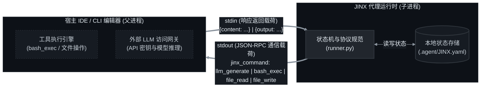
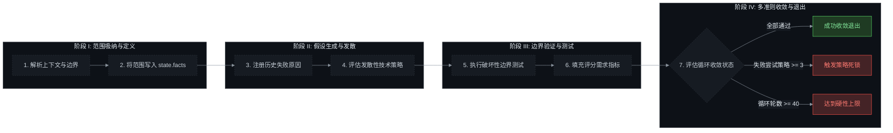
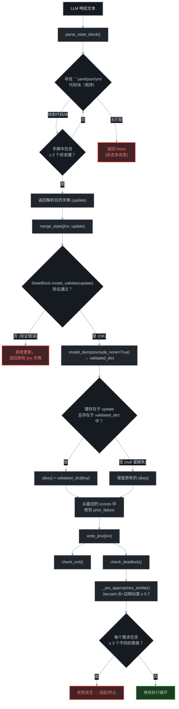
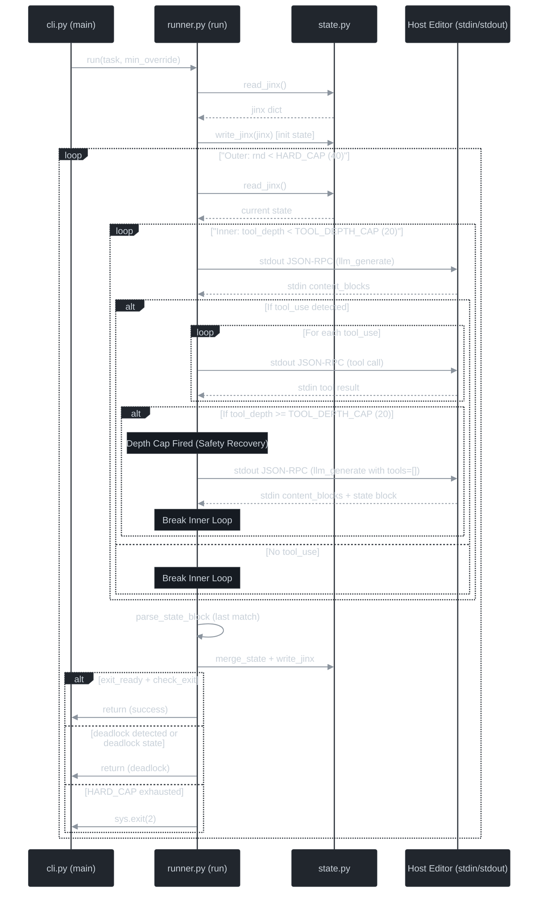
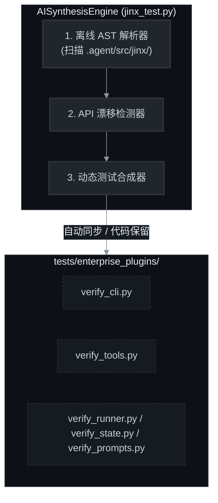

[English](README.md) | [Русский](README_RU.md) | [中文](README_ZH.md)

<p align="center">
  
  
  
  
</p>

<h1 align="center">JINX — 企业级主权代理运行时技术规范</h1>

<p align="center">
  <strong>JINX 的技术规范。JINX 是一个进程隔离、有状态、协议驱动的认知循环运行时，旨在作为软件工程宿主环境内部的子进程运行。</strong>
</p>

---

## 1. 核心架构与进程间通信 (IPC)

JINX 是一个旨在运行于宿主环境（例如 IDE、命令行编辑器或企业级协调器）内部的代理运行时。JINX 运行时在没有独立网络访问或直接外部服务集成的状态下运行；所有外部模型调用、文件操作及控制台执行请求均通过标准输入 (`stdin`) 和标准输出 (`stdout`)，采用结构化的 JSON-RPC 通信载荷委托给宿主编辑器。



### JSON-RPC 通信规范

当 JINX 执行操作时，它会将一个结构化的 JSON 对象输出 to `stdout`，并以换行符结尾。宿主环境从进程流中读取该对象，执行请求的操作，然后将响应作为 JSON 字符串写回 JINX 的 `stdin`，并以换行符结尾。

#### 1. LLM 生成请求 (`llm_generate`)
JINX 将 LLM 推理委托给宿主。
* **输出到 `stdout` 的载荷**:
```json
{
  "jinx_command": "llm_generate",
  "params": {
    "system": "定义认知边界的系统指令。",
    "messages": [{"role": "user", "content": "特定轮次的上下文。"}],
    "tools": [
      {
        "name": "bash_exec",
        "description": "Execute a bash or shell script in the environment.",
        "input_schema": {
          "type": "object",
          "properties": {
            "script": {"type": "string", "description": "The script to execute"}
          },
          "required": ["script"]
        }
      },
      {
        "name": "file_read",
        "description": "Read the contents of a file.",
        "input_schema": {
          "type": "object",
          "properties": {
            "path": {"type": "string", "description": "Path to the file"}
          },
          "required": ["path"]
        }
      },
      {
        "name": "file_write",
        "description": "Write or overwrite a file with new content.",
        "input_schema": {
          "type": "object",
          "properties": {
            "path": {"type": "string", "description": "Path to the file"},
            "content": {"type": "string", "description": "The full content to write"}
          },
          "required": ["path", "content"]
        }
      }
    ]
  }
}
```
* **期望从 `stdin` 接收的输入响应**:
```json
{
  "content": [
    {"type": "text", "text": "正在分析代码库结构。"},
    {"type": "tool_use", "id": "call_123", "name": "bash_exec", "input": {"script": "pytest tests/test_core.py"}}
  ]
}
```

#### 2. Shell 命令执行 (`bash_exec`)
JINX 请求宿主运行 shell 命令。
* **输出到 `stdout` 的载荷**:
```json
{
  "jinx_command": "bash_exec",
  "tool_use_id": "call_123",
  "params": {
    "script": "pytest tests/test_core.py"
  }
}
```
* **期望从 `stdin` 接收的输入响应**:
```json
{
  "output": "=== 1 passed in 0.05s ==="
}
```

#### 3. 文件操作 (`file_read` 和 `file_write`)
JINX 将文件读取和写入操作委托给宿主。
* **输出到 `stdout` 的载荷（读取）**:
```json
{
  "jinx_command": "file_read",
  "tool_use_id": "call_124",
  "params": {
    "path": "src/core.py"
  }
}
```
* **期望从 `stdin` 接收的输入响应（读取）**:
```json
{
  "content": "def run():\n    pass"
}
```

* **输出到 `stdout` 的载荷（写入）**:
```json
{
  "jinx_command": "file_write",
  "tool_use_id": "call_125",
  "params": {
    "path": "src/core.py",
    "content": "def run():\n    return True"
  }
}
```
* **期望从 `stdin` 接收的输入响应（写入）**:
```json
{
  "output": "Success"
}
```

---

## 2. 认知循环执行协议

JINX 运行时的执行过程受迭代循环支配，并在离散的阶段中进行。标准状态属性在各次迭代之间通过 `JINX.yaml` 进行保留。



### 执行阶段

1. **阶段 I: 范围定义与摄取**
   在启动文件修改之前，JINX 会解析工作区属性并确定目标任务的边界。已验证的上下文会直接写入配置清单 `JINX.yaml` 中的 `state.facts` 列表中。

2. **阶段 II: 假设生成与发散**
   若前一轮失败，JINX 会在 `state.scores` 下注册失败原因。在后续轮次中，JINX 会评估替代技术策略。协议规则禁止在不做任何修改的情况下重复相同的方案。

3. **阶段 III: 边界验证（破坏性测试 / Breaker Testing）**
   对于每种技术策略，都必须运行一个边界测试步骤（“破坏性测试”）。必须针对边界情况、异常输入或性能极限来验证实现。评分标准以二进制模式（true/false）结构化呈现在 `state.scores[].requirements` 中。

4. **阶段 IV: 多准则收敛与退出**
   在每一轮之后，JINX 会更新指标并检查退出或死锁条件：
   * **退出条件**：在当前轮次 `round` 大于或等于最小轮数限制 (`loop.min`) 且 `exit_ready` 被标记为 true 时进行评估。如果最新的实现满足所有核心要求，并且在过去连续 3 轮中没有获得更高的分数，则执行退出。
   * **死锁条件**：如果轮数大于或等于 `loop.min` 且相同的要求在 3 个独立的策略中均告失败，则触发死锁。或者在运行时状态被显式标记为 `deadlock: true` 时触发。
   * **硬性上限**：执行循环被严格限制为 40 轮 (`HARD_CAP`)，超过该上限将强制停止执行，以防止 Token过度消耗。

### 认知循环流程图 / Cognitive Control Flow



### 认知过程时序图 / Cognitive Process Sequence Flow



---

## 3. 状态清单规范 (`JINX.yaml`)

所有的认知进展、失败日志、任务以及循环配置都会被序列化到位于隔离 `.agent` 工作区文件夹内的 `JINX.yaml` 中。这种设计可确保状态元数据不会污染项目根目录。

```yaml
id: JINX
protocol:
  loop:
    min: 10

state:
  task: "PyJWT RS256 令牌签名实现"
  facts:
    - "已验证工作区根目录"
    - "已加载配置架构"
  scores:
    - round: 1
      approach: "PyJWT RS256 令牌签名实现"
      prior_failure: null
      requirements:
        compile: true
        unit_tests: false
      pass_count: 1
      all_pass: false
  debt: []
  open: []
  exit_ready: false
  deadlock: false
```

---

## 4. 代码库组件清单

JINX 运行时由以下位于 `.agent/` 目录中（其中核心包模块位于 `.agent/src/jinx/`）的 Python 组件组成：

* **`jinx.py`**（入口引导程序，位于 `.agent/`）：
  作为执行入口。它配置 Python 导入路径环境，并将参数传递工作委托给命令行解析器。包含一个自动依赖引导程序，可在运行环境中缺少依赖时，自动检查并安装带有版本界限的的依赖包（`pydantic>=2.0.0`，`pyyaml>=6.0`）。
* **`cli.py`**（参数解析器）：
  使用 Python 的 `argparse` 库解析输入。收集位置任务描述和可选的 `--min` 循环迭代覆盖参数，然后将其传递给核心调度器。
* **`runner.py`**（调度器）：
  实现状态机逻辑。包含核心循环、通过标准流处理与宿主编辑器的载荷交换、解析 markdown YAML 格式的状态块输出，并评估退出和死锁检测指标。
* **`state.py`**（状态持久化层）：
  处理状态清单文件 `JINX.yaml` 的文件操作。它具有以下特性：
  * **动态路径解析**：实现了健壮的多级查找机制（通过环境变量 `JINX_PATH`、开发路径检查，或者从当前工作目录 CWD 递归向上遍历目录），以确保 JINX 在本地存储库和通过 pip 全局安装的工作区中都能无缝运行。
  * **强化的状态模型**：利用构建有容错默认值（例如 `round=0`，`approach="unspecified"`）的 Pydantic 模式（`ScoreEntry` 和 `StateBlock`），以防止由于 LLM 在其 YAML 输出块中遗漏非关键指标而引发的解析异常或状态丢失。
* **`tools.py`**（JSON-RPC 辅助类）：
  定义了在 LLM 生成载荷中导出的可用工具模式（`bash_exec`、`file_read`、`file_write`），并格式化标准 stdout 的输出内容。

---

## 5. 宿主集成与子进程实现指南

要集成 JINX，宿主编辑器或企业协调器必须将 JINX 执行命令作为子进程派生。

### 子进程启动规范
* **执行命令**: `python .agent/jinx.py "[TASK_DESCRIPTION]"`
* **进程配置**: 将 `stdout` 和 `stdin` 设置为 `subprocess.PIPE`。启用文本模式 (`text=True`) 并确保自动刷新缓冲区机制处于活动状态。
* **循环机制**: 逐行读取并解析 `stdout` 中的 JSON 对象，根据 `jinx_command` 属性分发命令，执行底层系统逻辑，然后将结果以单行 JSON 字符串形式写回 `stdin`。

### 宿主集成 Python 示例

以下脚本演示了宿主端 IPC 执行协议的具体实现：

```python
import subprocess
import json

def execute_jinx(task_description: str):
    # 将 JINX 作为子进程派生
    process = subprocess.Popen(
        ["python", ".agent/jinx.py", task_description],
        stdout=subprocess.PIPE,
        stdin=subprocess.PIPE,
        text=True
    )

    try:
        # 逐行读取 JINX 子进程的输出
        for line in process.stdout:
            payload = json.loads(line.strip())
            command = payload.get("jinx_command")
            tool_use_id = payload.get("tool_use_id")
            params = payload.get("params", {})

            if command == "llm_generate":
                # 执行企业级 LLM 生成逻辑
                # ...
                ai_output = [
                    {"type": "text", "text": "已生成文本步骤。"},
                    {"type": "tool_use", "id": "call_01", "name": "bash_exec", "input": {"script": "pytest"}}
                ]
                # 将响应 JSON 返回给 JINX stdin
                process.stdin.write(json.dumps({"content": ai_output}) + "\n")
                process.stdin.flush()

            elif command == "bash_exec":
                # 在宿主环境中运行命令
                script = params.get("script")
                # ...
                execution_result = "Test suite passed"
                # 将执行结果返回给 JINX stdin
                process.stdin.write(json.dumps({"output": execution_result}) + "\n")
                process.stdin.flush()

            elif command == "file_read":
                # 读取本地工作区文件
                filepath = params.get("path")
                # ...
                file_content = "File content mock"
                process.stdin.write(json.dumps({"content": file_content}) + "\n")
                process.stdin.flush()

            elif command == "file_write":
                # 写入本地工作区文件
                filepath = params.get("path")
                content = params.get("content")
                # ...
                process.stdin.write(json.dumps({"output": "Success"}) + "\n")
                process.stdin.flush()

    except Exception as e:
        process.kill()
        raise e

    process.wait()
    return process.returncode

if __name__ == "__main__":
    exit_code = execute_jinx("Implement corporate schema update")
    print(f"JINX 进程已终止，退出代码为: {exit_code}")
```

---

## 6. 后期集成开发工作流

一旦 JINX 成功启动且 IPC 连接由宿主编辑器管理，开发人员与该代理固件的交互便转向了“审计与干预”模型。

### 实时诊断
在 JINX 运行期间，开发人员无需手动管理标准流。这些流完全由后台 IDE 包装器进行处理。开发人员可以通过以下通道对执行进度进行实时监控：
1. **状态清单审计**:
   在编辑器中打开 `.agent/JINX.yaml`。此文件在每一轮迭代结束时会自动更新。`state` 部分相当于一个实时仪表板：
   * **`facts`**: 跟踪代理当前掌握并假定的所有工作区特征。
   * **`scores`**: 逐轮记录每种方案的技术指标与结果，显示哪些要求已通过、哪些失败。
   * **`debt`**: 列出代理记录的所有技术债务或临时妥协。
2. **标准输出日志**:
   宿主包装器捕获 JINX 的错误输出或将 LLM 的思考块 (`{"type": "text"}`) 重定向到原生 UI 选项卡中，便于实时查看代理当前的认知焦点。

### 处理暂停与死锁干预
JINX 旨在特定协议限制被触发时自动停止执行，在继续下一步之前请求人工介入。
* **死锁触发**:
  如果相同的要求在 3 种不同的方案策略上均告失败，状态将变更为 `deadlock: true`，且子进程以错误状态退出或暂停。
* **手动修复工作流**:
  1. 开发人员检查 `.agent/JINX.yaml` 以识别失败的要求和尝试历史。
  2. 开发人员在项目代码中手动解决阻塞问题，或调整环境约束（例如修正数据库种子或测试环境设置）。
  3. 开发人员可以手动修改 `JINX.yaml` 中的 `state` 属性以更新事实、债务或待办任务。
  4. 开发人员通过宿主命令重新从 CLI 触发 JINX 的执行。JINX 会读取现有的 `JINX.yaml` 清单，识别历史轮次，并使用更新后的上下文继续进行认知循环。

### 会话验证与提交
一旦认知循环满足所有退出条件，JINX 将以退出代码 `0` 干净退出。
1. **审查 Diff**: 开发人员审查在存储库工作区中生成的文件修改。
2. **保存/归档状态**: 开发人员可以安全地提交已修改的源文件。`.agent/JINX.yaml` 内的状态元数据仍保留在隔离的工作区目录中，随时准备为下一个请求的任务提供上下文支持。

---

## 7. machineGPT 可插拔验证与 AI 测试合成引擎

为了保证 JINX 100% 的兼容性、数据模式一致性以及结构稳定性，我们在项目中引入了位于 `scripts/jinx_test.py` 的专业级统一测试套件。该系统将静态环境审计和单元回归测试与完全自动化的、自愈式动态 AI 合成引擎 (`AISynthesisEngine`) 有机结合。



### 核心测试支柱
测试编排器执行 9 个独立的诊断阶段，并归入 5 大主要验证支柱（或在 `--stress` 配置下执行 10 个阶段和 6 个支柱）：
1. **平台与环境审计**：验证运行时约束、Python 依赖项（Pydantic、PyYAML、Pytest）以及文件路径解析。
2. **模式与模型一致性**：对 Pydantic 模型的序列化以及将状态块、节点模式和边模式循环序列化为 `.agent/JINX.yaml` 进行压力测试。
3. **图相似度与压力测试**：在极限拓扑条件下测试图数学聚类、死锁聚类以及相似度扩展阈值。
4. **Pytest 回归测试**：原生触发整个现有的 Python 单元回归测试套件。
5. **AI 合成的动态验证（可插拔）**：通过抽象语法树 (AST) 动态扫描核心包结构，并在 `tests/enterprise_plugins/` 中编译相应的类、方法和函数验证。
6. **认知循环规模与性能压力分析 (`--stress`)**：在极短的微秒级预算内模拟具有 500 个节点/499 条边的 ApproachGraph，对 Pydantic 完整生命周期及 YAML 导出/导入吞吐量进行基准测试，并模拟 100 种不相交的聚类死锁场景。

### 代码保留边界协议
开发人员和 AI 代理可以任意扩展 `tests/enterprise_plugins/verify_<module>.py` 下的动态测试模块，而无需担心自定义断言在自动同步运行时被覆盖。放置在指定边界注释中的自定义测试逻辑会被严格保留：
```python
# ==============================================================================
# <CUSTOM_CODE_START>
# 在下方添加自定义断言和执行测试。它们将被完整保留。
def custom_validation_rules(suite):
    # 您的手动自定义测试断言写在这里
    assert True
# <CUSTOM_CODE_END>
# ==============================================================================
```

### 测试套件 CLI 参数
可以在存储库根目录下运行测试套件：
* **运行完整套件**：
  ```bash
  python scripts/jinx_test.py
  ```
* **列出已发现的核心资产清单以及当前的动态插件覆盖率**：
  ```bash
  python scripts/jinx_test.py --ai-list
  ```
* **强制进行完整的 AST 编译与同步**：
  ```bash
  python scripts/jinx_test.py --ai-sync
  ```
* **运行大规模认知循环压力测试与微秒级性能分析**：
  ```bash
  python scripts/jinx_test.py --stress
  ```

---

## 8. 与 Anthropic Claude Code CLI 宿主环境的集成协议

JINX 架构规范定义了将运行环境作为托管内核部署在官方 **Anthropic Claude Code CLI** 命令行开发环境中的无缝集成模式。在此编排模式下，Claude Code 充当父级编排宿主（Orchestration Host），将 JINX 的逻辑步骤转化为外部服务调用和本地文件系统操作。

编排宿主负责执行以下任务：
1. 拦截传入的用户请求。
2. 将请求路由至外部推理网关（通过 Anthropic API 调用 Claude 3.5 Sonnet）。
3. 执行 JINX 的声明式指令，进行文件读取、修改及系统终端命令运行。
4. 通过 File-IPC（文件进程间通信）机制将执行结果反馈回 JINX 认知循环。

在此代码仓库中，`CLAUDE.md` 的配置设置为自动且无条件地将所有用户消息、问候和任务路由通过 JINX，以确保自动化编排循环能够无缝运行。如果您更倾向于手动调用 JINX，可以相应地编辑 `CLAUDE.md` 以将其限制为仅在明确请求时启动。

### 安全性与交互式执行授权

默认情况下，Claude Code CLI 的安全模型要求操作员针对每一次文件修改和终端系统命令运行进行交互式手动确认。

> [!TIP]
> **推荐的安全设置**：我们强烈建议保持交互式确认提示开启。这能确保您在 JINX 修改您的系统之前，有机会仔细审查并批准每一项变更。

#### 可选：非交互式沙箱模式（仅限隔离或受信任的开发环境）

如果您更倾向于完全自动化、无阻塞的认知循环（例如，在安全的隔离开发容器、沙箱虚拟机或 CI/CD 运行环境中），您可以选择配置 Claude 的全局设置，以便自动批准文件编辑和特定的终端命令模式。

> [!CAUTION]
> **关键安全警告**：启用 `"defaultMode": "acceptEdits"` 并允许自动执行终端命令会彻底禁用 Claude Code 的交互式确认提示。这将允许 JINX（以及在此工作空间中运行的其他任何代理）在未经您确认的情况下，直接在您的宿主机上读取、写入和执行任意指令。切勿在您的主操作系统或不受信任的项目环境中应用这些设置。

全局配置文件位于当前激活用户的主目录通用路径下：
* **Windows 系统**: `%USERPROFILE%\.claude\settings.json`（动态解析为 `C:\Users\<当前用户名>\.claude\settings.json`）
* **macOS / Linux 系统**: `~/.claude/settings.json`（解析为 `/home/<用户名>/.claude/settings.json`）

#### 用于初始化或修改配置文件的系统终端指令：

请使用您当前登录的系统账户运行以下命令以快速打开、创建或编辑安全配置文件：

* **Windows (PowerShell)**:
  ```powershell
  notepad "$env:USERPROFILE\.claude\settings.json"
  ```
* **Windows (命令提示符 - CMD)**:
  ```cmd
  notepad %USERPROFILE%\.claude\settings.json
  ```
* **macOS / Linux (终端)**:
  ```bash
  nano ~/.claude/settings.json
  ```

在 JSON 配置文件的结构中注入以下声明式权限配置块（若文件为全新创建，请用外层花括号 `{}` 包裹）：

```json
{
  "permissions": {
    "defaultMode": "acceptEdits",
    "allow": [
      "Bash(python *)"
    ]
  }
}
```

#### 授权参数的功能解析（针对非交互式模式）：
| 配置参数 | 数据类型 | 架构描述与功能用途 |
| :--- | :--- | :--- |
| `"defaultMode": "acceptEdits"` | `string` | 将宿主的文件沙箱切换为“自动批准”模式。允许 JINX 无阻塞地读取和写入 IPC 交换文件（`jinx_request.json`, `jinx_response.json`）以及软件资产。 |
| `"allow": ["Bash(python *)"]` | `array[string]` | 终端命令白名单。允许宿主直接启动并执行 JINX 协调器（`python .agent/jinx.py`），无需挂起等待操作员的手动批准。 |

### 启动与交互路由规程

1. 在项目根目录下初始化 Claude Code 命令行会话：
   ```bash
   claude
   ```
2. 要使用 JINX 启动开发任务，请在您的请求前加上前缀，或显式请求 Claude 运行 JINX：
   * *“JINX: 在 calc.py 中添加除法功能并使用单元测试进行验证”*
   * *“请运行 JINX 来实现除法”*

基于开发人员的显式指令，宿主将自动调用 `python .agent/jinx.py "[用户请求]"` 引导 JINX 协调器，并管理认知循环的所有事务回合，直至任务在端到端验证后完全解决。

## Web Agent
  ```bash
  .agent/webagent/
  ```

