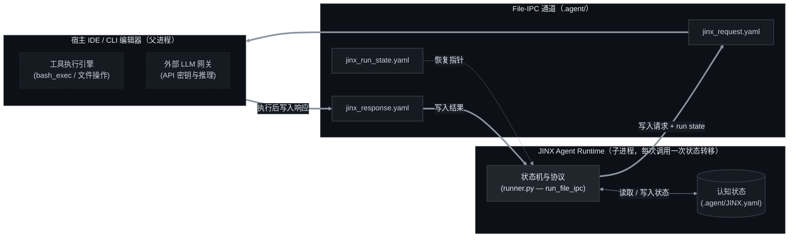
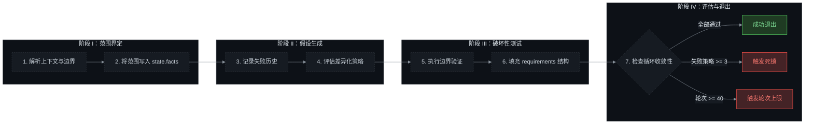
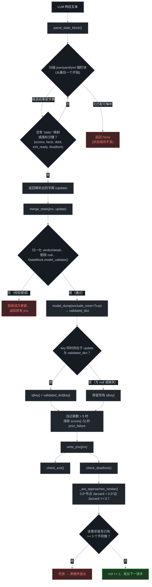
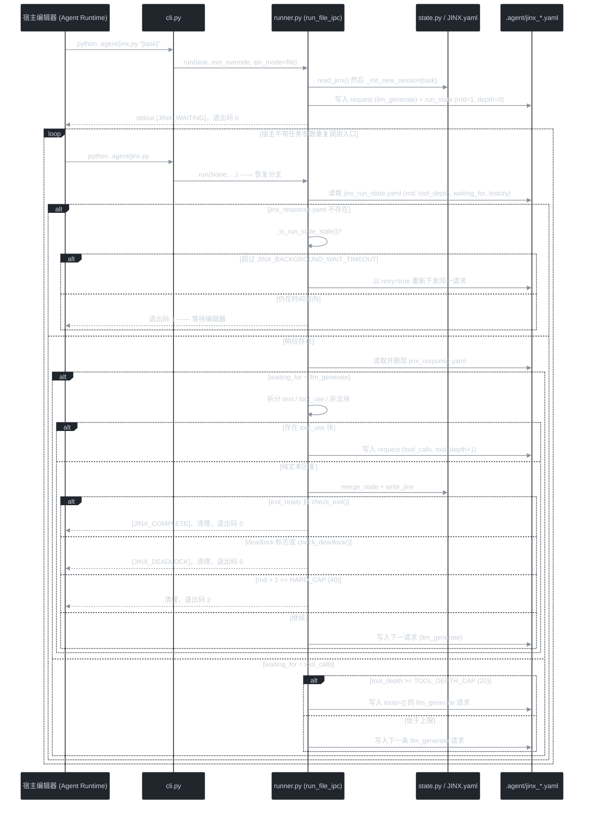
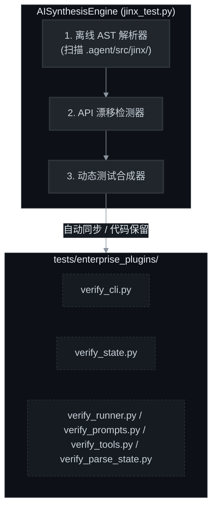

[English](README.md) | [Русский](README_RU.md) | [中文](README_ZH.md)

<p align="center">
  
  
  
  
</p>

<h1 align="center">JINX — 企业级主权智能体运行时规范</h1>

<p align="center">
  <strong>JINX 技术规范：这是一个隔离的、有状态的、由协议驱动的认知循环，被设计为在软件工程宿主环境内部以子进程方式运行。</strong>
</p>

---

## 1. 核心架构与进程间通信（IPC）

JINX 是一个智能体运行时，被设计为在宿主环境（如 IDE、命令行编辑器或企业级编排器）内部运行。JINX 运行时本身不具备独立的网络访问能力，也不包含与外部服务的直接集成；所有模型调用、文件操作与命令执行请求均通过文件交由宿主编辑器代为完成。

运行时提供 **两种 IPC 传输通道**，通过 `--ipc` 标志选择：

| 传输通道 | 标志 | 状态 | 机制 |
| :--- | :--- | :--- | :--- |
| **基于文件的状态机** | `--ipc file` *(默认)* | 主要方式 | `.agent/` 目录下的 YAML 请求／响应／运行状态文件 |
| **双向流 JSON-RPC** | `--ipc rpc` | 遗留／嵌入式宿主 | 通过 `stdout` / `stdin` 传输以换行符分隔的 JSON |

### 1.1 基于文件的 IPC（默认）

每次执行 `python .agent/jinx.py` 都会完成状态机的 **恰好一次状态转移**，随后进程退出。宿主只需不带任务参数重复调用入口，整个循环即可继续推进。全部连续性信息都保存在磁盘上，因此运行时能够承受宿主重启、编辑器崩溃以及任意进程返回码。

该通道由三个文件构成，路径均相对于 `.agent/` 目录解析：

| 文件 | 写入方 | 用途 |
| :--- | :--- | :--- |
| `.agent/jinx_request.yaml` | JINX | 请求宿主执行的动作 |
| `.agent/jinx_response.yaml` | 宿主 | 该动作的执行结果 |
| `.agent/jinx_run_state.yaml` | JINX | 轮次计数、工具调用深度、消息历史以及 `waiting_for` 指针 |

`stdout` 仅输出便于阅读的进度标记（`[JINX_WAITING]`、`[JINX_COMPLETE]`、`[JINX_DEADLOCK]`）；所有结构化诊断信息均通过 `jinx.cli` / `jinx.runner` 日志器输出到 `stderr`。


```mermaid
%%{init: {'theme': 'base', 'themeVariables': {"darkMode": true, "background": "#0d1117", "primaryColor": "#21262d", "primaryTextColor": "#e6edf3", "primaryBorderColor": "#8b949e", "lineColor": "#8b949e", "textColor": "#e6edf3", "edgeLabelBackground": "#161b22", "mainBkg": "#21262d", "nodeBorder": "#8b949e", "nodeTextColor": "#e6edf3"}}}%%
flowchart LR
    classDef sub fill:#161b22,stroke:#30363d,stroke-dasharray: 3 3,color:#c9d1d9;
    classDef state fill:#21262d,stroke:#30363d,stroke-width:2px,color:#e6edf3;
    classDef yaml fill:#161b22,stroke:#30363d,stroke-width:2px,color:#c9d1d9;

    subgraph JINX["JINX Agent Runtime（子进程，每次调用一次状态转移）"]
        direction TB
        SM["状态机与协议<br/>(runner.py — run_file_ipc)"]:::state
        DB[("认知状态<br/>(.agent/JINX.yaml)")]:::yaml
        SM <-->|"读取 / 写入状态"| DB
    end
    style JINX fill:#0d1117,stroke:#30363d,color:#e6edf3

    subgraph IPC["File-IPC 通道（.agent/）"]
        direction TB
        REQ["jinx_request.yaml"]:::yaml
        RSP["jinx_response.yaml"]:::yaml
        RUN["jinx_run_state.yaml"]:::yaml
    end
    style IPC fill:#0d1117,stroke:#30363d,color:#e6edf3

    subgraph HOST["宿主 IDE / CLI 编辑器（父进程）"]
        direction TB
        EXE["工具执行引擎<br/>(bash_exec / 文件操作)"]:::sub
        LLM["外部 LLM 网关<br/>(API 密钥与推理)"]:::sub
    end
    style HOST fill:#0d1117,stroke:#30363d,color:#e6edf3

    SM ==>|"写入请求 + run state"| REQ
    RUN -.->|"恢复指针"| SM
    RSP ==>|"写入结果"| SM
    REQ ==> HOST
    HOST ==>|"执行后写入响应"| RSP
```

#### 请求契约 —— `type: llm_generate`

```yaml
type: llm_generate
system: "You are JINX, a single-agent cognitive loop..."   # prompts.SYSTEM_PROMPT
messages:                                                   # 已裁剪的历史记录，详见下文
  - role: user
    content: "ROUND 1 (at least 10 rounds required before exit is considered)\nCURRENT STATE:\n..."
tools:                                                      # tools.tool_schema()；触发深度上限恢复时为 []
  - name: bash_exec
    description: Execute a bash or shell script in the environment.
    input_schema:
      type: object
      properties:
        script: {type: string, description: The script to execute}
      required: [script]
  - name: file_read
    description: Read the contents of a file.
    input_schema:
      type: object
      properties:
        path: {type: string, description: Path to the file}
        start_line: {type: integer, description: Optional 1-indexed starting line to read (inclusive)}
        end_line: {type: integer, description: Optional 1-indexed ending line to read (inclusive)}
      required: [path]
  - name: file_write
    description: Write or overwrite a file with new content.
    input_schema:
      type: object
      properties:
        path: {type: string, description: Path to the file}
        content: {type: string, description: The full content to write}
      required: [path, content]
processed_tool_use_ids: [call_00, call_01]   # 已执行的调用，供编辑器侧去重
tool_result_cache:                          # memoized results, keyed by tool_use_id
  call_00: "85 passed in 0.21s"
retry: false                                  # 因等待超时而重新下发时为 true
```

**宿主应返回的响应：**

```yaml
content:
  - type: text
    text: "Analyzing codebase structure."
  - type: tool_use
    id: call_123
    name: bash_exec
    input: {script: pytest tests/test_state.py}
```

`content` 字段也允许直接以普通字符串给出，JINX 会将其归一化为单个 `text` 块。任何缺少 `id`／`name`，或 `input` 不是对象的 `tool_use` 块都会被拒绝，并以 `tool_result` 错误的形式回传给模型，而不会导致本轮异常中止。

#### 请求契约 —— `type: tool_calls`

```yaml
type: tool_calls
calls:
  - id: call_123
    name: bash_exec
    params: {script: pytest tests/test_state.py}
processed_tool_use_ids: []
tool_result_cache:
  call_00: "85 passed in 0.21s"
retry: false
```

**宿主应返回的响应：**

```yaml
results:
  - tool_use_id: call_123
    content: "59 passed in 0.14s"
```

#### 运行状态契约 —— `jinx_run_state.yaml`

```yaml
rnd: 7
tool_depth: 2
waiting_for: llm_generate      # llm_generate | tool_calls
min_rounds: 10
updated_at: 1758901234.5       # epoch 秒，每次状态变更都会更新
processed_tool_use_ids: [call_00, call_01]   # 可选字段，详见下文
history:                       # 最近消息的有界窗口
  - {role: user, content: "ROUND 7 ..."}
  - {role: assistant, content: [{type: text, text: "..."}]}
```

恢复运行时，运行器恰好要求五个键 —— `rnd`、`tool_depth`、`history`、`waiting_for` 与 `min_rounds` ——
缺少其中任何一个都会被判定为无效的运行状态。`updated_at` 在每次写入时都会打上时间戳，并用于判定
等待是否超时。

`processed_tool_use_ids` 是**可选且临时**的字段。运行器在处理工具结果后，会把每个已执行的
`tool_use_id` 追加到该字段，并在构建下一个请求时将其读回；但新的 `llm_generate` 请求会在不包含该
字段的情况下重写运行状态。因此宿主应把请求中的 `processed_tool_use_ids` 视为权威来源，而运行状态中
的副本仅用于在等待超时时重新下发请求的场景下恢复上下文。

`history` 是一个**有界窗口**，而不是完整记录。循环能够跨越进程边界，是因为每一轮都会重新加载这个窗口；窗口会跳过开头的 `tool_result` 块，并裁掉结尾悬空的 `tool_use` 块，因此模型绝不会收到孤立的工具结果（`compact_history_for_request`）。这里有两个彼此独立的尺寸：run state 保留最新的 `JINX_HISTORY_PERSIST_WINDOW` 条消息（默认 **8**），而每个 `llm_generate` 请求只发送最新的 `JINX_HISTORY_WINDOW` 条（默认 **6**）。被丢弃的消息永远不会被回读——退出判定与死锁检测读取的是 `JINX.yaml` 中的评分历史，而工具调度只需要最近的调用——因此 run state 大小固定，不再随轮数增长。窗口被截断时，提示词中会附上一行说明，告知有多少条消息被省略，避免模型把窗口误认为整个会话。

#### 等待超时后的恢复机制

若 `jinx_run_state.yaml` 存在而 `jinx_response.yaml` 不存在，说明宿主未能应答。此时 JINX 调用 `_is_run_state_stale()`：只有当 `updated_at` 与 `jinx_run_state.yaml` / `jinx_request.yaml` 的修改时间 **同时** 超过 `JINX_BACKGROUND_WAIT_TIMEOUT`（默认 `30` 秒）时，才判定为超时。超时的运行会以 `retry: true` 重新下发同一请求，并附带扩充后的 `processed_tool_use_ids`，使宿主返回已保存的结果而非重复产生副作用；未超时的运行则以退出码 `1` 结束，等待宿主重试。

#### 清理与信号处理

`SIGINT`、`SIGTERM` 与 `SIGHUP` 在导入阶段即被捕获；处理器会删除全部三个 IPC 文件，并通过 `os._exit(1)` 终止进程。正常退出时，无论成功、检测到死锁还是触达硬上限，都会调用 `clean_up_ipc_files()`，因此过期的运行状态永远不会阻塞下一次会话。

### 1.2 双向流 JSON-RPC（`--ipc rpc`）

遗留传输方式为偏好单一长驻子进程与管道流的宿主保留。JINX 每发起一个请求就打印一行 JSON 对象，并读取一行 JSON 对象作为响应。

#### `llm_generate`
* **输出到 `stdout`**：
```json
{
  "jinx_command": "llm_generate",
  "params": {
    "system": "System instructions defining the cognitive boundaries.",
    "messages": [{"role": "user", "content": "Round-specific context."}],
    "tools": [{"name": "bash_exec", "input_schema": {"type": "object"}}]
  }
}
```
* **`stdin` 上的预期响应**：
```json
{
  "content": [
    {"type": "text", "text": "Analyzing codebase structure."},
    {"type": "tool_use", "id": "call_123", "name": "bash_exec", "input": {"script": "pytest tests/test_state.py"}}
  ]
}
```

#### `bash_exec`
* **输出到 `stdout`**：
```json
{"jinx_command": "bash_exec", "tool_use_id": "call_123", "params": {"script": "pytest tests/test_state.py"}}
```
* **`stdin` 上的预期响应**：
```json
{"output": "=== 1 passed in 0.05s ==="}
```

#### `file_read` / `file_write`
* **输出到 `stdout`（读取）**：
```json
{"jinx_command": "file_read", "tool_use_id": "call_124", "params": {"path": "src/core.py", "start_line": 1, "end_line": 80}}
```
* **`stdin` 上的预期响应（读取）**：
```json
{"content": "def run():\n    pass", "sliced": false}
```
* **输出到 `stdout`（写入）**：
```json
{"jinx_command": "file_write", "tool_use_id": "call_125", "params": {"path": "src/core.py", "content": "def run():\n    return True"}}
```
* **`stdin` 上的预期响应（写入）**：
```json
{"output": "Success"}
```

若响应中包含 `error` 键，或 `status` 字符串含有 `error` 子串，则判定为错误。可选布尔字段 `sliced` / `is_sliced` 用于告知 JINX 宿主是否已应用 `start_line` / `end_line` 窗口；若该字段缺失或为 false，则由 JINX 自行切片。流读取由唯一的后台 stdin 读取线程负责并写入共享队列，因此超时不会造成数据流失步。

---

## 2. 认知循环执行协议

JINX 运行时由按明确阶段划分的迭代循环驱动。标准状态属性通过 `JINX.yaml` 在各轮迭代之间保持。


```mermaid
%%{init: {'theme': 'base', 'themeVariables': {"darkMode": true, "background": "#0d1117", "primaryColor": "#21262d", "primaryTextColor": "#e6edf3", "primaryBorderColor": "#8b949e", "lineColor": "#8b949e", "textColor": "#e6edf3", "edgeLabelBackground": "#161b22", "mainBkg": "#21262d", "nodeBorder": "#8b949e", "nodeTextColor": "#e6edf3"}}}%%
flowchart LR
    classDef sub fill:#161b22,stroke:#30363d,stroke-dasharray: 3 3,color:#c9d1d9;
    classDef fail fill:#442326,stroke:#f85149,color:#ff7b72;
    classDef pass fill:#1f3b23,stroke:#56d364,color:#85e89d;

    subgraph P1["阶段 I：范围界定"]
        A["1. 解析上下文与边界"]:::sub --> B["2. 将范围写入 state.facts"]:::sub
    end
    style P1 fill:#0d1117,stroke:#30363d,color:#e6edf3

    subgraph P2["阶段 II：假设生成"]
        C["3. 记录失败历史"]:::sub --> D["4. 评估差异化策略"]:::sub
    end
    style P2 fill:#0d1117,stroke:#30363d,color:#e6edf3

    subgraph P3["阶段 III：破坏性测试"]
        E["5. 执行边界验证"]:::sub --> F["6. 填充 requirements 结构"]:::sub
    end
    style P3 fill:#0d1117,stroke:#30363d,color:#e6edf3

    subgraph P4["阶段 IV：评估与退出"]
        G{"7. 检查循环收敛性"}:::sub
        G -->|全部通过| H["成功退出"]:::pass
        G -->|失败策略 >= 3| I["触发死锁"]:::fail
        G -->|轮次 >= 40| J["触发轮次上限"]:::fail
    end
    style P4 fill:#0d1117,stroke:#30363d,color:#e6edf3

    B --> C
    D --> E
    F --> G
```

### 执行阶段

1. **阶段 I：任务边界定义与信息采集**
   在开始修改文件之前，JINX 会解析工作区环境并确定目标任务的边界。经确认的上下文直接写入配置清单 `JINX.yaml` 的 `state.facts` 列表。

2. **阶段 II：假设生成与发散**
   若上一轮失败，JINX 会在 `state.scores` 中登记失败原因。在后续轮次中，JINX 会评估其他技术策略，并可选地将每个策略描述为 `approach_graph` 知识图谱，使死锁检测能够区分真正不同的策略与纯粹的措辞改写。协议规则禁止在不做修改的情况下重复相同方案。

3. **阶段 III：边界条件验证（破坏性测试 / Breaker Test）**
   每一项技术策略都必须执行边界测试环节（"Breaker Test"）。实现必须针对边界情况、异常输入或性能上限进行验证。评分标准以布尔结构（true/false）的形式记录在 `state.scores[].requirements` 中。

4. **阶段 IV：多条件收敛与退出**
   每轮结束后，JINX 更新度量指标并检查退出或死锁条件：
   * **退出条件**（`check_exit`）：当前轮次必须 `>= loop.min`，必须至少存在 2 条评分记录，且 **最后一条** 记录的 `all_pass` 必须为 `true`。一旦记录数达到 4 条或更多，最近 3 轮的最优 `pass_count` 不得高于此前所有记录的最优 `pass_count` —— 仍在改进中的循环不允许退出。
   * **死锁条件**（`check_deadlock`）：轮次必须 `>= loop.min`，且某个需求必须在 **至少 3 个语义上不同的策略簇** 上失败。模型亦可自行声明 `deadlock: true`。
   * **硬上限**：迭代轮次总数被严格限制为 40（`HARD_CAP`）；达到后进程以状态码 `2` 退出，以防令牌消耗无度增长。
   * **工具深度上限**：单轮内最多串联 20 次工具调用（`TOOL_DEPTH_CAP`）。一旦突破，JINX 会注入恢复指令并发出一次 `tools: []` 的最终 `llm_generate`，强制要求输出状态块而非被截断。

   `loop.min` 取自 `JINX.yaml` 中的 `protocol.loop.min`（默认 **10**），或由 `--min` 命令行参数覆盖；并且在每次成功合并状态后都会重新解析，因此模型输出的协议变更可以在会话中途即时生效。

### 认知循环控制流


```mermaid
%%{init: {'theme': 'base', 'themeVariables': {"darkMode": true, "background": "#0d1117", "primaryColor": "#21262d", "primaryTextColor": "#e6edf3", "primaryBorderColor": "#8b949e", "lineColor": "#8b949e", "textColor": "#e6edf3", "edgeLabelBackground": "#161b22", "mainBkg": "#21262d", "nodeBorder": "#8b949e", "nodeTextColor": "#e6edf3"}}}%%
flowchart TD
    classDef start fill:#161b22,stroke:#8b949e,stroke-width:2px,color:#e6edf3;
    classDef process fill:#21262d,stroke:#30363d,stroke-width:2px,color:#c9d1d9;
    classDef decision fill:#161b22,stroke:#30363d,stroke-width:2px,color:#c9d1d9;
    classDef success fill:#1f3b23,stroke:#56d364,stroke-width:2px,color:#85e89d;
    classDef danger fill:#442326,stroke:#f85149,color:#ff7b72;

    A["LLM 响应文本"]:::start --> B["parse_state_block()"]:::process
    B --> C{"扫描 json/yaml/yml 围栏块<br/>(从最后一个开始)"}:::decision
    C -->|"候选结果是字典"| D{"含有 'state:' 映射<br/>或强标识键？<br/>(scores, facts, debt,<br/>exit_ready, deadlock)"}:::decision
    D -->|"是"| E["返回解析出的字典 (update)"]:::process
    D -->|"否"| C
    C -->|"无匹配可解析"| F["返回 None<br/>(状态保持不变)"]:::danger

    E --> G["merge_state(jinx, update)"]:::process
    G --> H{"归一化 verdict/detail、<br/>剔除 null、<br/>StateBlock.model_validate()"}:::decision
    H -->|"否（校验错误）"| I["拒绝该次更新，<br/>返回原有 jinx"]:::danger
    H -->|"是（通过）"| J["model_dump(exclude_none=True)<br/>→ validated_dict"]:::process
    J --> K{"key 同时存在于 update<br/>与 validated_dict？"}:::decision
    K -->|"是"| L["s[key] = validated_dict[key]"]:::process
    K -->|"否（为 null 或缺失）"| M["保留现有 s[key]"]:::process
    L --> N["当记录数 > 5 时<br/>清除 scores[:-5] 的 prior_failure"]:::process
    M --> N
    N --> O["write_jinx(jinx)"]:::process

    O --> P["check_exit()"]:::process
    O --> Q["check_deadlock()"]:::process
    Q --> R["_are_approaches_similar()<br/>0.5*节点 Jaccard + 0.5*边 Jaccard >= 0.7"]:::process
    R --> S{"该需求是否已有<br/>>= 3 个不同簇？"}:::decision
    S -->|"是"| T["死锁 → 清理并退出"]:::danger
    S -->|"否"| U["rnd += 1，发出下一请求"]:::success
```

`task` 与 `open` 被刻意 **排除** 在强标识键集合之外：它们是常见英文单词，将其视为状态特征会导致解析器劫持模型推理中嵌入的无关 YAML 示例。

### 认知过程时序图


```mermaid
%%{init: {'theme': 'base', 'themeVariables': {"darkMode": true, "background": "#0d1117", "primaryColor": "#21262d", "primaryTextColor": "#e6edf3", "primaryBorderColor": "#8b949e", "lineColor": "#8b949e", "textColor": "#e6edf3", "edgeLabelBackground": "#161b22", "actorBkg": "#21262d", "actorBorder": "#30363d", "actorTextColor": "#c9d1d9", "actorLineColor": "#30363d", "signalColor": "#8b949e", "signalTextColor": "#c9d1d9", "noteBkgColor": "#161b22", "noteBorderColor": "#30363d", "noteTextColor": "#c9d1d9", "labelBoxBkgColor": "#21262d", "labelBoxBorderColor": "#30363d", "labelTextColor": "#c9d1d9", "loopTextColor": "#c9d1d9", "activationBkgColor": "#21262d", "activationBorderColor": "#30363d"}}}%%
sequenceDiagram
    participant Host as 宿主编辑器 (Agent Runtime)
    participant CLI as cli.py
    participant Runner as runner.py (run_file_ipc)
    participant State as state.py / JINX.yaml
    participant IPC as .agent/jinx_*.yaml

    Host->>CLI: python .agent/jinx.py "[task]"
    CLI->>Runner: run(task, min_override, ipc_mode=file)
    Runner->>State: read_jinx() 然后 _init_new_session(task)
    Runner->>IPC: 写入 request (llm_generate) + run_state (rnd=1, depth=0)
    Runner-->>Host: stdout [JINX_WAITING]，退出码 0

    loop 宿主不带任务参数重复调用入口
        Host->>CLI: python .agent/jinx.py
        CLI->>Runner: run(None, ...) —— 恢复分支
        Runner->>IPC: 读取 jinx_run_state.yaml (rnd, tool_depth, waiting_for, history)

        alt jinx_response.yaml 不存在
            Runner->>Runner: _is_run_state_stale()?
            alt 超过 JINX_BACKGROUND_WAIT_TIMEOUT
                Runner->>IPC: 以 retry=true 重新下发同一请求
            else 仍在时间窗内
                Runner-->>Host: 退出码 1 —— 等待编辑器
            end
        else 响应存在
            Runner->>IPC: 读取并删除 jinx_response.yaml
            alt waiting_for = llm_generate
                Runner->>Runner: 拆分 text / tool_use / 非法块
                alt 存在 tool_use 块
                    Runner->>IPC: 写入 request (tool_calls, tool_depth+1)
                else 纯文本回复
                    Runner->>State: merge_state + write_jinx
                    alt exit_ready 且 check_exit()
                        Runner-->>Host: [JINX_COMPLETE]，清理，退出码 0
                    else deadlock 标志或 check_deadlock()
                        Runner-->>Host: [JINX_DEADLOCK]，清理，退出码 0
                    else rnd + 1 >= HARD_CAP (40)
                        Runner-->>Host: 清理，退出码 2
                    else 继续
                        Runner->>IPC: 写入下一请求 (llm_generate)
                    end
                end
            else waiting_for = tool_calls
                alt tool_depth >= TOOL_DEPTH_CAP (20)
                    Runner->>IPC: 写入 tools=[] 的 llm_generate 请求
                else 低于上限
                    Runner->>IPC: 写入下一条 llm_generate 请求
                end
            end
        end
    end
```

---

## 3. 状态清单规范（`JINX.yaml`）

全部认知进展、失败日志、任务与循环配置都序列化至位于隔离工作目录 `.agent` 中的 `JINX.yaml`。该结构确保状态元数据不会被放置在项目仓库根目录下。

```yaml
id: JINX
protocol:
  loop:
    min: 10

state:
  task: "PyJWT RS256 令牌签名实现"
  facts:
    - "已校验工作区根目录"
    - "已加载配置结构"
  scores:
    - round: 1
      approach: "PyJWT RS256 令牌签名实现"
      prior_failure: null
      requirements:
        compile: true
        unit_tests: false
      pass_count: 1
      all_pass: false
      approach_graph:            # 可选 —— 启用语义化死锁聚类
        nodes:
          - {id: "jwt_signer.py", type: file}
          - {id: "pytest", type: tool}
        edges:
          - {source: "pytest", target: "jwt_signer.py", relation: tests}
  debt: []
  open: []
  lessons:                    # 可选——跨轮次持久；合并进 .agent/lessons.yaml
    - text: "在写入状态块前先验证解析结果"
      kind: rule
      evidence: "一个未加引号的 ':' 曾静默丢弃整整一轮"
  exit_ready: false
  deadlock: false
```

`lessons` 是此处唯一**不**存储在 `JINX.yaml` 中的字段。它会被送往 §4a.1 描述的
持久账本，因为 `_init_new_session` 会在新任务开始时重置该状态块。

### 路径解析

`JINX.yaml` 通过三级查找机制定位（`_resolve_jinx_path`）：

1. 环境变量 `JINX_PATH`（若已设置）。
2. 与已安装包同级的 `.agent/JINX.yaml`（开发布局）。
3. 自当前工作目录逐级向上查找 `<目录>/.agent/JINX.yaml`，并以 `<cwd>/.agent/JINX.yaml` 作为兜底。

### 评分条目的两种格式

`ScoreEntry` 接受两种形态。**完整格式**携带 `requirements`、`pass_count` 与 `all_pass`。**简化格式**仅携带一个结论与一段自由文本：

```yaml
scores:
  - round: 2
    verdict: fail        # pass | passed | ok | true | 1  → all_pass: true
    detail: "RS256 key loading still fails on rotated keys"   # → approach
```

两者都会在 Pydantic 校验之前自动归一化为完整结构（`requirements: {task_complete: <bool>}`、`pass_count`、`all_pass`、`approach`），因此模型过于简略的回复也绝不会被拒绝。`round` 默认为 `0`，`approach` 默认为 `"unspecified"`；`task`、`facts`、`debt`、`open` 会被模型所发送的内容整体替换，而值为 `None` 的键则被忽略，使局部更新能够保留清单的其余部分。

例外是 `scores`：它**按轮号合并**而非整体替换（`merge_scores`）。已存在 `round` 的条目会覆盖该条目，而回复中缺失的轮次会保留在磁盘上。因此模型只需发送当前轮次；完整重发依然有效，只会在原处覆盖。合并后按 `round` 升序排列，没有整数 `round` 的条目按位置编键，不会在保存与读取中丢失。这消除了此前「回复漏掉某轮就静默删除该轮」的缺陷，也正是提示词得以不再要求每轮回显全部历史的原因。

两个工作列表在写入时会被限长。`facts`、`debt`、`open` 中含义相近的重复项会合并为一条——比较时忽略大小写、标点与空白，因此 `"Doesn't work."` 与 `"doesnt work"` 视为同一条事实——而 `facts` 上限为 `JINX_FACTS_CAP`（默认 **60**），超出时优先丢弃最旧的条目，因为该列表每轮都要重发，否则会成为最主要的每轮开销。`facts` 仍然是*替换*而非累加，这样模型才能撤回后来被证伪的判断。

当状态块校验失败时，先前的状态会被保留，拒绝原因会追加到下一轮的提示词中，而不再只是写进日志后丢弃。被拒绝的块现在会告知模型其块已被拒绝、具体的校验错误是什么，以及常见原因（标量值中未加引号的 `:` 或 `#`、用制表符缩进、键多嵌套了一层）——此前的静默拒绝与「模型什么都没做」在表现上完全无法区分。

---

## 4. 代码库组件清单

JINX 运行时由以下位于 `.agent/` 目录下的 Python 组件构成（核心包文件位于 `.agent/src/jinx/`）：

* **`jinx.py`**（入口引导脚本，位于 `.agent/`）：
  作为统一执行入口，它会将 `.agent/src` 插入 `sys.path`，使 `import jinx` 无需全局安装即可解析，随后将命令行参数处理委托给解析器。内含自动依赖引导器：若检测到缺少依赖，则通过 `sys.executable -m pip` 自动安装受限版本（`pydantic>=2.0.0`、`pyyaml>=6.0`）；失败时以退出码 `1` 结束并提示手动安装命令。
* **`cli.py`**（参数解析器）：
  使用 `argparse` 解析输入。它会收集位置参数任务（拼接为单一字符串），以及可选的 `--min`（轮次覆盖）与 `--ipc {file,rpc}`（传输通道覆盖），再传给编排器。日志被绑定到 `stderr`，以保证传输通道保持干净。不带任务的裸调用被视为恢复操作，且仅在存在运行状态文件时才合法。
* **`runner.py`**（编排器）：
  实现状态机与两种传输方式。核心职责：
  * `run_file_ipc` —— 默认的单步状态机：恢复检测、等待超时恢复、响应分发与轮次推进。
  * `run` —— 传输通道调度器。当 `ipc_mode == "file"` 时委派给 `run_file_ipc`，否则在同一函数内直接运行遗留的长驻 JSON-RPC 循环。
  * `parse_state_block` —— 从 markdown 围栏中提取最后一个有效状态块。语言标签是可选的，因此无标签的围栏同样会被解析；所有内容都经由 `yaml.safe_load` 处理，它也接受 JSON。
  * `check_exit` / `check_deadlock` / `_are_approaches_similar` —— 收敛性与语义聚类逻辑。
  * `Yaml` —— 隔离的 `SafeDumper`，带有能感知块标量的字符串呈现器，并提供基于临时文件的原子写入；`HARD_CAP`（40）与 `TOOL_DEPTH_CAP`（20）护栏；以及用于 IPC 清理的信号处理器。
* **`state.py`**（状态序列化层）：
  负责 `JINX.yaml` 的全部文件操作：
  * **动态路径解析**：即 §3 所述的 `JINX_PATH` / 开发路径 / 逐级向上查找三级机制。
  * **加固模型**：Pydantic 模型 `GraphNode`、`GraphEdge`、`ApproachGraph`、`ScoreEntry` 与 `StateBlock` 均带有容错默认值，因此不完整的输出块不会抛出异常或导致状态丢失。
  * **原子写入**：`atomic_write_yaml` 是暂存文件写入的唯一事实来源，`StateManager.persist_state` 与编排器都委托于此。
  * **格式归一化**：`_normalize_score_entry` / `_normalize_state_update` 在校验前将简化的 `verdict`/`detail` 形态转换并剔除 `None` 值。
* **`tools.py`**（工具结构注册表）：
* **`learning.py`**（跨轮次的持久经验账本）：
  让学习成果活过单次运行。`facts`/`debt`/`open` 属于单次运行的工作记忆，并且为了保持每轮成本平稳而被有意截断，因此没有这个模块，JINX 学到的最昂贵的东西会在任务之间被丢弃。账本存放在**独立文件** `.agent/lessons.yaml` 中，正是因为 `_init_new_session` 在新任务开始时会重置状态块。关键职责：
  * `add_lessons` — 增量且去重：重复表述的规则会累加 `seen` 计数，而不是追加副本，因此每轮都复述自身规则的模型无法撑大该文件。上限为 `JINX_LESSONS_CAP`。
  * `render_lessons` — 注入有界的 `LEARNED RULES` 块。同时受**数量**（`JINX_LESSONS_INJECT_LIMIT`）和**字符预算**（`JINX_LESSONS_BUDGET_CHARS`）限制，因为真正消耗 token 的正是字符。它还会返回已展示经验的键，这正是记功机制得以成立的前提。
  * `record_outcome` — 每一轮根据该轮结果，为实际展示过的经验记功或记过。被验证有效的经验上浮；反复失效的经验不再展示，因此该存储会自我修剪而不是持续增长。缺少这一步，账本就只是一份只写的日志。
* **`selfpatch.py`**（带闸门的自我修改）：
  允许 JINX 修改自己的代码，同时不允许它拆掉自己的安全闸。`file_write` 接受的是裸字符串路径，因此模型一直都能重写 `.agent/src/jinx/*.py`——事实上本仓库自身的发布工作正是这样完成的。此前没有任何机制检查结果是否还能工作，本模块补上了这一环：
  * **校验与回滚** — `capture_baseline` 复制源码树，`baseline_changed` 比对差异，`restore_baseline` 执行回滚。任何改动了框架源码的轮次之后，`verify` 都会运行 `pytest` **以及** 完整的 `jinx_test` 套件；任一失败即撤销该修改，并把失败输出回灌到下一轮提示词中。一次失败的尝试只损失一轮，而不是整次运行。基线覆盖整个运行，而非单轮：运行开始时采集，某个轮次没有改动时保留，已验证的修改被采纳后重新采集。正常结束时清除；出错退出时**刻意保留**——正是它让下一次启动能够修复损坏。
  * **启动前预检** — 同一检查会在 `.agent/jinx.py` 中、在导入 JINX 之前再运行一次，并按路径直接加载 `selfpatch.py`。否则，留下语法错误的自修改会让框架根本无法启动，而本该捕捉该问题的闸门也根本无法运行。磁盘上没有基线时无从比较，此时损坏的代码树会明确报错，而不是被悄悄覆盖。
  * **闸门保护** — `guard_tool_call` 拒绝任何会重定义 `merge_state`、`StateBlock`、`atomic_write_yaml`、`_resolve_jinx_path`、`check_exit`、`check_deadlock`、`_resolve_min_rounds`、`_handle_llm_response` 或 `SYSTEM_PROMPT` 的写入，并将 `selfpatch.py` 与 `learning.py` 整体列为禁区。拒绝发生在**派发之前**而非事后撤销，模型因此会知道自己被拒绝，而不会误以为校验机制坏了。保护比较这些定义的*函数体*与磁盘上的实际内容，而不仅仅检查名字是否存在，因此只要闸门本身逐字节未变，就可以整体重写受保护的文件。削弱、改写、删除闸门都会被拒绝，更隐蔽的做法同样会被识破：在文件末尾追加一个在导入时覆盖受保护定义的第二份定义，或是通过 `bash_exec` 动手——它根本不经过这道检查。因此在真正校验之前，机制会对磁盘上的文件与 baseline 重新做一次同样的比较；一旦发现闸门被这样动过，就直接回滚而不运行测试：一次通过的测试无法成为修改「决定测试是否通过的那段代码」的理由。
* **`prompts.py`**（提示词模板）：
  包含 `SYSTEM_PROMPT`、当某轮遗漏状态块时注入的 `MISSING_STATE_WARNING`、恢复指令 `TOOL_DEPTH_CRITICAL_MSG`，以及 `construct_round_prompt()`。

### 运行时环境变量

| 变量 | 默认值 | 适用通道 | 用途 |
| :--- | :--- | :--- | :--- |
| `JINX_PATH` | *(自动)* | 两者 | `JINX.yaml` 的显式路径 |
| `JINX_IPC_TIMEOUT` | `10` | `--ipc rpc` | 每次 stdin 读取尝试的等待秒数 |
| `JINX_IPC_RETRIES` | `3` | `--ipc rpc` | 抛出 `IPCError` 前的读取尝试次数 |
| `JINX_IPC_BACKOFF` | `1.0` | `--ipc rpc` | 两次读取尝试之间的间隔秒数 |
| `JINX_BACKGROUND_WAIT_TIMEOUT` | `30` | `--ipc file` | 未响应运行被判定为过期的秒数 |
| `JINX_HISTORY_WINDOW` | `6` | 两者 | 每个 `llm_generate` 请求发送的消息条数 |
| `JINX_HISTORY_PERSIST_WINDOW` | `8` | 两者 | `jinx_run_state.yaml` 中保留的消息条数 |
| `JINX_FACTS_CAP` | `60` | 两者 | `facts` 保留的最大条目数，优先丢弃最旧的 |
| `JINX_KEEP_IPC_ON_SIGNAL` | *(未设置)* | 两者 | 设为 `1` 时在 Ctrl+C 后保留 IPC 文件以便排查 |
| `JINX_TOOL_RESULT_CACHE_CAP` | `64` | 两者 | 保留的记忆化工具结果上限，超出时淘汰最旧的条目 |

---

---

## 4a. 自我改进：两种不同的能力

JINX 能够自我改进，但"自我改进"其实涵盖了两件风险等级完全不同的事情。把二者混为一谈是这里最容易犯的设计错误，因此我们有意将它们分开。

### 4a.1 持久经验——始终安全，而且价值更高

JINX 已经学到的一切（`prior_failure`、`approach_graph`、`facts`/`debt`/`open`）都是**单次运行内**的，并且为了保持每轮成本平稳而被有意截断——`facts` 上限 60 条，`prior_failure` 只保留最近 5 轮。因此它学到的最昂贵的东西会在任务之间被丢弃，每个新任务都从零开始。

状态块中的 `lessons` 字段解决了这个问题。经验具有以下特性：

* **增量累积。** 与每轮由模型全量替换的 `facts`/`debt`/`open` 不同，经验是合并写入的。只需发送新增条目。
* **跨轮次持久。** 它们写入 `.agent/lessons.yaml` 这个独立文件，因为开始新任务会调用 `_init_new_session` 重置状态块。若把经验也存在那里，存储的衰减速度就与它本应超越的状态完全相同。
* **按结果记功。** 每一轮中，实际注入到提示词里的经验会根据该轮是否通过而记功或记过。被验证有效的规则上浮；反复失效的规则不再展示。这正是它成为"学习"而非"日志"的原因，也正是它保持有界的机制。

由于经验会延续到后续任务，一条经验应当是通用、可复用的祈使句，而不是关于当前任务的备注：

```yaml
lessons:
  - text: "状态块是整体校验的，所以绝不要留下未填完整的 approach_graph"
    kind: antipattern        # rule | skill | antipattern（省略时按措辞推断）
    evidence: "第 2 轮因一条不完整的边被整体拒绝"
```

`kind` 为可选项，省略时会按措辞推断。`evidence` 为可选项。

若要重置 JINX 自认为已经学到的东西，删除 `.agent/lessons.yaml` 即可。

### 4a.2 带闸门的自我修改——强大且经过验证

JINX 可以编辑 `.agent/src/jinx/*.py` 来改善自身效果，而在做框架本身的工作时，这往往是**正确的**策略而非权宜之计。闸门的存在，是因为此前缺少了这样一项检查：确认结果仍然可用。

在任何写入了框架源码的轮次之后，运行器会：

1. 运行 `pytest` **以及** 完整的 `scripts/jinx_test.py` 套件，并在首次失败处停止；
2. 两者都通过则保留该修改；
3. 否则**回滚源码树**，并把失败输出回灌到下一轮提示词中，使失败的尝试产出证据，而不是留下一个悄悄损坏的框架。

此外，任何会重新定义闸门逻辑的写入都会在**派发之前**被拒绝，而不是先写入再回滚，因此模型会知道自己被拒绝，而不会误判校验机制已损坏。受保护的有：`merge_state`、`StateBlock`、`atomic_write_yaml`、`_resolve_jinx_path`、`check_exit`、`check_deadlock`、`_resolve_min_rounds`、`_handle_llm_response` 和 `SYSTEM_PROMPT`；`selfpatch.py` 与 `learning.py` 整体不可触碰。

**为什么这道防线不可省略。** `file_write` 没有任何路径限制，而且模型已经可以把 `protocol` 块合并进清单，从而在会话中途改变 `min_rounds`。没有防线保护的自主自我修改，会让"智能体改进了自己"和"智能体删掉了本会察觉此事的逻辑"变得无法区分——而后者可由任意任务中的提示词注入触发。

设置 `JINX_ALLOW_PROTECTED_EDITS=1` 可允许修改受保护逻辑。这是供人工有意使用的覆盖开关，而不是让智能体为自己开启的。

| 变量 | 默认值 | 适用范围 | 用途 |
| :--- | :--- | :--- | :--- |
| `JINX_SELF_PATCH` | `1` | 两者 | 设为 `0` 可完全关闭校验回滚闸门与经验注入 |
| `JINX_SELF_PATCH_TIMEOUT` | `600` | 两者 | 每个校验套件允许的秒数，超时即视为失败 |
| `JINX_SELF_PATCH_BASELINE` | `.agent/.selfpatch_baseline` | 两者 | 修改前源码一次性副本的存放位置 |
| `JINX_ALLOW_PROTECTED_EDITS` | `0` | 两者 | `1` 允许修改受保护的闸门逻辑。仅供人工覆盖 |
| `JINX_LESSONS_CAP` | `40` | 两者 | 存储经验的上限，超出时淘汰最旧的条目 |
| `JINX_LESSONS_INJECT_LIMIT` | `12` | 两者 | 注入到轮次提示词中的经验条数上限 |
| `JINX_LESSONS_BUDGET_CHARS` | `1200` | 两者 | 注入块的字符预算 |
| `JINX_LESSONS_PATH` | `.agent/lessons.yaml` | 两者 | 持久经验账本的位置 |

---

## 5. 宿主集成与子进程实现指南

要集成 JINX，宿主编辑器或企业级编排器必须将 JINX 执行命令作为子进程启动，并驱动请求／响应循环。

### 启动规范
* **执行命令**：启动使用 `python .agent/jinx.py "[TASK_DESCRIPTION]"`，恢复使用 `python .agent/jinx.py`。
* **进程配置**：以文本模式与管道流运行。宿主不持有任何内存状态 —— 继续循环所需的一切信息都在磁盘上。
* **循环机制**：每次调用后读取 `.agent/jinx_request.yaml`；依据 `type` 字段路由、执行动作、写入 `.agent/jinx_response.yaml`，然后不带任务参数重新调用。当 `jinx_request.yaml` 不再出现时，循环结束。

### 宿主集成 Python 示例

以下脚本实现宿主侧的 File-IPC 执行协议：

```python
import subprocess
import sys
from pathlib import Path
from typing import Any, Dict, List

import yaml

AGENT = Path(".agent")
REQUEST = AGENT / "jinx_request.yaml"
RESPONSE = AGENT / "jinx_response.yaml"
RUN_STATE = AGENT / "jinx_run_state.yaml"


def current_round() -> int:
    """The round JINX is asking about, read from the run state it just wrote.

    The manifest merges `scores` by round number, so the host only ever sends the
    round it is currently answering; earlier rounds are already on disk.
    """
    state = yaml.safe_load(RUN_STATE.read_text(encoding="utf-8")) or {}
    return int(state.get("rnd", 1))


def spawn(task: str | None = None) -> subprocess.CompletedProcess:
    """执行一次 JINX 状态转移。写入请求后立即返回。"""
    argv = [sys.executable, str(AGENT / "jinx.py")]
    if task:
        argv.append(task)
    return subprocess.run(argv, text=True, capture_output=True, check=False)


def call_llm(request: Dict[str, Any]) -> Dict[str, Any]:
    """将 system / messages / tools 转发至推理网关。

    请将函数体替换为真实的网关调用。此示例在第一轮读取一个文件，随后输出状态块，
    因此下面的循环确实能到达 [JINX_COMPLETE]，而不会无限地请求工具。
    """
    already_ran_a_tool = any(
        isinstance(m, dict) and isinstance(m.get("content"), list)
        and any(isinstance(b, dict) and b.get("type") == "tool_result"
                for b in m["content"])
        for m in request.get("messages", [])
    )
    if not already_ran_a_tool:
        return {"content": [
            {"type": "text", "text": "Inspecting the workspace."},
            {"type": "tool_use", "id": "call_01", "name": "file_read",
             "input": {"path": ".agent/src/jinx/state.py"}},
        ]}
    return {"content": [{"type": "text", "text": (
        "Read the manifest module.\n\n"
        "```yaml\nid: JINX\nstate:\n"
        "  task: Update the auth schema\n"
        "  facts:\n    - Inspected src/jinx/state.py\n"
        # Only this round's entry. merge_scores() keeps every earlier round, so
        # the manifest accumulates distinct rounds and check_exit can complete.
        f"  scores:\n    - round: {current_round()}\n"
        "      approach: Read the manifest module\n"
        "      requirements:\n        task_complete: true\n"
        "      pass_count: 1\n      all_pass: true\n"
        "  debt: []\n  open: []\n  exit_ready: true\n  deadlock: false\n```"
    )}]}


def run_tool(name: str, params: Dict[str, Any]) -> str:
    if name == "bash_exec":
        return subprocess.run(
            params["script"], shell=True, text=True,
            stdout=subprocess.PIPE, stderr=subprocess.STDOUT,
        ).stdout
    if name == "file_read":
        lines = Path(params["path"]).read_text(encoding="utf-8").splitlines()
        start = max(1, int(params.get("start_line", 1)))
        end = int(params.get("end_line", len(lines)))
        return "\n".join(lines[start - 1:end])
    if name == "file_write":
        target = Path(params["path"])
        target.parent.mkdir(parents=True, exist_ok=True)
        target.write_text(params["content"], encoding="utf-8")
        return "Success"
    return f"Error: unknown tool '{name}'"


def dispatch(request: Dict[str, Any]) -> None:
    """写入 JINX 正在等待的响应。"""
    if request.get("type") == "llm_generate":
        response = call_llm(request)
    else:  # type == "tool_calls"
        # 重放已记忆化的结果，而不是重复产生副作用。仅有调用 ID 并不够：
        # 缓存中保存的是该调用实际返回的内容。
        cache = request.get("tool_result_cache") or {}
        done: List[Dict[str, str]] = []
        for call in request.get("calls", []):
            cid = call["id"]
            if cid in cache:
                done.append({"tool_use_id": cid, "content": cache[cid]})
                continue
            done.append({
                "tool_use_id": cid,
                "content": run_tool(call["name"], call.get("params") or {}),
            })
        response = {"results": done}
    RESPONSE.write_text(yaml.safe_dump(response, sort_keys=False), encoding="utf-8")


def execute_jinx(task_description: str) -> int:
    result = spawn(task_description)
    if result.returncode != 0:
        return result.returncode  # 1 = 等待编辑器，2 = HARD_CAP 已耗尽

    while REQUEST.exists():
        request = yaml.safe_load(REQUEST.read_text(encoding="utf-8"))
        REQUEST.unlink()          # 先消费请求，再写入响应
        dispatch(request)

        result = spawn()          # 恢复：不带任务参数
        if result.returncode != 0:
            return result.returncode

    # 已无待处理请求：JINX 输出了 [JINX_COMPLETE] 或 [JINX_DEADLOCK]。
    return 0


if __name__ == "__main__":
    print(f"JINX 进程以代码 {execute_jinx('更新鉴权结构')} 结束")
```

> **注意**：迭代过程中绝不要删除 `jinx_run_state.yaml` —— 它是 JINX 指向当前轮次、工具深度与消息历史的唯一指针。

**路由表：**

| `type` | 从请求中读取 | 写入响应 |
| :--- | :--- | :--- |
| `llm_generate` | `system`、`messages`、`tools` | `content:`，即 `text` / `tool_use` 块列表 |
| `tool_calls` | `calls[]`，含 `id`、`name`、`params` | `results[]`，含 `tool_use_id`、`content` |

两种请求类型都带有 `tool_result_cache`，即 `tool_use_id` 到该调用实际返回结果的映射。运行器会记录收到的每一个结果并持久化该映射（上限为 `JINX_TOOL_RESULT_CACHE_CAP`，默认 **64**，超出时淘汰最旧的条目），因此后续请求 —— 包括等待超时后以 `retry: true` 重新下发的请求 —— 都可以直接从记忆中作答。

这正是 `processed_tool_use_ids` 得以成立的原因。ID 列表只能告诉宿主某个调用*已经*执行过，却无法告诉它*返回了什么*，于是唯一安全的做法是跳过该调用并丢弃其输出 —— 连模型需要的结果也一并丢失。有了缓存，宿主可以在同一个 `tool_use_id` 下原样重放已保存的内容，副作用不会重复发生。因此宿主应优先检查 `tool_result_cache`，仅在缓存不可用时才回退到 `processed_tool_use_ids`，因为同一个调用之后可能以不同参数被重新请求。

---

## 6. 集成后的开发者工作流

当 JINX 成功启动且 File-IPC 握手由宿主驱动之后，开发者与运行时之间的交互建立在审计与介入式干预模型之上。

### 实时诊断
运行期间，开发者无需手动管理循环，可通过以下渠道观察进展：
1. **状态清单审计**：
   在编辑器中打开 `.agent/JINX.yaml`。它在每轮结束时被原子重写。`state` 部分可作为实时仪表板：
   * **`facts`**：追踪智能体当前采纳的全部工作区事实与属性。
   * **`scores`**：逐轮记录度量与结果，包含 `prior_failure` 以及可能存在的 `approach_graph`。
   * **`debt`**：列出已记录的权衡取舍或临时方案。
   * **`open`**：列出结转到下一轮的未解决事项。
2. **运行状态审计**：
   `.agent/jinx_run_state.yaml` 暴露 `rnd`、`tool_depth`、`waiting_for` 以及最近的消息窗口，非常适合用于追溯最后究竟向模型传达了什么、以及模型做了什么。所有尝试的完整记录位于 `JINX.yaml` 中的 `scores` 历史：它无损且按设计不受长度限制，是权威的审计线索。
3. **标准输出／错误日志**：
   宿主将 JINX 的 stdout 进度标记与 stderr 日志流（`[jinx.cli]`、`[jinx.runner]`、`[jinx.state]`）呈现到原生 UI 标签页中。

### 暂停处理与死锁干预
JINX 在触达协议上限时会自动停止执行，以请求人工介入。
* **死锁触发**：
  若同一需求在 3 个语义不同的策略簇上失败，清单中的 `deadlock` 会被强制置为 `true`，输出 `[JINX_DEADLOCK]`，IPC 文件被删除，进程以代码 `0` 退出（循环是主动终止，而非出错 —— 可通过清单将其与成功的 `[JINX_COMPLETE]` 区分开）。
* **硬上限触发**：
  40 轮之后进程以代码 `2` 退出；IPC 文件同样会被清除。
* **手动纠正工作流**：
  1. 检查 `.agent/JINX.yaml`，定位失败的需求与方案历史。
  2. 手动修复代码中的阻塞问题，或修正环境配置（数据库种子数据、测试夹具、工具可用性）。
  3. 如有需要，可手工编辑 `JINX.yaml` 中的 `state` 属性（facts、debt、未解决事项）。
  4. 从 CLI 重新启动。直接执行 `python .agent/jinx.py` **只有在 `jinx_run_state.yaml` 仍然存在时才会恢复运行** —— 该文件正是标记一次运行尚未完结的标志。它会在 `[JINX_COMPLETE]`、`[JINX_DEADLOCK]` 以及达到硬上限时被删除，因此运行一旦结束，直接重启会以代码 `1` 退出并提示「Cannot start new session without a task description」，而不会恢复循环。`JINX.yaml` 本身*不会*被删除，仍可作为审计记录读取；但一旦传入任务就会调用 `_init_new_session`，将 `facts`、`scores`、`debt` 与 `open` 全部重置 —— 于是新任务从干净状态开始，先前的评估记录会从清单中消失。若要继续被中断的工作，请保留 run-state，并选择先排除故障原因再无参数重启，或先手动编辑清单。

### 会话验证与提交
当循环满足全部退出条件时，JINX 输出 `[JINX_COMPLETE] Task resolved successfully!` 并以代码 `0` 退出。
1. **审查差异**：检查工作区中产生的文件修改。
2. **提交代码**：`.agent/JINX.yaml` 中的状态元数据将保留，作为下一轮任务的上下文；而临时文件 `jinx_request.yaml`、`jinx_response.yaml` 与 `jinx_run_state.yaml` 会被自动删除。

---

## 7. machineGPT 可插拔验证与 AI 合成引擎

为保证结构符合规范与结构稳定性，仓库中提供了一套统一的超级测试套件 `scripts/jinx_test.py`。该系统将静态环境审计与单元回归测试，同一套全自动、可自愈的 AI 合成引擎（`AISynthesisEngine`）结合起来。


```mermaid
%%{init: {'theme': 'base', 'themeVariables': {"darkMode": true, "background": "#0d1117", "primaryColor": "#21262d", "primaryTextColor": "#e6edf3", "primaryBorderColor": "#8b949e", "lineColor": "#8b949e", "textColor": "#e6edf3", "edgeLabelBackground": "#161b22", "mainBkg": "#21262d", "nodeBorder": "#8b949e", "nodeTextColor": "#e6edf3"}}}%%
flowchart TD
    classDef sub fill:#161b22,stroke:#30363d,stroke-dasharray: 3 3,color:#c9d1d9;
    classDef standard fill:#21262d,stroke:#30363d,stroke-width:2px,color:#c9d1d9;

    subgraph Engine["AISynthesisEngine (jinx_test.py)"]
        AST["1. 离线 AST 解析器<br/>(扫描 .agent/src/jinx/)"]:::standard
        DIFF["2. API 漂移检测器"]:::standard
        GEN["3. 动态测试合成器"]:::standard
        AST --> DIFF --> GEN
    end
    style Engine fill:#0d1117,stroke:#30363d,color:#e6edf3

    subgraph Plugins["tests/enterprise_plugins/"]
        V_CLI["verify_cli.py"]:::sub
        V_STATE["verify_state.py"]:::sub
        V_OTHER["verify_runner.py / verify_prompts.py / verify_tools.py / verify_parse_state.py"]:::sub
    end
    style Plugins fill:#0d1117,stroke:#30363d,color:#e6edf3

    GEN -->|"自动同步 / 代码保留"| Plugins
```

### 核心验证支柱
编排器共运行若干**诊断阶段，归入主要验证支柱**（使用 `--stress` 时会额外增加阶段与支柱）。四个静态支柱先行执行，随后针对每个被发现的核心模块各运行一个 AI 合成阶段：

1. **平台与环境审计**：校验运行时约束、Python 依赖（Pydantic、PyYAML、Pytest）以及文件路径解析。
2. **结构与模型一致性**：对 Pydantic 模型序列化以及状态块的完整序列化／反序列化往返进行压力测试（涵盖 `ApproachGraph` 的节点与边），并通过 `.agent/JINX.yaml` 落地。
3. **图相似度与压力测试**：在极端拓扑条件下检验 Jaccard 聚类、死锁检测与相似度阈值伸缩性。
4. **Pytest 集成回归**：原样触发 `tests/` 目录下全部单元回归测试。
5. **AI 合成动态验证（可插拔）**：通过抽象语法树（AST）扫描 `.agent/src/jinx/`，并将类、方法与函数的存在性检查编译进 `tests/enterprise_plugins/verify_<module>.py` —— 每个模块一个阶段（`cli`、`runner`、`state`、`tools`、`prompts`、`parse_state`）。
6. **认知循环规模与性能压力剖析（`--stress`）**：模拟 500 节点／499 边的 `ApproachGraph`，剖析完整 Pydantic 循环与 YAML 转储／加载的吞吐，并在严格的亚毫秒预算内模拟 100 路互不相交聚类的死锁场景。

### 代码保留边界协议
开发者与 AI 智能体可以自由扩展 `tests/enterprise_plugins/verify_<module>.py` 中的任何动态测试模块，无需担心手工断言在自动同步过程中被覆盖。放置在指定边界注释之间的自定义测试逻辑会被严格保留：
```python
# ==============================================================================
# <CUSTOM_CODE_START>
# 在下方添加自定义断言与执行测试，它们会被保留。
def custom_validation_rules(suite):
    # 你手写的自定义断言写在这里
    assert True
# <CUSTOM_CODE_END>
# ==============================================================================
```

### 测试套件命令行参数
测试套件可在仓库根目录下运行：

| 标志 | 作用 |
| :--- | :--- |
| *(无)* | 执行完整的验证循环并渲染状态仪表板 |
| `--ai-list` | 打印所发现模块的清单、其类／函数以及插件覆盖状态 |
| `--ai-sync` | 强制执行 AST 编译，并对插件模块进行同步／重新生成 |
| `--stress` | 启用额外的压力／性能阶段 |
| `--output PATH` | 覆盖 JSON 报告输出路径（默认为 `tests/jinx_test_report.json`） |
| `--verbose` | 输出每一项检查的详细结果 |

```bash
python scripts/jinx_test.py
python scripts/jinx_test.py --ai-list
python scripts/jinx_test.py --ai-sync
python scripts/jinx_test.py --stress
python -m pytest -q          # tests/ 下的 59 个回归测试
```

---

## 8. 与 Anthropic Claude Code CLI 宿主环境的集成协议

JINX 架构规范将运行时部署定义为核心组件，内嵌于官方 **Anthropic Claude Code CLI** 控制台开发环境之中。在该编排方案下，Claude Code 承担父级编排宿主角色，将 JINX 的逻辑步骤转译为对外部服务与本地文件系统的实际操作。

编排宿主负责：
1. 拦截传入的用户请求。
2. 将请求路由至外部推理网关（通过 Anthropic API 调用 Claude）。
3. 执行 JINX 关于读取、写入文件与运行系统命令的声明式指令。
4. 通过 File-IPC 机制将执行结果回送至 JINX 认知循环。

在本仓库中，`CLAUDE.md` 被配置为自动且无条件地将所有用户消息、问候与任务路由经由 JINX，以确保自动化编排循环顺畅运行。若你更希望手动调用 JINX，可编辑 `CLAUDE.md`，将其限制为仅响应显式请求。

### 安全性与交互式执行授权

默认情况下，Claude Code CLI 的安全模型要求对每次文件修改与终端命令执行进行交互式操作员确认。

> [!TIP]
> **推荐的安全配置**：我们强烈建议保持交互式提示开启。这可确保在 JINX 提议的每一项变更真正落到系统之前，你都能显式审阅并批准。

#### 可选项：非交互式沙箱模式（适用于隔离或已验证的可信环境）

若你希望获得完全自动化的非阻塞认知循环（例如在安全的隔离开发容器、沙箱虚拟机或 CI/CD 运行器中），可选择配置 Claude 的全局设置以自动批准文件编辑与特定命令模式。

> [!CAUTION]
> **严重安全警告**：启用 `"defaultMode": "acceptEdits"` 并自动批准终端命令，会关闭 Claude Code 的交互式确认提示。这将允许 JINX（以及在此工作区中运行的任何其他智能体）在未经确认的情况下读取、写入并在你的宿主系统上执行任意命令。请勿在主力宿主机或不可信的项目环境中配置这些设置。

全局设置配置文件位于映射到当前用户配置文件主目录的通用路径：
* **Windows 操作系统**：`%USERPROFILE%\.claude\settings.json`（动态解析为 `C:\Users\<当前用户账户>\.claude\settings.json`）
* **macOS / Linux**：`~/.claude/settings.json`（解析为 `/home/<用户名>/.claude/settings.json`）

#### 用于初始化或修改配置档案的系统指令：

如需在当前用户上下文下初始化或修改安全档案，请执行相应的终端命令：

* **Windows（PowerShell）**：
  ```powershell
  notepad "$env:USERPROFILE\.claude\settings.json"
  ```
* **Windows（命令提示符 - CMD）**：
  ```cmd
  notepad %USERPROFILE%\.claude\settings.json
  ```
* **macOS / Linux（终端）**：
  ```bash
  nano ~/.claude/settings.json
  ```

请将以下声明式权限块嵌入 JSON 配置文档中（若为新建文件，请用根对象 `{}` 包裹该结构）：

```json
{
  "permissions": {
    "defaultMode": "acceptEdits",
    "allow": [
      "Bash(python *)"
    ]
  }
}
```

#### 授权参数的架构用途（针对非交互模式）：
| 参数 | 值类型 | 架构说明与功能用途 |
| :--- | :--- | :--- |
| `"defaultMode": "acceptEdits"` | `string` | 将宿主的文件沙箱切换为自动批准模式。允许 JINX 无阻塞地读写 IPC 文件（`.agent/jinx_request.yaml`、`.agent/jinx_response.yaml`、`.agent/jinx_run_state.yaml`）以及目标软件产物。 |
| `"allow": ["Bash(python *)"]` | `array[string]` | 声明式终端命令模式白名单。允许宿主启动并向编排器 `python .agent/jinx.py` 传递控制权，而无需等待操作员交互式批准。 |

### 会话启动与消息路由流程

1. 在项目根目录下初始化 Claude Code CLI 会话：
   ```bash
   claude
   ```
2. 若要使用 JINX 启动任务，请为请求添加前缀，或直接要求 Claude 运行 JINX：
   * *“JINX: 在 calc.py 中加入除法功能并用单元测试验证”*
   * *“请运行 JINX 实现除法功能”*

在收到开发者明确指示后，宿主会通过 `python .agent/jinx.py "[请求]"` 引导编排器，持续驱动 File-IPC 握手直至 `.agent/jinx_request.yaml` 消失，并报告最终的终止标记（`[JINX_COMPLETE]`、`[JINX_DEADLOCK]`，或退出码 `2`）。

---

## Web Agent

用于实时可视化认知循环的 React + Express + Vite 仪表板位于 `.agent/webagent/`。

```bash
cd .agent/webagent
npm install
npm run dev          # http://localhost:3301
```

完整指南、环境变量与 API 说明请参阅 [`README.md`](.agent/webagent/README.md) · [`README_RU.md`](.agent/webagent/README_RU.md) · [`README_ZH.md`](.agent/webagent/README_ZH.md)。


